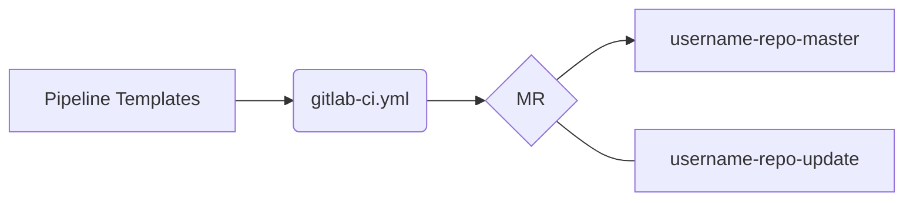

# Testing Pipelines
The goal of this repository is to streamline testing of pipelines.  Under normal circumstances projects in Repo1 do not allow redirection of the CI/CD pipeline references in settings or use of the `.gitlab-ci.yml` file.  This repository has been set up to allow the CI/CD pipelines to be defined via the `.gitlab-ci.yml` file.

> The following guidelines will ensure concurrent testing of pipelines can occur

### Set up
- Create a branch in [Pipeline Templates](https://repo1.dso.mil/big-bang/pipeline-templates/pipeline-templates)
- Clone the target repo
    - Add a remote `git remote add validator https://repo1.dso.mil/big-bang/pipeline-templates/package-validation.git`
    - Create a branch `username-repo-master` | `git checkout -b username-repo-master`
    - Add a .gitlab-ci.yml file
    - Push `git push validator`
- If Fork Repo Tokens are needed reach out to a CODEOWNER to grant maintainer access
    - Settings > CI/CD > Variables > Create a Variable `USERNAME_FORK_TOKEN` with the access token from your fork.

### Variables
Any CI Variable can be overridden to get the tested pipeline to a desired state.  Below are a few important ones

- `CI_DEFAULT_BRANCH`: Set to `username-repo-master` to override the default branch of "master" || "main"
- `BB_AUTO_MR_TOKEN`: Set to `USERNAME_FORK_TOKEN` this is to prevent publicly saving repo access tokens in git history
- `PIPELINE_REPO_BRANCH`: Must match the branch name in pipeline-templates

### Testing Master Branch Pipeline
Generally "master" or "main" pipelines only run on just that.  This is due to rules in our pipelines that check that the `CI_DEFAULT_BRANCH == CI_COMMIT_BRANCH` By modifying `CI_DEFAULT_BRANCH` to be equal to the `username-repo-master` branch name in the `ci.yml` the pipeline will treat this branch as "master".

### Testing MR Pipelines
Create a branch `username-repo-update` and then create a MR into `username-repo-master`

