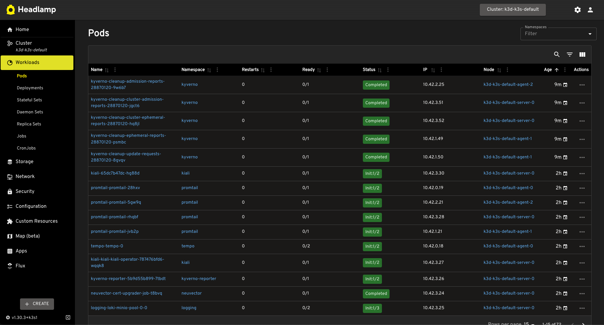
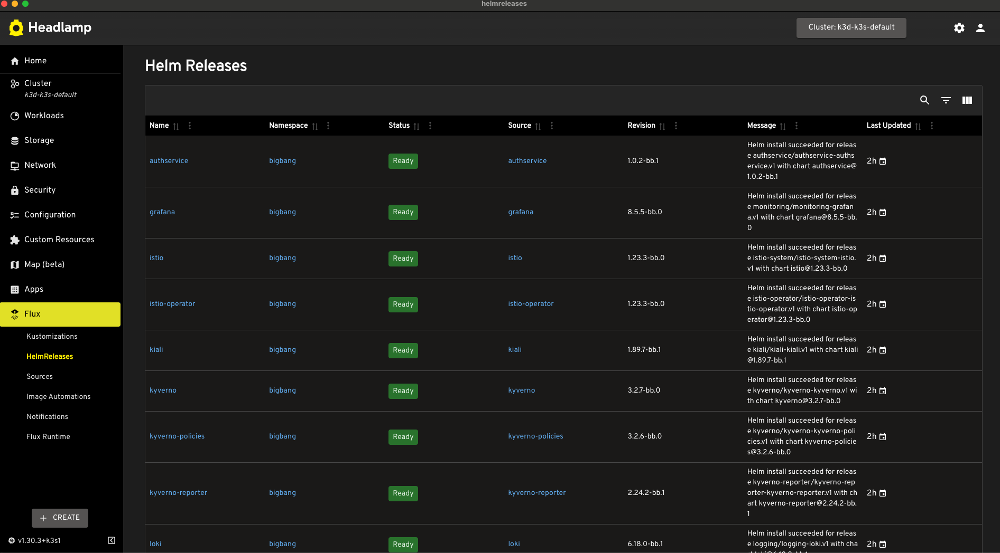
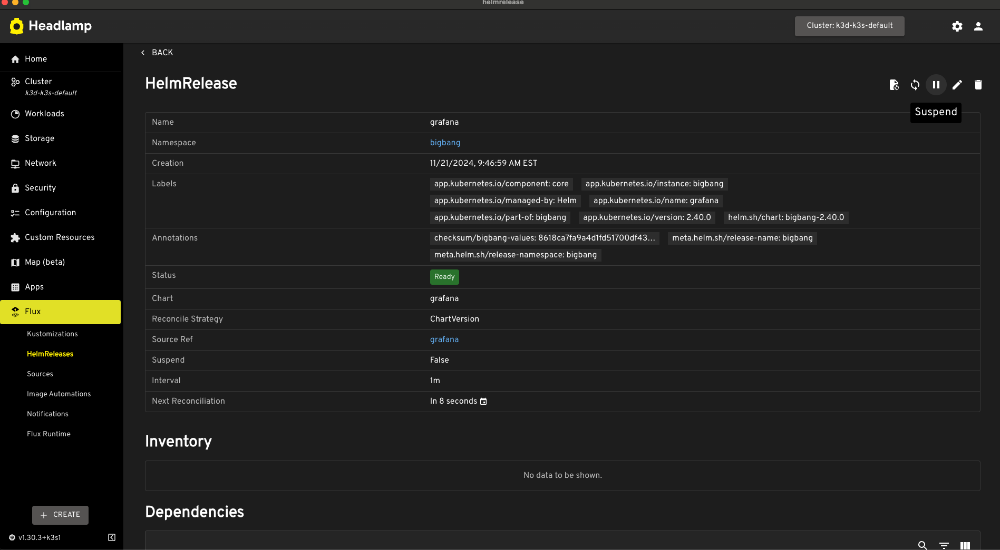
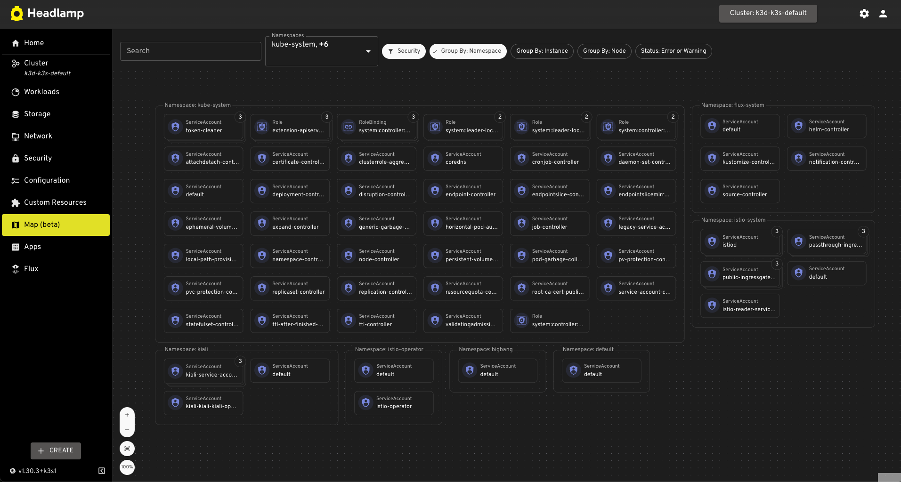
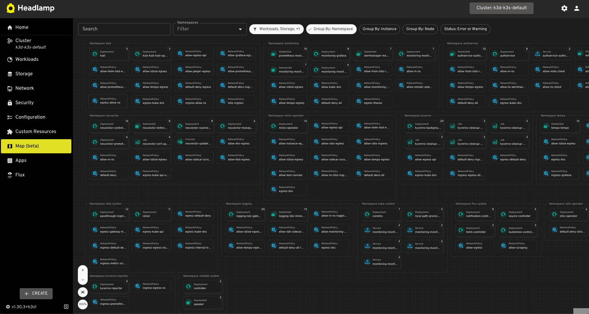

We at BigBang are excited to share some great news! We're working on adding **Headlamp**, a modern, user-friendly Kubernetes management UI, as an installable add-on in BigBang. But you don’t have to wait—Headlamp is already available as a desktop client for macOS, Windows, and Linux. You can download it now at [headlamp.dev](https://headlamp.dev/#download-platforms).  

## Benefits of Headlamp

### 1. **Easy to Use**
Headlamp provides a clean, intuitive interface that simplifies Kubernetes cluster management. It’s accessible for both beginners and experienced users, reducing the steep learning curve often associated with Kubernetes.

### 2. **Lightweight and Fast**
Designed to be lightweight, Headlamp ensures fast performance and minimal resource usage, making it a great tool for responsive cluster management.

### 3. **Real-Time Insights**
Get live updates on resource statuses, metrics, and logs. This ensures you always have the most accurate information to monitor cluster health and troubleshoot issues effectively.

### 4. **Customizable and Extensible**
- **Plugin Support:** Add or modify functionality to tailor the UI to your needs such as the easily implemented Flux plugin.
- **Open Source:** Adapt Headlamp for specific requirements or contribute to its development.  

### 5. **Multi-Cluster Management**
Easily manage multiple Kubernetes clusters from a single interface, streamlining operations across environments.

### 6. **RBAC Visualization**
Understand and manage Role-Based Access Control (RBAC) with clear visualizations, simplifying permission management.

### 7. **Native Kubernetes API Integration**
Headlamp connects directly with Kubernetes APIs, ensuring accurate, real-time cluster management without relying on additional tools or agents.

### 8. **Real-Time Visualization of resources**
Headlamp is capable of mapping out your real-time resources such as Workloads(pods, deployments, etc), Storage(PVCs), Network (Services, Endpoints, Ingress), Security(Service Accounts, Roles, Role Bindings), Configuration(Config Maps, Secrets, etc) and can be grouped by Namespace, Instance, or node. 

---

Start exploring Headlamp today to simplify and enhance your Kubernetes management experience!

Progress of headlamp being implemented into Big Bang as an add-on can be found [here](https://repo1.dso.mil/big-bang/product/bbtoc/-/issues/144)