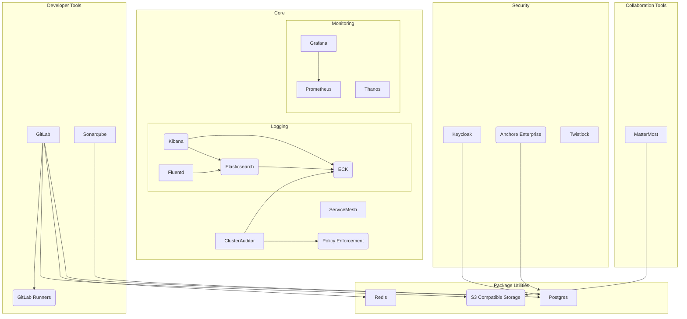
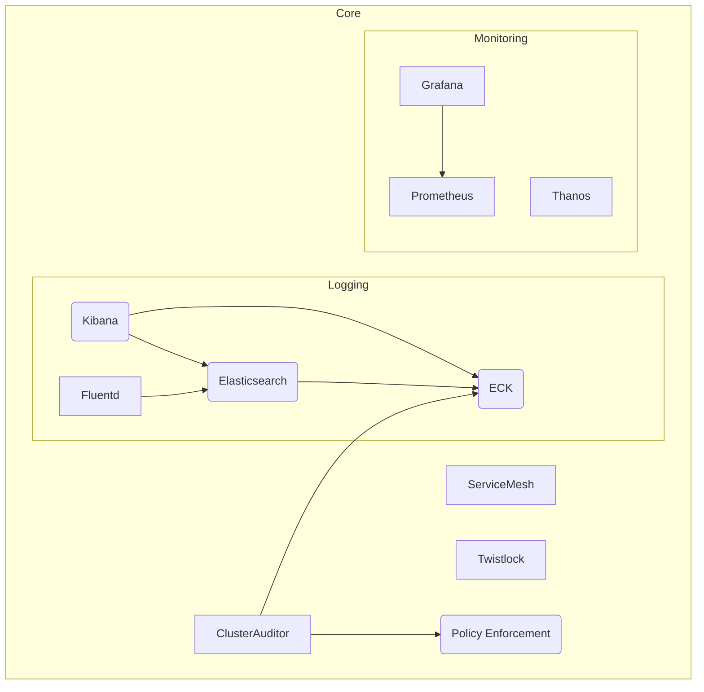
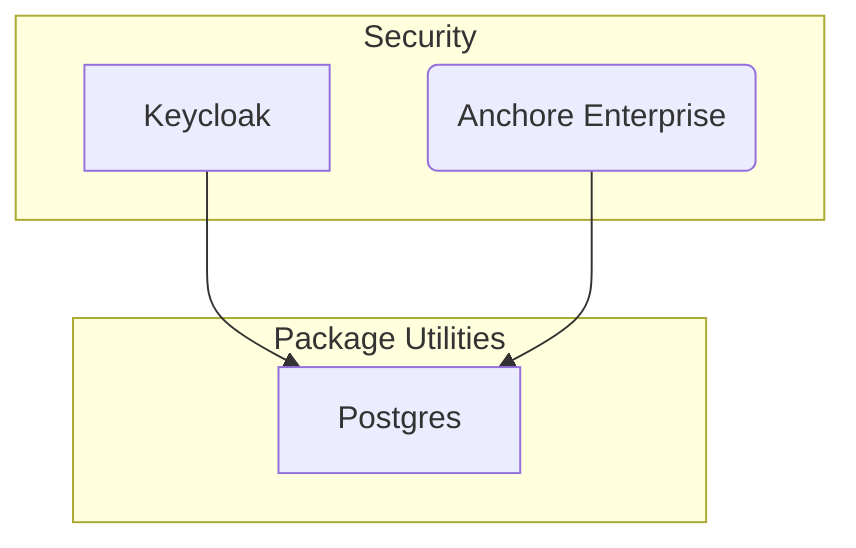
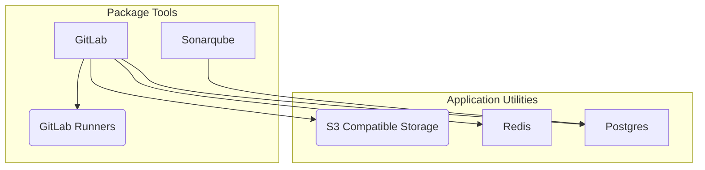
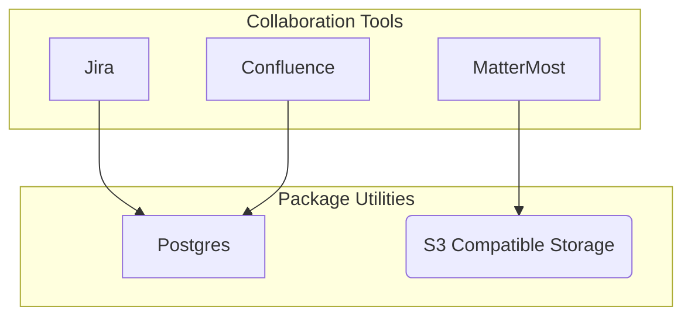
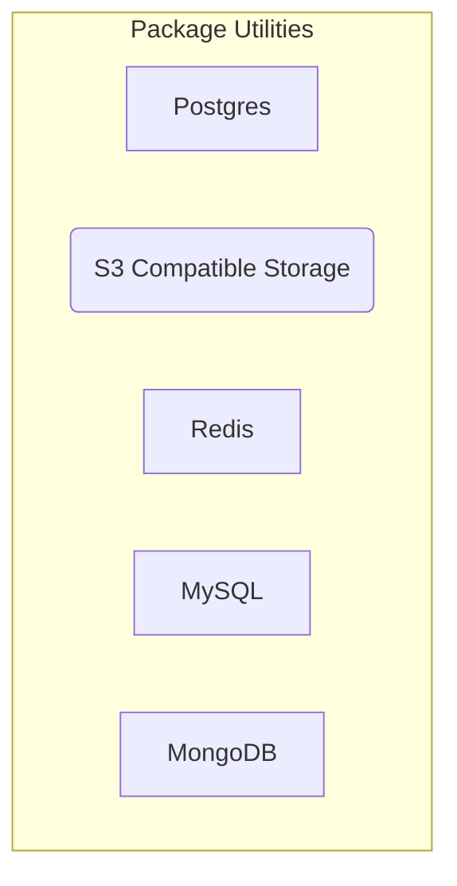

# Big Bang Packages

Each Big Bang Package is present in the [Big Bang Package](https://repo1.dso.mil/platform-one/big-bang/apps) repository and broken up into several sub-groupings.

Each package has _at least_ two `CODEOWNERS`.  Responsibilities are outlined [here](PackageOwner.md).

[[_TOC_]]

## Dependencies

## Core

Core packages are supported Big Bang packages that have to be enabled and are located at [Big Bang Core](https://repo1.dso.mil/platform-one/big-bang/apps/core).  Core packages are platform/admin level packages that are leveraged by other packages.

### Service Mesh

Current implementation of Service Mesh is provided by Istio. Service Mesh should be the first Package deployed to ensure other applications are operating with visibility and security.

Product:

* [Istio](https://istio.io/)

Repository:

* [Istio-operator](https://repo1.dso.mil/platform-one/big-bang/apps/core/istio-operator)
* [Istio-controlplane](https://repo1.dso.mil/platform-one/big-bang/apps/core/istio-controlplane)

Dependency: None

Owners:
* [CODEOWNERS](https://repo1.dso.mil/platform-one/big-bang/apps/core/istio-operator/-/blob/main/CODEOWNERS)

### Auth Service

authservice helps delegate the OIDC Authorization Code Grant Flow to the Istio mesh. authservice is compatible with any standard OIDC Provider as well as other Istio End-user Auth features, including Authentication Policy and RBAC. Together, they allow developers to protect their APIs and web apps without any application code required.

Product:

* [authservice](https://github.com/istio-ecosystem/authservice)

Repository:

* [authservice](https://repo1.dso.mil/platform-one/big-bang/apps/core/authservice)

Dependency: None

Owners:
* [CODEOWNERS](https://repo1.dso.mil/platform-one/big-bang/apps/core/authservice/-/blob/main/CODEOWNERS)

### Logging

The logging package is responsible for deploying Elasticsearch, Kibana, and Fluentd.  It is also responsible for configuring the logging pipelines to aggregate all running containers logs for viewing by both Cluster Owners and Application Operators.

The logging capability is comprised of:

* Elastic Cloud on Kubernetes (ECK) Operator
* Elasticsearch
* Kibana
* Fluentd
* Logging Operator

Repository:

* [Elasticsearch-kibana](https://repo1.dso.mil/platform-one/big-bang/apps/core/elasticsearch-kibana)
* [Fluentbit](https://repo1.dso.mil/platform-one/big-bang/apps/core/fluentbit)
* [Eck-operator](https://repo1.dso.mil/platform-one/big-bang/apps/core/eck-operator)

Dependencies:

* RWO StorageClass

Owners:
* [Elasticsearch-kibana CODEOWNERS](https://repo1.dso.mil/platform-one/big-bang/apps/core/elasticsearch-kibana/-/blob/main/CODEOWNERS)
* [Fluentbit CODEOWNERS](https://repo1.dso.mil/platform-one/big-bang/apps/core/fluentbit/-/blob/main/CODEOWNERS)
* [Eck-operator CODEOWNERS](https://repo1.dso.mil/platform-one/big-bang/apps/core/eck-operator/-/blob/main/CODEOWNERS)

### Policy Enforcement

The Policy Enforcement Package installs the Open Policy Agent Gatekeeper [Operator](https://kubernetes.io/docs/concepts/extend-kubernetes/operator/).

Product:

* [OPA Gatekeeper](https://github.com/open-policy-agent/gatekeeper)
* [Open Policy Agent](https://www.openpolicyagent.org/)

Repository:

* [Policy Repo](https://repo1.dso.mil/platform-one/big-bang/apps/core/policy)

Dependencies: None

Owners:

* [CODEOWNERS](https://repo1.dso.mil/platform-one/big-bang/apps/core/policy/-/blob/main/CODEOWNERS)

### Monitoring

Monitoring is provided by Prometheus, Grafana and Thanos.

Product:

* [Prometheus](https://prometheus.io/)
* [Grafana](https://grafana.com/)
* [Thanos](https://thanos.io/)

Repository:

* [Monitoring Repo](https://repo1.dso.mil/platform-one/big-bang/apps/core/monitoring)

Dependencies: None

Owners:

* [CODEOWNERS](https://repo1.dso.mil/platform-one/big-bang/apps/core/monitoring/-/blob/main/CODEOWNERS)

### Cluster Auditor

Cluster Auditor is an internal tool that provides compliance information to Cluster Owners and Application Developers for insight into Reference DevSecOps compliance

Product:

Repository: [Cluster Auditor](https://repo1.dso.mil/platform-one/big-bang/apps/core/cluster-auditor)

Dependencies:

* [Logging](#Logging)
* [OPA Gatekeer](#policy-enforcement)

Owners:

* [CODEOWNERS](https://repo1.dso.mil/platform-one/big-bang/apps/core/cluster-auditor/-/blob/main/CODEOWNERS)

Repository:

* [Cluster Auditor Repo](https://repo1.dso.mil/platform-one/big-bang/apps/core/cluster-auditor)

### Twistlock

Twistlock provides runtime vulnerability detection

Product:

* [Twistlock](https://www.twistlock.com/labs-/)

Repository: [Twistlock Repo](https://repo1.dso.mil/platform-one/big-bang/apps/security-tools/twistlock)

Dependencies:

* RWO StorageClass

Owners:

* [CODEOWNERS](https://repo1.dso.mil/platform-one/big-bang/apps/security-tools/twistlock/-/blob/main/CODEOWNERS)

## Addons

Addons are supported Big Bang packages that come disabled by default.

### Security Tools

Security Tools are hosted here: [Security Tools](https://repo1.dso.mil/platform-one/big-bang/apps/security-tools)

#### Keycloak

Keycloak provides SSO to applications.

Product:

* [Keycloak](https://www.keycloak.org/)
* [Postgres](https://www.postgresql.org/)

Repository: [Keycloak](https://repo1.dso.mil/platform-one/big-bang/apps/security-tools/keycloak)

Dependencies:

* Postgres

Owners:

* [CODEOWNERS](https://repo1.dso.mil/platform-one/big-bang/apps/security-tools/keycloak/-/blob/main/CODEOWNERS)

#### Anchore Enterprise

Product:

* [Anchore Enterprise](https://anchore.com/enterprise/)

Repository: [Anchore Enterprise Repo](https://repo1.dso.mil/platform-one/big-bang/apps/security-tools/anchore-enterprise)

Dependencies:

* postgres

Owners:

* [CODEOWNERS](https://repo1.dso.mil/platform-one/big-bang/apps/security-tools/anchore-enterprise/-/blob/main/CODEOWNERS)

### Developer Tools

Developer Tools are hosted here: [Developer Tools](https://repo1.dso.mil/platform-one/big-bang/apps/developer-tools)

#### GitLab

GitLab is a product for providing DevOps including planning, code hosting, and CICD

Product:

* [GitLab](https://docs.gitlab.com/)

Repository:

* [GitLab Repo](https://repo1.dso.mil/platform-one/big-bang/apps/developer-tools/gitlab)

Dependencies:

* postgres
* S3 compatible object store (ex: [Minio](#minio))
* Redis
* RWO StorageClass

Owners:

* [CODEOWNERS](https://repo1.dso.mil/platform-one/big-bang/apps/developer-tools/gitlab/-/blob/main/CODEOWNERS)

#### GitLab Runners

GitLab Runners are pods that run jobs for GitLab CI/CD

Product:

* [GitLab Runners](https://docs.gitlab.com/runner/)

Repository:

* [GitLab Runners Repo](https://repo1.dso.mil/platform-one/big-bang/apps/developer-tools/gitlab-runner)

Dependencies:

* [GitLab](#gitlab)

Owners:

* [CODEOWNERS](https://repo1.dso.mil/platform-one/big-bang/apps/developer-tools/gitlab-runner/-/blob/main/CODEOWNERS)

#### Sonarqube

Sonarqube provides code reviews for code quality and security

Product:

* [Sonarqube](https://www.sonarqube.org/)

Repository:

* [Sonarqube Repo](https://repo1.dso.mil/platform-one/big-bang/apps/developer-tools/sonarqube)

Dependencies:

* postgres
* RWO StorageClass

Owners:

* [CODEOWNERS](https://repo1.dso.mil/platform-one/big-bang/apps/developer-tools/sonarqube/-/blob/main/CODEOWNERS)

#### Nexus

Nexus provides a robust artifact repository, supporting artifacts of multiple programming languages

Product:

* [Nexus](https://www.sonatype.com/nexus/repository-pro)
* Scope:
  * The Nexus OSS will not be supported as the licenced pro version is required for [HA and SAML SSO capabilities](https://www.sonatype.com/nexus/repository-oss-vs-pro-features)
  * Only Licended Nexus Repository Pro will be supported

Repository:

* [Nexus](https://repo1.dso.mil/platform-one/big-bang/apps/developer-tools/nexus)

Dependencies:

Owners:

* [CODEOWNERS](https://repo1.dso.mil/platform-one/big-bang/apps/developer-tools/nexus/-/blob/main/CODEOWNERS)

### Collaboration Tools

Collaboration tools are hosted here: [Collaboration Tools](https://repo1.dso.mil/platform-one/big-bang/apps/collaboration-tools)

<!-- #### Confluence

Confluence provides a centralized workspace for collaborating on documentation

Product:

* [Confluence](https://www.atlassian.com/software/confluence)

Repository:

* [Confluence Repo](https://repo1.dso.mil/platform-one/big-bang/apps/collaboration-tools/confluence)

Dependencies:

* Postgres
* RWM StorageClass (if HA)

Owners:

* @matt.kaiser
* @branden.cobb

#### Jira

Development tool for planning and tracking team tasks

Product:

* [Jira](https://www.atlassian.com/software/jira)

Repository:

* [Jira Repo](https://repo1.dso.mil/platform-one/big-bang/apps/collaboration-tools/jira)

Dependencies:

* Postgres
* RWM StorageClass (if HA)

Owners:

* @matt.kaiser
* @branden.cobb -->

#### Mattermost

Mattermost is an open sourced messaging platform.

Product:

* [Mattermost](https://mattermost.com/)

Repository:

* [Mattermost Repo](https://repo1.dso.mil/platform-one/big-bang/apps/collaboration-tools/mattermost)ß

Dependencies:

* S3 compatible object store (ex: [Minio](#minio))

Owners:

* [CODEOWNERS](https://repo1.dso.mil/platform-one/big-bang/apps/collaboration-tools/mattermost/-/blob/main/CODEOWNERS)

### Package Utilities

Application utilities are deployments of utilities used by one or more packages.  They are usually not user facing, and are dependencies of user facing packages.

A clear an obvious example of this is PostgreSQL.

#### PostgreSQL

Product:

* [PostgreSQL](https://www.postgresql.org/)

Repository:

* TBD

Owners:

* TBD
* TBD

#### Minio

Minio provides S3 compatible object storage

Product:

* [MinIO](https://min.io/)

Repository: 

* [Minio Package](https://repo1.dso.mil/platform-one/big-bang/apps/application-utilities/minio/)

Dependencies: None

Owners:

* [CODEOWNERS](https://repo1.dso.mil/platform-one/big-bang/apps/application-utilities/minio/-/blob/main/CODEOWNERS)

#### MySQL

Product:

* [MySQL](https://www.mysql.com/)

Repository:

* TBD

Owners:

* TBD
* TBD

#### MongoDB

Product:

* [MongoDB](https://www.mongodb.com/)

Repository:

* TBD

Owners:

* TBD
* TBD

#### Redis

Redis is an open source, in-memory data structure store, used as a database, cache, and message broker.

* [Redis](https://redis.io/)

Repository:

* [Redis Package](https://repo1.dso.mil/platform-one/big-bang/apps/sandbox/redis)

Owners:

* [CODEOWNERS](https://repo1.dso.mil/platform-one/big-bang/apps/sandbox/redis/-/blob/main/CODEOWNERS)

### Cluster Utilities

Packages that provider cluster level utility, such as RWX storage or generic backup capabilities.

#### ArgoCD

Product:

* [ArgoCD](https://argoproj.github.io/argo-cd/)

Repository:

* [ArgoCD Repo](https://repo1.dso.mil/platform-one/big-bang/apps/core/argocd)

Dependency: None

Owners:

* [CODEOWNERS](https://repo1.dso.mil/platform-one/big-bang/apps/core/argocd/-/blob/main/CODEOWNERS)

#### Velero

Velero is an open source tool to safely backup and restore, perform disaster recovery, and migrate Kubernetes cluster resources and persistent volumes

* [Velero](https://velero.io/)

Repository:

* [Velero Package](https://repo1.dso.mil/platform-one/big-bang/apps/cluster-utilities/velero/-/tree/main)

Owners:

* [CODEOWNERS](https://repo1.dso.mil/platform-one/big-bang/apps/cluster-utilities/velero/-/blob/main/CODEOWNERS)

### BB Technical Oversight Committee (BB TOC) 

[Process](https://repo1.dso.mil/platform-one/bbtoc/-/tree/master/process)

#### BB TOC Repos
[Graduated](https://repo1.dso.mil/platform-one/big-bang/apps/graduated)

[Incubating](https://repo1.dso.mil/platform-one/big-bang/apps/incubating)

[Sandbox](https://repo1.dso.mil/platform-one/big-bang/apps/sandbox)