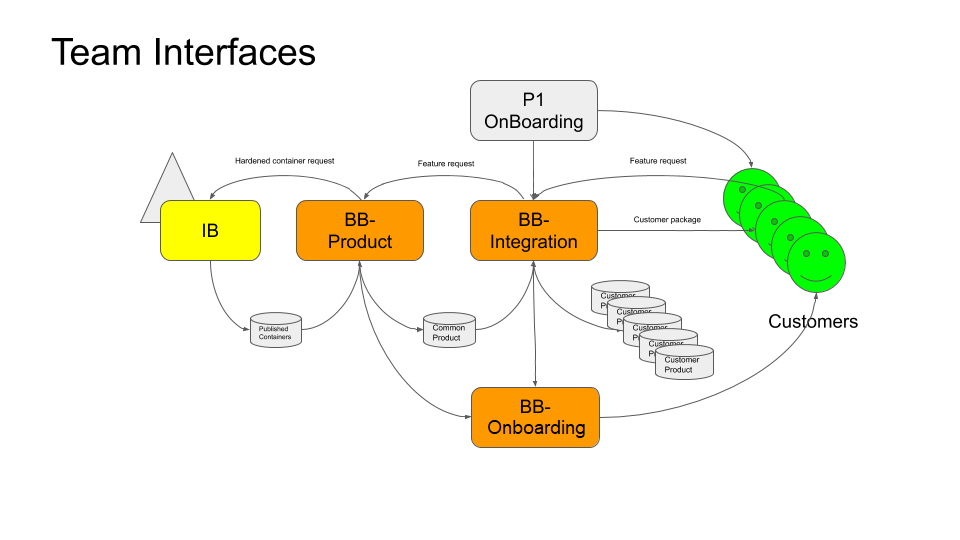

# Teams

[[_TOC_]]

## Engineering

Big Bang consists of two primary missions: Product Development and Integration

## Product Development

Product development consists of improving Big Bang Applications used by all customers:

* Upgrading application versions
* Improving reliability
* Adding configuration options used by multiple customers
* Improving interface for customer consumption

## Integration

Integration consists of facilitating user adoption of Big Bang by providing:

* On the ground debugging of production issues
* Creation of Environment Bootstrap pipelines to test changes in versions of Big Bang Umbrella

## Communication

Execution in these two engineering efforts requires tight collaboration and feedback loop with each other and external teams as defined in the diagram below:

### Product and Integration

#### Product to Integration

* Change logs
* Tier 2/3 support for application specific issues in customer production environments

#### Integration to Product

* Bugs from customers that need to be solved in Big Bang Applications
* Common "extensions" of Big Bang Umbrella that should be added to provide consistency across customers
* Mock environments for Umbrella testing

### Integration and Customers

#### Integration To Customers

* Changelog of new versions of Big Bang Umbrella
* Building

#### Customers to Integration

* Bugs
* Environment specifics that can go back into Mock Environments as defined in [Testing](Testing.md)

### Product and Iron Bank

#### Product to Iron Bank

* Requests for new/updated Iron Bank Images
* pipelines for testing Iron Bank Image functionality

#### Iron Bank to Product

* Approval of Iron Bank Images
