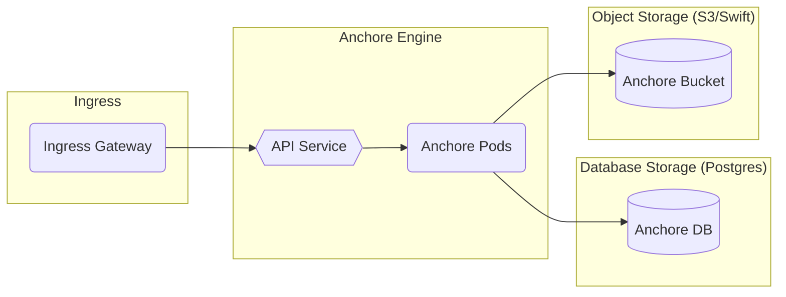
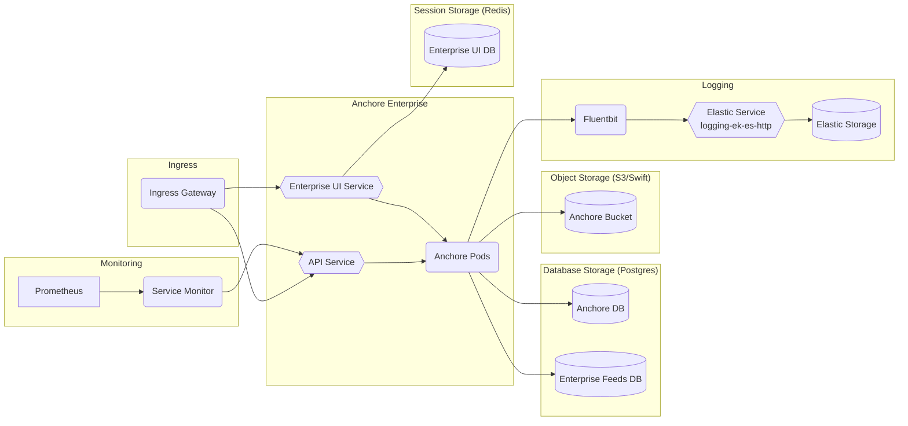

# Anchore

## Overview

[Anchore](https://anchore.com/) is a Docker container static analysis and policy-based compliance system that automates the inspection, analysis, and evaluation of images against user-defined checks to allow high confidence in container deployments by ensuring workload content meets the required criteria.

Anchore offers several [open source tools](https://anchore.com/opensource/) and products, however, this document will cover the architectural touch points for the Big Bang Anchore package, which includes Anchore Engine (open source) and Anchore Enterprise (requires enterprise license). For more information on the differentiators between Anchore's open source and commercial offerings, see [here](https://anchore.com/pricing/).

### Anchore Engine



### Anchore Enterprise



For more information on the Anchore Enterprise architecture, see [Enterprise Service Overview and Architecture](https://docs.anchore.com/current/docs/overview/architecture/).

## Big Bang Touch Points

### Licensing

The Big Bang Anchore Enterprise services require a valid Anchore Enterprise license as well as credentials with access to Registry1 hosting the hardened images.

To be onboarded and provided with a trial or production license, please send an email to publicsector@anchore.com including program name and contact details.

Once you have obtained a license this can be added to your values in Big Bang to automatically set up your Anchore deployment with the license (replacing the `licenseYaml:` value with your full license):

```yaml
addons:
  anchore:
    enterprise:
      enabled: true
      licenseYaml: |
        ehjgjhh...
```

### Single Sign On

Anchore Enterprise 2.1+ can be configured to support user login to the UI using identities from external identity providers that support SAML 2.0. In such a configuration, Anchore never stores any credentials for the users, only their usernames and Anchore permissions, and all UI access is gated through a user’s valid login into the identity provider. Anchore uses the external provider to verify username identity and initialize a username, account, and roles on first login for a new user. Once a user’s identity is initialized in Anchore, the Anchore administrator may manage user permissions by managing the roles associated with the user’s identity in Anchore itself. For more information, see [Anchore Enterprise SSO Support](https://docs.anchore.com/current/docs/overview/sso/).

See below for an example of the values to provide to Anchore Enterprise for SSO setup:

```yaml
addons:
  anchore:
    sso:
      enabled: true
      client_id: platform1_a8604cc9-f5e9-4656-802d-d05624370245_bb8-anchore
      role_attribute: ""
```

### Storage

Anchore relies on a PostgreSQL database as its primary data store. By default, Anchore will deploy an in-cluster PostgreSQL database, but it is recommended that an external PostgreSQL 9.6+ database be used, which can be configured in the Big Bang values.yaml. For more information, see [Anchore Enterprise Storage Overview](https://docs.anchore.com/current/docs/installation/storage/).

### High Availability

Since Anchore relies on a PostgreSQL database, it is recommended that production users utilize their database service's HA and scaling capabilities (e.g. Amazon Aurora, Google Cloud SQL, etc.). For users who need scaling or redundancy for their object storage, S3 or Swift are recommended. By default, Anchore Enterprise will utilize an HA redis deployment, but it can also be configured to use an external redis such as Elasticache).

Anchore Enterprise can run one or more analyzer services to scale out the processing of images. There may be many of these analyzers but best practice is to not have more than one per node since analysis is very IO intensive (see [Affinity](https://repo1.dso.mil/platform-one/big-bang/apps/security-tools/anchore-enterprise/-/blob/main/docs/Affinity.md) for an example of how to specify nodeSelector/affinity/anti-affinity). By specifying a `replicaCount` for the analyzers, the number of analysis pods can be scaled up or down:

```yaml
addons:
  anchore:
    values:
      anchoreAnalyzer:
        replicaCount: 2
```

As of the anchore-engine Chart version 0.9.0, all services can be scaled-out, so the above example can be modified for the `anchoreApi:`, `anchoreCatalog:`, `anchorePolicyEngine:`, and `anchoreSimpleQueue:` components as well.

### UI

Anchore Enterprise includes a UI, which can be used to scan repositories and images, edit policy bundles, manage users accounts and roles via RBAC, and view and generate security vulnerability and policy evaluation reports. For more information, see [Using the Anchore Enterprise UI](https://docs.anchore.com/current/docs/using/ui_usage/).

### Logging

Anchore services produce detailed logs that contain information about user interactions, internal processes, warnings and errors. The verbosity of the logs is controlled using the log_level setting in config.yaml (for manual installations) or the corresponding ANCHORE_LOG_LEVEL environment variable (for Helm installations) for each service. The log levels are DEBUG, INFO, WARN, ERROR, and FATAL, where the default is INFO. Most of the time, the default level is sufficient as the logs will contain warn, error and fatal messages as well, but for deep troubleshooting, it is always recommended to increase the log level to DEBUG in order to ensure the availability of the maximum amount of information. For more information, see [Anchore Enterprise Logs](https://docs.anchore.com/current/docs/troubleshooting/#logs).

_Note:_ within Big Bang, logs are captured by fluentbit and shipped to elastic by default.

### Monitoring

Anchore Engine and Enterprise expose prometheus metrics in the API of each service if the config.yaml used by that service has the metrics.enabled key set to true. Each service exports its own metrics and is typically scraped by a Prometheus installation to gather the metrics. Anchore does not aggregate or distribute metrics between services. You should configure your Prometheus deployment or integration to check each Anchore service’s api (using the same port it exports), for the /metrics route. For more information, see [Anchore Enterprise Monitoring](https://docs.anchore.com/current/docs/monitoring/#monitoring-in-kubernetes-andor-helm-chart).

The Big Bang Anchore Helm chart has been modified to use your `monitoring:` values in Big Bang to automatically toggle metrics on/off.

### Health Checks

Liveness and readiness probes are included in the Anchore Helm chart for all deployments. System health can also be retrieved via the CLI, API, or UI. For example, to see the health of the Anchore services after a Helm install via the CLI:

```shell
kubectl -n anchore exec -it <ANCHORE_ENGINE_API_POD> -- anchore-cli --u <USERNAME> --p <PASSWORD> system status
```

For more information, see [Anchore Enterprise System Health](https://docs.anchore.com/current/docs/using/ui_usage/system_health/).

### Dependent Packages

- PostgreSQL 9.6+ (in-cluster by default; can be configured to use an external postgres)
- Redis (in-cluster by default; can be configured to use an external redis)
