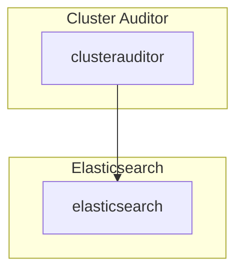

# Cluster Auditor

## Overview

Cluster Auditor(CA) pulls data from the kubernetes API, transforms them and inserts them into Elasticsearch which can then be queried by Kibana.  The types of objects are both OPA Gatekeeper CRDs and native kubernetes [objects](https://repo1.dso.mil/platform-one/big-bang/apps/core/cluster-auditor/-/blob/main/chart/templates/configMap.yaml).

## Big Bang Touch Points

## High Availability

CA currently does not support HA.

## Storage

It uses the currently deployed Elasticsearch that's deployed as part of the logging stack.

## Single Sign On (SSO)

CA does not have SSO Integration.

## Licensing

CA parent image is `fluentd` which uses  [Apache License 2.0](https://github.com/fluent/fluentd/blob/master/LICENSE).

## Dependant Packages

- Elasticsearch Kibana
- OPA Gatekeeper
