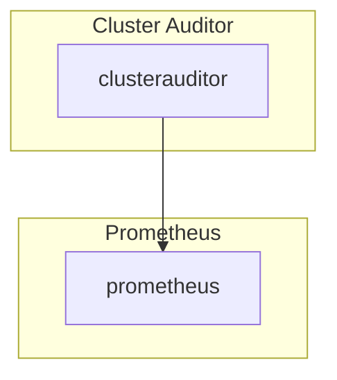

# Cluster Auditor

## Overview

Cluster Auditor(CA) pulls contstraints from the kubernetes API, transforms them and inserts them into Prometheus to be displayed in a Grafana Dashboard. Cluster Auditor uses OPA Gatekeeper CRDs and native kubernetes [objects](https://repo1.dso.mil/platform-one/big-bang/apps/core/cluster-auditor/-/blob/main/chart/templates/clusterRole.yaml).

## Big Bang Touch Points

## High Availability

CA currently does not support HA.

## Storage

It uses the currently deployed Prometheus that's deployed as part of the monitoring stack.

## Single Sign On (SSO)

CA does not have SSO Integration.

## Licensing

CA is based off of the OPA Scorecard which uses the [Apache License 2.0](https://github.com/mcelep/opa-scorecard/blob/master/LICENSE).

## Dependant Packages

- Monitoring
- OPA Gatekeeper
