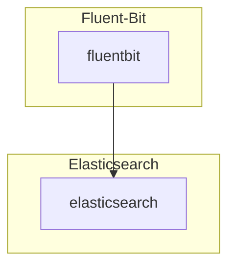

# Fluentbit

## Overview

[FluentBit](https://fluentbit.io/) is an open source Log Processor and Forwarder which allows you to collect any data like metrics and logs from different sources, enrich them with filters and send them to multiple destinations. It's the preferred choice for containerized environments like Kubernetes.

## Big Bang Touch Points



### Storage

Fluentbit itself does not use or require any persistent storage, however it does need hostPath mounts to the kubernetes nodes to tail and process log data. These hostPath volumes are for `/var/log/containers` to tail logs from containers running on the nodes, and `/var/log/flb-storage` which is a configurable [storage buffer](https://docs.fluentbit.io/manual/administration/buffering-and-storage) path in use for Big Bang production environments.
This storage buffer is configurable via the following values in Big Bang:

```yaml
fluentbit:
  values:
    storage_buffer:
      path: /var/log/flb-storage/

    extraVolumes:
      - hostPath:
          path: /var/log/flb-storage/
          type: DirectoryOrCreate
        name: flb-storage

    extraVolumeMounts:
      - mountPath: /var/log/flb-storage/
        name: flb-storage
```

This storage buffer hostPath mount, in conjunction with the hostPath mount of `/var/log/containers/` used to fetch logs requires a securityContext of `privileged` to be set if SELinux is set to `Enforcing` on the kubernetes nodes. To set this securityContext for the fluentbit pods, add the following values in Big Bang:

```yaml
fluentbit:
  values:
    securityContext:
      privileged: true
```

## Logging

Since Fluentbit is the method for shipping cluster logs to the ECK stack, to reduce the amount of logs fluentbit and ECK has to process, fluentbit container logs are excluded from being processed and shipped to ECK. However, if you would like to enable fluentbit container logs being sent to ECK  you just have to remove the "Excluded_Path" portion of this INPUT block (requires presence of entire block even when changing a single line):

```yaml
fluentbit:
  values:
    config:
      inputs: |
        [INPUT]
            Name tail
            Path /var/log/containers/*.log
            Exclude_Path /var/log/containers/*fluent*.log,/var/log/containers/*gatekeeper-audit*.log
            Parser containerd
            Tag kube.*
            Mem_Buf_Limit 50MB
            Skip_Long_Lines On
            storage.type filesystem
```

## Health Checks

Fluentbit is able to be configured with a service port for the container, which is able to expose [all kinds of metrics](https://docs.fluentbit.io/manual/administration/monitoring) including metrics for Prometheus.
Starting with Chart version 0.15.X fluentbit comes packaged (when monitoring is enabled) with a ServiceMonitor for the prometheus-operator also bundled with Big Bang so that metrics are available in the Prometheus and Grafana UIs, the latter thanks to this [Grafana Dashboard](https://docs.fluentbit.io/manual/administration/monitoring#grafana-dashboard).
