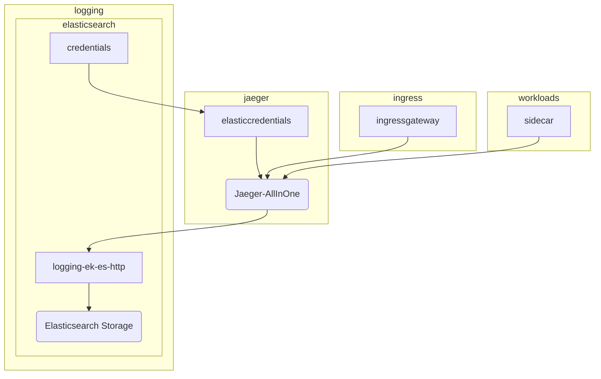
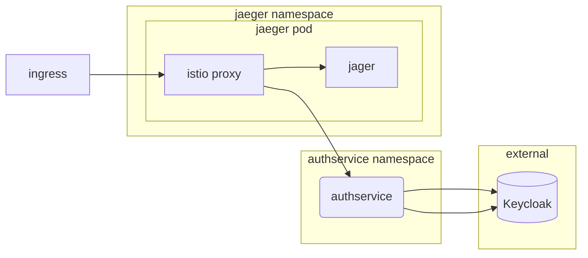

# Jaeger

## Overview

[Jaeger](https://www.jaegertracing.io/) is an open source implementation of Zipkin that can be used to collect and visualize traces.

## Big Bang Touchpoints



### Storage

When Jaeger recieves traces, it needs a location to store them.  The default configuration in the Helm Chart is to use in memory storage.  This, of course, doesn't provide High Availability.  To provide storage, the chart uses the deployed Elasticserach instance deployed in the logging namespace.

### Istio Configuration

Istio is configured with knowledge of the jaeger ingest service so istio sidecars attached to workloads can send trace data.  This is done via the `meshconfig`:

```yaml
  meshConfig:
    accessLogFile: /dev/stdout
    defaultConfig:
      tracing:
        sampling: 100
      zipkinAddress: jaeger-jaeger-operator-jaeger-collector.istio-system.svc:9411
    enableTracing: false
```

## High Availability

Jaeger is deployed with HorizonalPodAutoscalers for the collector and the queerying pods.  Use the below yaml to update the `maxReplicas` on the HPA:

```yaml
jaeger:
  values:
    jaeger:
      spec:
        query:
          maxReplicas: 5
        collector:
          maxReplicas: 5
```


## Single Sign on (SSO)

Jaeger does not have built in SSO.  In order to provide SSO, this deployment legerages [Authservice]().



## Licencing

Jaeger has no licencing options nor requirements.

## Storage

For production workloads, Jaeger uses Elasticsearch to store and query for traces.  

## Dependencies

Jaeger can be run without dependencies, but to ensure resilliency of data, it uses Elasticsearch for its span and trace database.
