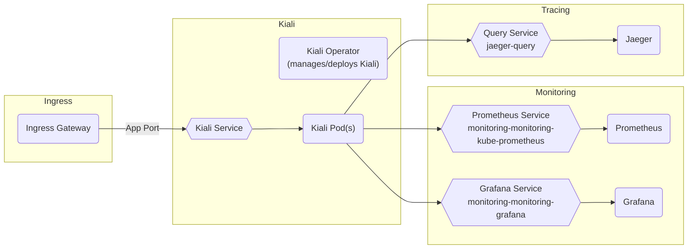

# Kiali

## Overview

[Kiali](https://kiali.io/) is a console for managing your Istio service mesh. It provides graphical views of networking interactions, metrics, and configuration options for the mesh. To aggregate this data it interacts with Prometheus, Grafana, and Jaeger.

Big Bang's implementation uses the [Kiali operator](https://github.com/kiali/kiali-operator) to provide custom resources and manage the deployment.

## Big Bang Touch Points



NOTE: Prometheus is required for Kiali to function properly; Jaeger and Grafana are optional (although all are part of Big Bang Core).

### Storage

Kiali does not have any persistent storage, all data is accessed live/directly from Jaeger/Monitoring services.

### Istio Configuration

The Istio VirtualService is created automatically (hosted at `kiali.{{ .Values.hostname }}`) and can be configured with the following values:

```yaml
kiali:
  # Gateway override
  ingress:
    gateway: "private"
  values:
    istio:
      kiali:
        # Hostname override
        hosts:
        - kiali.{{ .Values.hostname }}
```

Kiali is also pre-configured with knowledge of the BB Istio stack for monitoring purposes. Kiali will monitor the status of all ingressGateways and istiod and display a status "bubble" when a component is unreachable or down.

### External Service Configuration

Kiali in Big Bang is preconfigured with the service information to connect to Big Bang's deployments of Prometheus, Grafana, and Jaeger. If you wish to configure Kiali with different external services rather than the BB provided ones, you can do that via values overrides:

```yaml
kiali:
  values:
    cr:
      spec:
        external_services:
          ...
          # Fill in with your custom overrides
          # See https://github.com/kiali/kiali-operator/blob/master/deploy/kiali/kiali_cr.yaml#L422 for available options
          ...
```

Since both Prometheus and Jaeger are open to Kiali via the service address there is no authentication needed for them. Grafana authentication will be set up automatically using the admin account for Grafana.

Important note: If you modify the Grafana admin username/password via the UI or another method besides Helm values (`monitoring.values.grafana.adminPassword` or `monitoring.values.grafana.admin.existingSecret`), Kiali will not be autoconfigured with this knowledge. This is due to limitations in where/how Grafana stores the "live" password. If you do modify your Grafana username/password in one of thse ways, it is recommended to pass these values to your Grafana install via one of the below methods where they will also be picked up by Kiali:

```yaml
monitoring:
  values:
    grafana:
      # Direct passing via values (method 1)
      adminUser: myadminuser
      adminPassword: myadminpassword
      # Passing via secret (method 2)
      admin:
        existingSecret: mygrafanasecret
        userKey: myusernamekey
        passwordKey: mypasswordkey
```

## High Availability

HA can be accomplished for Kiali via two methods. You can directly control the replicas required or have Kiali create and use a horizontal pod autoscaler and set a min/max number of replicas for the deployment. Both methods are shown below:

- Specific number of replicas
```yaml
kiali:
  values:
    cr:
      spec:
        deployment:
          replicas: 3
```

- HPA with min/max replicas
```yaml
kiali:
  values:
    cr:
      spec:
        deployment:
          hpa:
            spec:
              maxReplicas: 5
              minReplicas: 3
```

## Single Sign on (SSO)

SSO for Kiali is done via [built in OIDC](https://kiali.io/docs/configuration/authentication/openid/). Big Bang abstracts and simplifies the settings required for SSO setup. The following values can be used to configure SSO for Kiali:

```yaml
kiali:
  sso:
    enabled: true
    client_id: platform1_a8604cc9-f5e9-4656-802d-d05624370245_bb8-kiali
    client_secret: your_client_secret_or_empty_string
# Kiali inherits/uses the global SSO settings for the host/realm
sso:
  oidc:
    host: login.dso.mil
    realm: baby-yoda
```

If you require a more advanced SSO configuration there are additional ways to customize that are detailed in the [upstream OIDC docs](https://kiali.io/docs/configuration/authentication/openid/). This doc includes details on how to configure username, scope, timeout, proxies, and more. It also lists some [SSO provider specifics](https://kiali.io/docs/configuration/authentication/openid/#_provider_specific_instructions) which may be needed for configuring with different providers. If you want to provide any further configuration than what is included in the `kiali.sso` block, you can override the BB pre-configured SSO and pass values via `kiali.values.cr.spec.auth`.

## Non-SSO Login

If you do not configure Kiali with SSO you will have [4 options](https://kiali.io/docs/configuration/authentication/) for authentication. Big Bang will default to using the token method.

- Token: Uses the Kubernetes service account token for authentication. This method makes use of your cluster's RBAC and you can create additional service accounts/tokens to restrict access. In general Kiali gives the same access as whatever is granted to the token used for login (additional [details provided upstream](https://kiali.io/docs/configuration/rbac/)).
  - To get the default Kiali SA token for login: `kubectl get secret -n kiali | grep kiali-service-account-token | awk '{print $1}' | xargs kubectl get secret -n kiali -o go-template='{{.data.token | base64decode}}'`
- OpenShift: This method will redirect users to the OpenShift console login page for authentication (and is only available for use on OpenShift). Details and setup can be seen in the [upstream docs](https://kiali.io/docs/configuration/authentication/openshift/).
- Header: Requires use of reverse proxy to inject token into the header of the request. More details and considerations are noted [upstream](https://kiali.io/docs/configuration/authentication/header/).
- Anonymous: No authentication, Kiali is open to whoever can access the URL.

Example of how to override the authentication method:
```yaml
kiali:
  values:
    cr:
      spec:
        auth:
          strategy: "anonymous"
```

## Licensing

Kiali is open source and released under [Apache License v2](https://www.apache.org/licenses/LICENSE-2.0.txt). There are no paid options for licensing or support.

## Dependencies

Since Kiali is used to observe the Istio service mesh it is tightly coupled with Istio and dependent on Istio being deployed.

Big Bang's implementation of Kiali is dependent on Monitoring (Prometheus and Grafana) and Jaeger as well. While these services are not required for setup, Kiali will be missing information if one or more of them are not deployed (note that all are part of the core BB stack).
