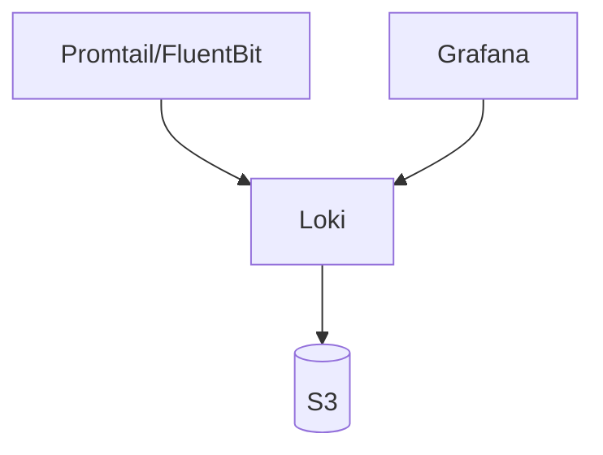
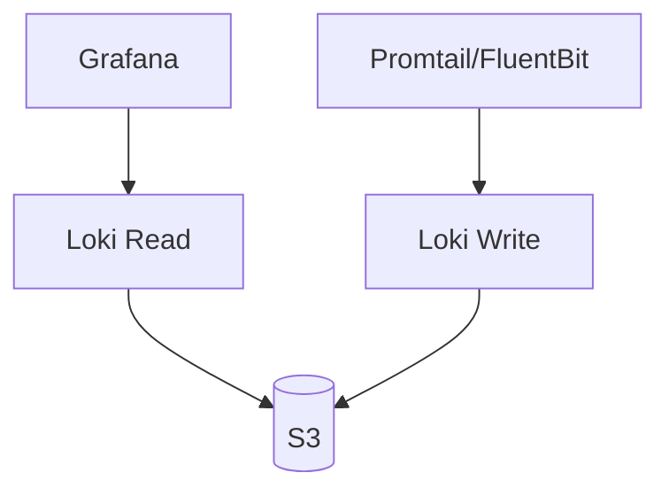
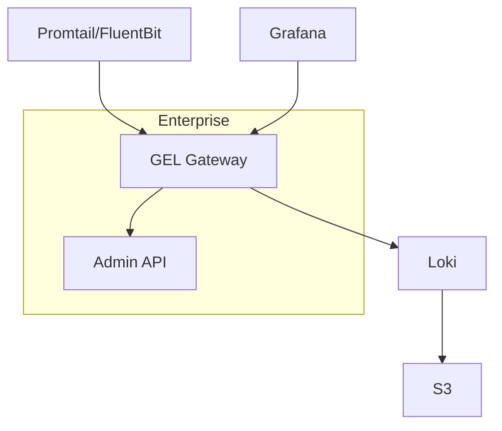
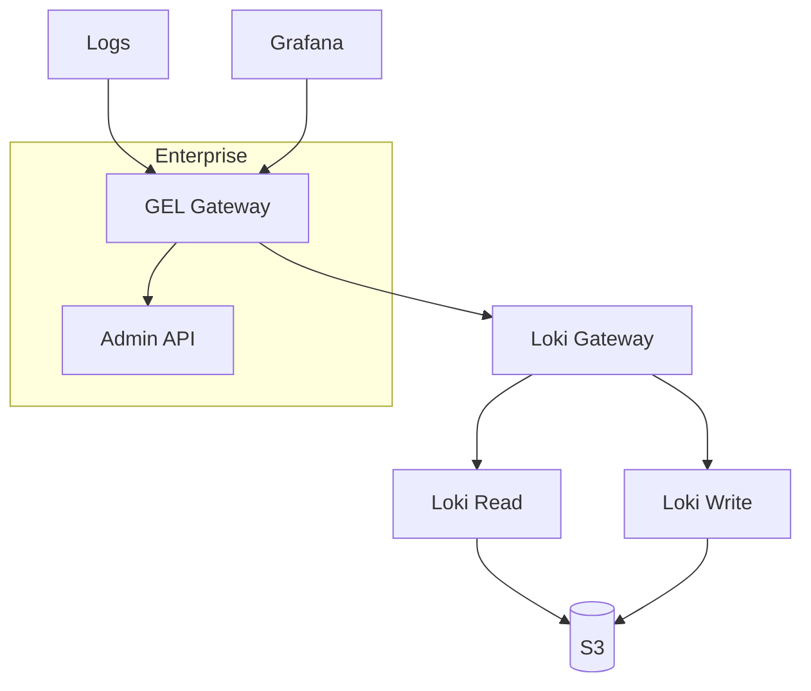

# Loki

Loki is a horizontally-scalable, highly-available, multi-tenant log aggregation system inspired by Prometheus. It is designed to be very cost effective and easy to operate. It does not index the contents of the logs, but rather a set of labels for each log stream. Loki is like Prometheus, but for logs: we prefer a multidimensional label-based approach to indexing, and want a single-binary, easy to operate system with no dependencies. Loki does require a forwarder to ship logs into it's database.

## Monolith



## (Simple) Scalable


## Monolith with Grafana Enterprise Logging (GEL)


## Simple Scalable Enterprise with Grafana Enterprise Logging (GEL)



## Big Bang Touch Points

### Licensing

Loki utilizes an AGPLv3 License for it's code and binaries. By default the application does not need a license out of the box but can be utilized with [Grafana Enterprise Logs](https://grafana.com/products/enterprise/logs/) that can be deployed in the Grafana Cloud or in-cluster. Big Bang will be adding in support for both implementations of Grafana Enterprise Logs.

### Single Sign On

Loki utilizes Grafana as the frontend for searching and viewing logs, please refer to the [monitoring package for Single Sign On capabilities](../monitoring/Architecture.md).

### High Availability

Since Big Bang release 1.32.0 a Big Bang value `loki.strategy` has been available. When set to `scalable` Loki is configured to run with multiple replicas of what are called read and write nodes. The read nodes are what schedule, process and return queries to/from the Loki API while the write nodes is where your configured log forwarder will send the logs to and process write/create operations against the API and storage.

```yaml
loki:

  strategy: scalable

  values:
    global:
      # -- Create Loki config for all sub-charts.
      # Uses data within 'global.config' value
      createGlobalConfig: true
      # -- Secret which Pods will consume for config.
      # Only use if 'global.createGlobalConfig' is true.
      # Default: "loki-config"
      existingSecretForConfig: "loki-config"
    
    loki-simple-scalable:
      # Configuration for the write node(s)
      write:
        # -- Number of replicas for the write
        replicas: 2
      # Configuration for the read node(s)
      read:
        # -- Number of replicas for the read
        replicas: 2
```

### UI

Loki has no UI packaged with it. Grafana is the frontend to view logs which are ingested by Loki.

### Logging

Within Big Bang, logs are captured by fluentbit or promtail and shipped to your logging engine (Loki when ECK not installed, ECK when it's installed or both).

### Health Checks

Loki pods come with a pre-configured Readiness probe to query `:3100/ready` for the pod to ensure it's healthy.

Loki package also comes bundled with a ServiceMonitor so it will show up as a Prometheus target assuming monitoring is installed and the `coreos` CRDs/APIs are available.

### Dependent Packages

When using the `scalable` deployment strategy without filling in `loki.objectStorage` values, minioOperator is required as a minio tenant will be auto-created and configured as the object storage backend.

Loki can be deployed by itself but since it's so closely tied with Grafana, the monitoring package is set as a required dependency within Big Bang so both are setup and auto-configured.

As mentioned above, Loki requires a log forwarder in the cluster to receive logs. You can use either one of fluentbit or promtail but Loki will not fail to install if neither one are installed via Big Bang.