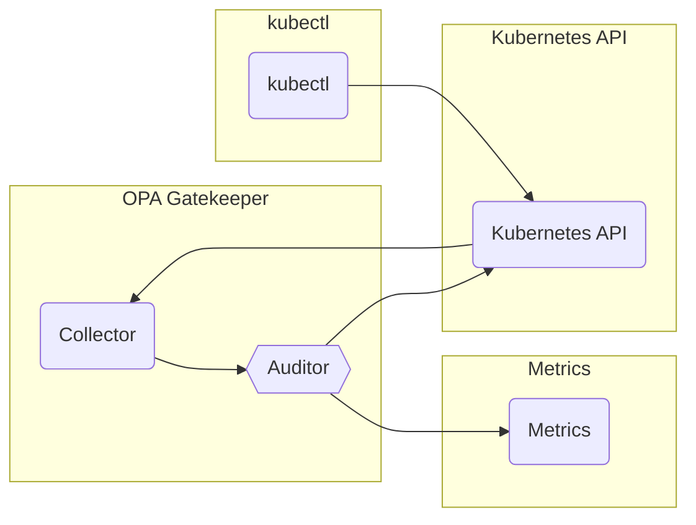

# OPA-Gatekeeper

## Overview

Gatekeeper is an auditing tool that allows administrators to see what resources are currently violating any given policy.

## Big Bang Touchpoints

### Storage

Data from gatekeeper is not stored is provided via [metrics](https://open-policy-agent.github.io/gatekeeper/website/docs/metrics/).

### Database

Gatekeeper doesn't have a database.

### Istio Configuration

This package has no specific istio configuration.

## High Availability

High availability is accomplished by increasing the replicas in the values file of this helm chart.

## Single Sign on (SSO)

None. This service doesn't have a web interface.

## Licencing

[Apache License](https://github.com/open-policy-agent/gatekeeper/blob/master/LICENSE)

## Dependencies

None.
