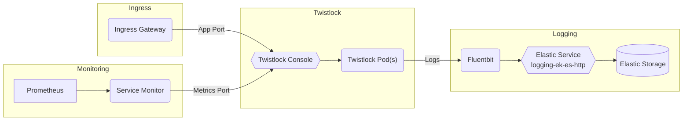

# Twistlock

## Overview

[Twistlock Administration Guide](https://docs.paloaltonetworks.com/prisma/prisma-cloud/20-04/prisma-cloud-compute-edition-admin/welcome/getting_started.html)

## Big Bang Touch Points



### UI

Twistlock Console serves as the user interface within Twistlock. The graphical
user interface (GUI) lets you define policy, configure and control your Twistlock deployment, and view the overall health (from a security perspective) of your container environment

### Logging
In order to enable logging this can only be done via the console UI. Logging can be enabled by clicking on the `Manage` dropdown and click `Alerts`. Under the `Logging` tab the option for `Stdout` can be set to Enabled. This allows for options for logging to stdout to be scraped by fluentbit/promtail OR log to the underlying hosts.


### Install Defender

In Bigbang the  twistlock defender is installed manual.
Follow the document to install defender as a daemonset.
<https://repo1.dso.mil/platform-one/big-bang/apps/security-tools/twistlock/-/blob/main/README.md>

### Storage

Twistlock Console requires access to persistent storage \
Persistent storage values can be set/modified  in the bigbang chart:

```yaml
console:
  persistence:
    size: 100Gi
    accessMode: ReadWriteOnce
```

### Database

N/A

### Istio Configuration

Istio is disabled in the twistlock chart by default and can be enabled by setting the following values in the bigbang chart:

```yaml
hostname: bigbang.dev
istio:
  enabled: true
```

NOTE: In  BigBang twistlock istio.enabled : true only exposes twistlock console to VirtualService.  The defender installation for twistlock in BigBang  is manual. By default, all traffic between the twistlock Defender and the console is TLS encrypted.

## Monitoring

Twistlock Prometheus metrics collection is implemented following the documentation:
[Twistlock Prometheus Integration]<https://docs.paloaltonetworks.com/prisma/prisma-cloud/prisma-cloud-admin-compute/audit/prometheus.html>\

Monitoring is disabled in the twistlock chart by default and can be enabled by setting the following values in the bigbang chart:

```yaml
monitoring:
  enabled: true
```

## High Availability

Twistlock uses orchestrators built-in high availability capabilities.

## Single Sign on (SSO)

SSO can be configured for twistlock  manually using the documentation provided. \
[Twistlock SSO Integration](https://repo1.dso.mil/platform-one/big-bang/apps/security-tools/twistlock/-/blob/main/docs/KEYCLOAK.md)

## Licensing

Twistlock deployment requires license to operate. Enter your license key in the twistlock console. \
[TwistLock License Documentation](https://docs.paloaltonetworks.com/prisma/prisma-cloud/20-04/prisma-cloud-compute-edition-admin/welcome/licensing.html)

### Health Checks

Twistlock provides API endpoints to monitor the health and availability of deployed components  at `/api/v1/_ping` \
Example command: curl -u admin:Password ‘https:<console-ip>:8083/api/ v1/_ping
