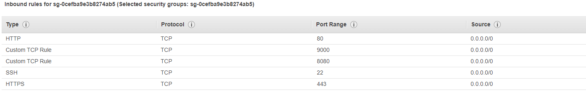

# Deploying a RHEL 8 EC2 Instance and Attaching a Public IP
Follow the steps below to deploy a RHEL 8 EC2 instance and attach a public IP:

## Sign in to AWS Console

1. Sign in to the AWS Management  [AWS Management](https://aws-dod-af-cce-p1-d-il2-p1-02.signin.amazonaws-us-gov.com/console) Console using your AWS credentials.

## Launch Instance

1. Navigate to the EC2 service by searching for "EC2" in the search bar or finding it under the "Compute" section.
2. Click on the "Launch Instance" button to start the instance creation process.

## Choose an Amazon Machine Image (AMI)

1. Select the appropriate RHEL 8 AMI from the available options. You can search for "RHEL 8" in the search bar to filter the results.
2. Click on the "Select" button to choose the AMI.

## Choose an Instance Type

1. Select the desired instance type based on your computer and memory requirements.
2. Click on the "Next: Configure Instance Details" button.

## Configure Instance Details

1. Configure the instance details such as the number of instances, network settings, and storage options according to your needs.
2. Ensure that the instance is launched in a public subnet to enable access from the internet.
3. Click on the "Next: Add Storage" button.

## Add Storage

1. Configure the storage options as required.
2. Adjust the size of the root volume or add additional volumes if needed.
3. Click on the "Next: Add Tags" button.

## Configure Security Group

1. Configure the security group to allow inbound access to the instance.
2. Add a rule to allow SSH (port 22), http 80, https 443,and JS-node port used for capturing webhook access from your IP address or a specific IP range.
3. Add rules for other services or protocols required for your application.
sample security group.

4. Click on the "Review and Launch" button.

## Review and Launch

1. Review the instance configuration to ensure all settings are correct.
2. Click on the "Launch" button.

## Select Key Pair

1. Choose an existing key pair or create a new one to securely access the instance.
2. Select the key pair and acknowledge that you have access to the associated private key.
3. Click on the "Launch Instances" button.

## View Instances

1. Click on the "View Instances" button to see the list of instances.
2. Wait for the instance to be in the "running" state.

## Create and attach elastic IP

1. Click on the "Elastic IPs" link under the "Network & Security" section in the left-hand navigation.
2. Click on the "Allocate Elastic IP address" button.
3. Select the "Amazon's pool of IPv4 addresses" option and click on the "Allocate" button.
4. Click on the "Close" button.
5. Select the newly created elastic IP and click on the "Actions" button.
6. Click on the "Associate Elastic IP address" button.
7. Select the instance you created in the previous steps and click on the "Associate" button.
8. Wait for the instance to be in the "running" state.
