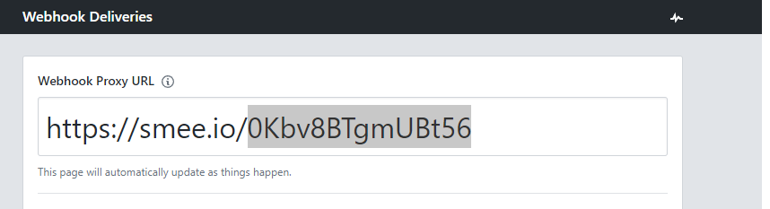

# Install Project & Dependencies 

Set up your local development environment: Open your terminal or command prompt and navigate to your project directory where you want to receive the webhooks.

Install the smee-client: To use smee.io on your local machine, you'll need to install the smee-client package. You can install it using Node Package Manager (npm) by running the following command in your terminal:

`npm install` 

# Set .env variables

Visit the smee.io website: Go to https://smee.io/ in your web browser. Smee.io is a service that helps you receive webhooks on your local development environment.

Generate a new channel: On the smee.io homepage, you'll see a "New Channel" button. Click on it to create a new channel for your webhook.

Copy channel ID highlighted below for .env variable

### Create .env in editor then add PORT and SMEE channel ID taken from previous step
`vi /repos-sync/.env`

`SMEE=0Kbv8BTgmUBt56`

`PORT=8080`

Start the smee-client: In the same terminal, run the following command:

`npm run smee:start`

This command starts the smee-client and establishes a connection between your local development environment and smee.io.

