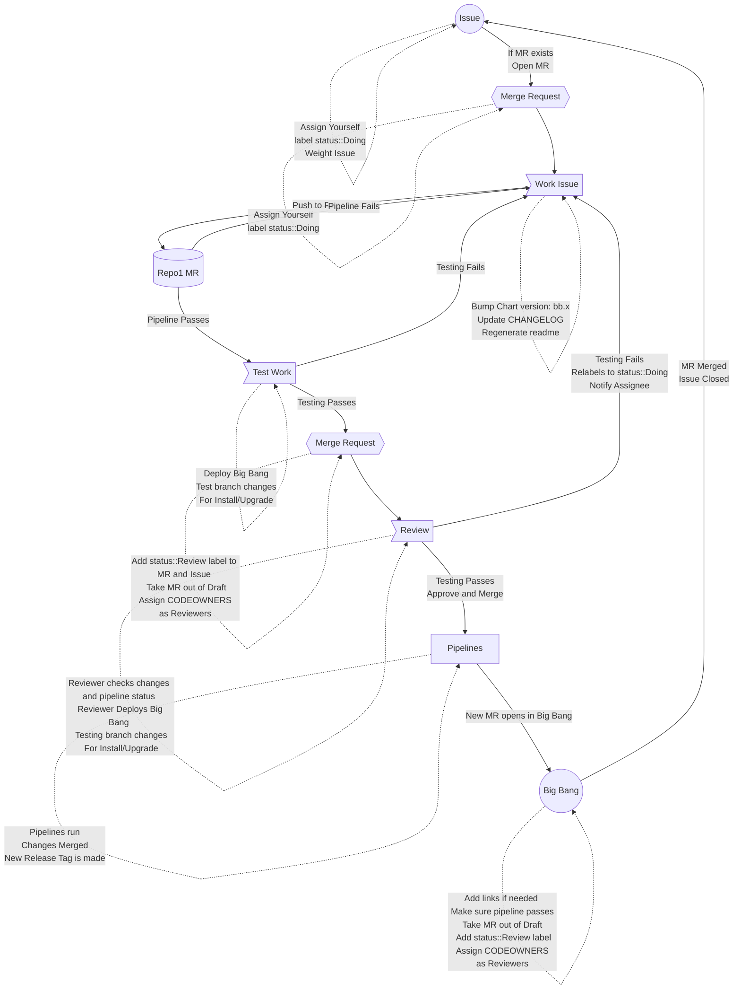

# Renovate Package Maintenance

The bread and butter of Big Bang is updating and providing timely releases for the Big Bang maintained helm charts. Most of these helm charts are based off of upstream vendor charts and repositories. This can be confirmed via seeing if a `chart/Kptfile` exists in our repository.

1. All Big Bang packages should contain a `docs/DEVELOPMENT_MAINTENANCE.md` file which should be reviewed and understood by codeowners and those working the package updates. It has all of the necessary changes to begin working a Renovate update for any given package. Repository CODEOWNERS should also be using this document when reviewing the updates for a Merge Request that is in `status::review` to ensure all items are being performed, or updating the documentation if a portion is no longer relevant or needed. This document is where all of our local changes and caveats should be documented when creating changes which deviate from upstream templates or values according to the [Develop Package](./develop-package.md) steps when onboarding a new package.

1. Once the package has been updated, tested, and verified according to the DEVELOPMENT_MAINTENANCE.md guide, the following steps should then be taken:

    a. Review pipeline and ensure all items are passing or if warnings are found, they are notated in the Merge Request comments or description. If an item mentioned in the [CI Workflow Document](./ci-workflow.md) is added `SKIP UPGRADE/skip-bb-mr` ensure this is notated why so we have justification as to why this was needed.

    b. The `## Upgrade Notices` section is accurately filled out in the MR description. This notice should be treated as customer public facing and should not include any internal team or CI specific notes for the package. Good examples of relevant upgrade notices are when a template or value moves or is renamed like a ENV var or value for an admin password for example, some change that will require downstream consumers of Big Bang to read and perform a change for their environment.

    c. Ensure `SKIP UPDATE CHECK` is removed from the MR title and a pipeline has ran with a `chart update check` stage.

    d. Add `status::review` label to issue and Merge Request.

1. Once merged into `main`, ensure post-MR pipelines for `main` and tag creation fully pass. Reach out to CODEOWNERS or anchors if issues arise.

1. After all MR, main, and tag pipelines pass and are successful, bigbang-bot will open a Big Bang Merge Request. Link your issue your assigned in the description after the `Closes` (e.g., `Closes https://repo1.dso.mil/ISSUE`). Ensure pipeline is passing and package/change related issues are not present in pipeline. Once pipeline is passing and is linked take MR out of draft status. Assign anchors and Big Bang codeowners as reviewers.

## General Renovate Issue Workflow

