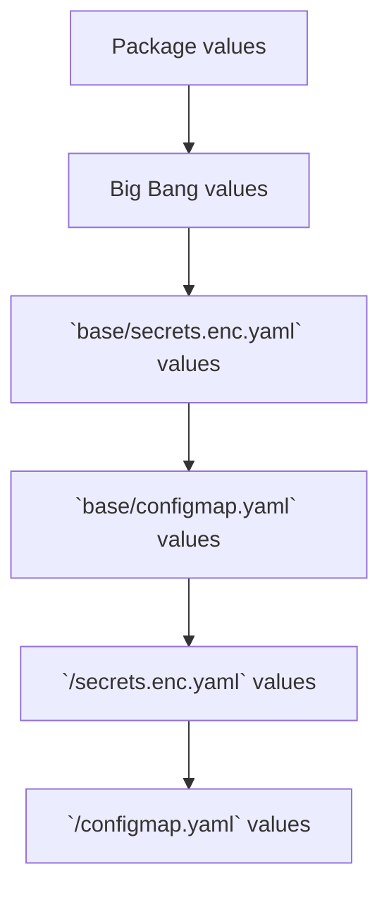

# Big Bang Configuration

[[_TOC_]]

## Overview

Configuration of Big Bang is achieved by overriding default values set in the package or Big Bang using the [environment template](https://repo1.dso.mil/platform-one/big-bang/customers/template).  The template has a 4 potential locations for setting values: `base/secrets.enc.yaml`, `base/configmap.yaml`, `<env>/secrets.enc.yaml`, and `<env>/configmap.yaml`.  Overrides proceed as follows, with `<env>/configmap.yaml` having the highest precedence.



In all four cases, Big Bang reads a single key named `values.yaml` that contains the data to override.  See the [Big Bang environment template](https://repo1.dso.mil/platform-one/big-bang/customers/template) for examples on how to use these files to override values.

## Pre-configuration

Before configuring Big Bang, it is expected that you have already setup:

- A Kubernetes cluster
- A [SOPS key pair](encryption.md)
- A Git repository to hold your configuration
  - Pull credentials for the Git repository (if not public)
- An Iron Bank robot account for production, or a non-robot account for testing. Reference [Iron Bank authentication](./troubleshooting.md#iron-bank-authentication) for additional details.
- Certificates specific to your environment (if needed)

## Minimum Viable Configuration

At a minimum, the following items must be configured for a default Big Bang deployment:

- [Big Bang version](#big-bang-version)
- [Environment Git repository](#environment-location)
- [Hostname](#hostname)
- [SOPS private key reference](encryption.md).
- [Registry pull credentials](#registry-pull-credentials)

The Big Bang [Environment Template](https://repo1.dso.mil/platform-one/big-bang/customers/template) has placeholders for all of the above.

## Big Bang Globals

### `hostname`

Hostname is used to override the domain of deployed packages.  This allows you to go to the DNS name of a server using the domain.  For example, if the domain is `bigbang.dev`, Kiali can be reached at `kiali.bigbang.dev`.

| Key | Description | Type | Default |
|--|--|--|--|
| `hostname` | Domain to use for deployed servers | Domain Name | `bigbang.dev`

### `registryCredentials`

Registry credentials are used to pull images for Big Bang.  By default, it points to Iron Bank, but can be modified to use a private registry.  These credentials are passed down to all relevant namespaces as an image pull secret.

| Key | Description | Type | Default |
|--|--|--|--|
| `registry` | Container registry location | Domain Name | `registry1.dso.mil`
| `username`* | Container registry username | String | "" |
| `password`* | User's password | String | "" |
| `email` | User's email | Email | "" |
> *Credentials should be SOPS encrypted

### `flux`

Flux settings are used to setup the default continuous deployment configuration for Big Bang packages.

| Key | Description | Type | Default |
|--|--|--|--|
| `interval` | Polling interval to check for Git or Helm chart updates | ##m##s | 2m |
| `install.retries` | The number of retries that should be attempted on Helm chart installation failures before bailing. | int | 3 |
| `upgrade.retries` | The number of retries that should be attempted on Helm chart upgrade failures before bailing. | int | 3 |
| `rollback.timeout` | The time to wait for any individual Kubernetes operation (like Jobs for hooks) during the performance of a Helm rollback action. | ##m##s | 5m |
| `rollback.cleanupOnFail` | Allows deletion of new resources created during the Helm rollback action when it fails. | Boolean | `true` |

### Package

Each package (e.g. `istio`, `clusterAuditor`) has configuration to control how Big Bang deploys the package

| Key | Description | Type | Default |
|--|--|--|--|
| `enabled` | Determines if the package will get deployed or skipped | Boolean | `true` (unless its an `addon`) |
| `git.repo` | Location of the Git repo holding the package deployment resources | URL | `https://repo1.dso.mil/platform-one/big-bang/apps/...`
| `git.branch` | Branch to use for package deployment resources | string | `chart-release` or `release-vx.x.x` |
| `git.commit` | SHA of specific commit to use in Git for package deployment resources | SHA | null |
| `git.tag` | Git tag to use for package deployment resources | string | null |
| `ingress.gateway` | Name of Istio Gateway to use for ingress (if supported) | string | "public" |
| `sso.*` | Single sign on configuration (if supported) | | |
| `database.*` | External database connection configuration (if supported) | | |
| `objectStorage.*` | Object storage configuration (if supported) | | |
| `values` | Package specific values to configure | List of key/values pairs | {} |
| `postRenderers` | See [docs/postrenderers.md](./postrenderers.md) | list | [] |

## Flux Resources

Big Bang deploys four flux resources that can be customized:

| Resource | Controls | Location |
|--|--|--|
| GitRepository | Environment | Top-level manifest (e.g. `dev.yaml`, `prod.yaml`)
| Kustomization | Environment | Top-level manifest (e.g. `dev.yaml`, `prod.yaml`)
| GitRepository | Big Bang | [Link](../base/gitrepository.yaml) |
| HelmRelease | Big Bang | [Link](../base/helmrelease.yaml) |

In addition, each package contains its own GitRepository and HelmRelease resource that can be customized.  Look in the [Helm chart templates](../chart/templates) for the these resources.

Settings for any of these resources can be overridden by [patching](https://kubectl.docs.kubernetes.io/references/kustomize/kustomization/patches/) the resource in your environment's kustomization files.  Use Flux's documentation for [GitRepository](https://toolkit.fluxcd.io/components/source/gitrepositories/), [HelmRelease](https://toolkit.fluxcd.io/components/helm/helmreleases/), and [Kustomization](https://toolkit.fluxcd.io/components/kustomize/kustomization/) to find settings for these resources. The following are examples of commonly requested custom patches covered in the [bigbang template repo]<https://repo1.dso.mil/platform-one/big-bang/customers/template/-/tree/main#flux-components>):

- Updating flux-system component resource usage
  - [Example `kustomization.yaml`](https://repo1.dso.mil/platform-one/big-bang/customers/template/-/tree/main#adjust-resource-allocation-for-a-flux-system-component)
  - This patch could be used to adjust the resources requested by the `flux-system/helm-controller` resource. A similar patch could be used to adjust the resources required by the other flux components.
  > NOTE: If flux is under-resourced, occasionally requests can fail in a manner that looks like a network connectivity issue (use with caution)
- Adding environment variables to flux-system components
  - [Example `kustomization.yaml`](https://repo1.dso.mil/platform-one/big-bang/customers/template/-/tree/main#adjust-resource-allocation-for-a-flux-system-component)
  - This patch could be used to add AWS credential environment variables into the `flux-system/kustomize-controller` resource to enable SOPS decryption using a KMS key from outside of AWS.
- Changing the image name / version
  - [Example `kustomization.yaml`](https://repo1.dso.mil/platform-one/big-bang/customers/template/-/tree/main#updating-a-flux-system-component-image-tag)
  - This patch could be used to update the tag of the flux-system component image to be deployed.

> NOTE: Multiple patches could be applied within a single kustomization.yaml

## Big Bang Version

In your `kustomization.yaml` under your environment, here is an example of how to override the version of Big Bang you will use.  You can also use a tag or branch if desired.

```yaml
bases:
- https://repo1.dso.mil/platform-one/big-bang/bigbang.git/base/?ref=v1.2.*
patchesStrategicMerge:
- |-
  apiVersion: source.toolkit.fluxcd.io/v1beta1
  kind: GitRepository
  metadata:
    name: bigbang
  spec:
    ref:
      $patch: replace
      semver: "1.2.x"
```

> Note: You must put the version in two places, once for Kustomize to pull the right configuration base and two for Git Repository to pull the right Helm Chart.

## Environment Location

In your top-level `<env>.yaml` Kubernetes manifest, you would place configuration for the location of your environment.  Here is an example:

```yaml
apiVersion: source.toolkit.fluxcd.io/v1beta1
kind: GitRepository
metadata:
  name: environment-repo
  namespace: bigbang
spec:
  interval: 1m
  url: https://repo1.dso.mil/platform-one/big-bang/customers/template.git
  ref:
    branch: main
---
apiVersion: kustomize.toolkit.fluxcd.io/v1beta1
kind: Kustomization
metadata:
  name: environment
  namespace: bigbang
spec:
  interval: 1m
  sourceRef:
    kind: GitRepository
    name: environment-repo
  path: ./dev
  prune: true
  decryption:
    provider: sops
    secretRef:
      name: sops-gpg
```

## Registry Pull Credentials

If you have pull credentials for your docker registry, add them to `secrets.enc.yaml`.  Here is an example:

> The name of the Secret must be `common-bb` or `environment-bb` for Big Bang to read values from it.

```yaml
apiVersion: v1
kind: Secret
metadata:
    name: common-bb
stringData:
    values.yaml: |-
        registryCredentials:
          username: iron-bank-user
          password: iron-bank-password
```

You will also need to update your `kustomization.yaml` to merge with the existing secret:

```yaml
namespace: bigbang
patchesStrategicMerge:
- secrets.enc.yaml
```

## Package settings

Besides the [global settings](#big-bang-globals), package settings are defined by the individual packet's helm charts.   You can find these by reviewing the `git.registry` setting for the package in Big Bang's [default values.yaml](../chart/values.yaml)

To modify a non-sensitive package setting, add it to your `configmap.yaml`.  For sensitive information, follow the pattern for setting [registry pull credentials](#registry-pull-credentials).  Here we disable `twistlock` and set `gatekeeper`'s replicas to `1`:

```yaml
twistlock:
  enabled: false

gatekeeper:
  values:
    replicas: 1
```

You will also need to merge this file with the existing configmaps in `kustomization.yaml`.

> The name of the ConfigMap must be `common` or `environment` for Big Bang to read values from it.

```yaml
namespace: bigbang
configMapGenerator:
  - name: common
    behavior: merge
    files:
      - values.yaml=configmap.yaml
```
