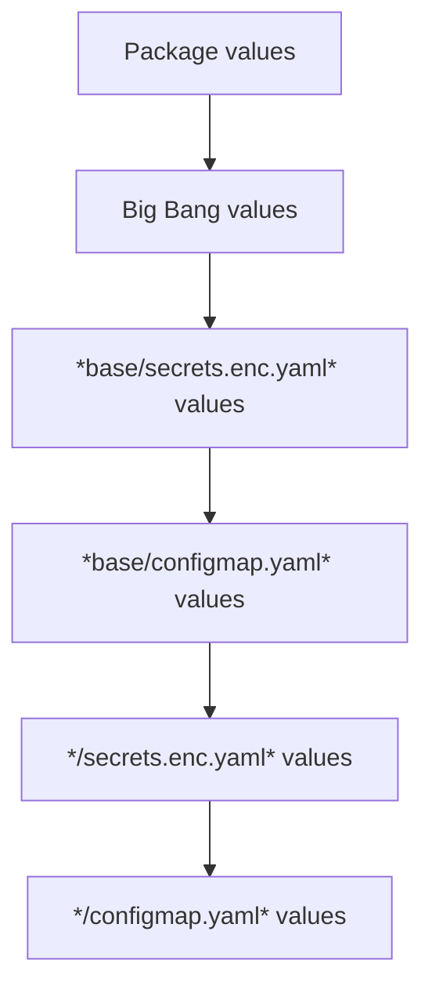

# Configuration

[[_TOC_]]

## Overview

Configuration of Big Bang is achieved by overriding default values set in the package or Big Bang using the [environment template](https://repo1.dso.mil/big-bang/customers/template).  The template has a 4 potential locations for setting values: `base/secrets.enc.yaml`, `base/configmap.yaml`, `<env>/secrets.enc.yaml`, and `<env>/configmap.yaml`.  Overrides proceed as follows, with `<env>/configmap.yaml` having the highest precedence.



In all four cases, Big Bang reads a single key named `values.yaml` that contains the data to override.  See the [Big Bang environment template](https://repo1.dso.mil/big-bang/customers/template) for examples on how to use these files to override values.

## Pre-configuration

Before configuring Big Bang, it is expected that you have already setup:

- A Kubernetes cluster
- A [SOPS key pair](../concepts/encryption.md)
- A Git repository to hold your configuration
  - Pull credentials for the Git repository (if not public)
- An Iron Bank robot account for production, or a non-robot account for testing. Reference [Iron Bank authentication](../operations/troubleshooting/index.md#iron-bank-authentication) for additional details.
- Certificates specific to your environment (if needed)

## Minimum Viable Configuration

At a minimum, the following items must be configured for a default Big Bang deployment:

- [Big Bang version](#big-bang-version)
- [Environment Git repository](#environment-location)
- [Domain](#domain)
- [SOPS private key reference](../concepts/encryption.md).
- [Registry pull credentials](#registry-pull-credentials)

The Big Bang [Environment Template](https://repo1.dso.mil/big-bang/customers/template) has placeholders for all of the above.

## Big Bang Globals

### `domain`

`domain` sets the base DNS domain for package ingress hosts. For example, if the domain is `bigbang.dev`, Kiali can be reached at `kiali.bigbang.dev`.

| Key      | Description                        | Type        | Default           |
| -------- | ---------------------------------- | ----------- | ----------------- |
| `domain` | Domain to use for deployed servers | Domain Name | `dev.bigbang.mil` |

### `registryCredentials`

`registryCredentials` supplies image-pull authentication to relevant package namespaces. Its default is `null`, in which case Big Bang does not create its shared registry Secret or add image pull secrets. This is appropriate only when the environment provides another authenticated pull mechanism or all configured images are public.

| Key          | Description                 | Type        | Default             |
| ------------ | --------------------------- | ----------- | ------------------- |
| `registry`   | Container registry location | Domain Name | `registry1.dso.mil` |
| `username`\* | Container registry username | String      | Required when set   |
| `password`\* | Registry password or token  | String      | Required when set   |
| `email`      | User's email                | Email       | ""                  |

Supply either one credential mapping or a list of mappings for multiple registries. Credentials stored in the environment repository should be SOPS encrypted.

### `flux`

Flux settings control reconciliation defaults inherited by Big Bang package `HelmRelease` resources. Important current defaults include:

| Key | Description | Type | Default |
|--|--|--|--|
| `timeout` | Timeout for Helm operations | Duration | `10m` |
| `interval` | Reconciliation interval | Duration | `2m` |
| `install.remediation.retries` | Installation remediation retries (`-1` means unlimited) | Integer | `-1` |
| `upgrade.remediation.retries` | Upgrade remediation retries | Integer | `3` |
| `upgrade.cleanupOnFail` | Delete resources created during a failed upgrade | Boolean | `true` |
| `rollback.timeout` | Timeout for rollback operations | Duration | `10m` |
| `rollback.cleanupOnFail` | Allows deletion of new resources created during the Helm rollback action when it fails. | Boolean | `true` |

Use the generated [configuration reference](base-config.md) for the complete schema for the selected release.

### Package

Each package has an `enabled` switch, source configuration, optional Flux overrides, package-chart values, and optional [post-renderers](postrenderers.md). Source fields depend on whether `sourceType` is `git` or `helmRepo`; do not combine examples from the two modes. Package availability and defaults change between releases, so use the selected release's [`chart/values.yaml`](../../chart/values.yaml), generated [configuration reference](base-config.md), and package documentation rather than a copied generic package schema.

## Flux Resources

The manifests in [`base/`](../../base) create the Flux resources that install Big Bang. The environment repository creates the resources that reconcile environment configuration:

| Resource      | Controls    | Location                                          |
| ------------- | ----------- | ------------------------------------------------- |
| GitRepository | Environment | Top-level manifest (e.g. `dev.yaml`, `prod.yaml`) |
| Kustomization | Environment | Top-level manifest (e.g. `dev.yaml`, `prod.yaml`) |
| GitRepository | Big Bang    | [`base/gitrepository.yaml`](../../base/gitrepository.yaml) |
| HelmRelease   | Big Bang    | [`base/helmrelease.yaml`](../../base/helmrelease.yaml) |

The Big Bang chart also renders a `GitRepository`, `Kustomization`, and `HelmRelease` for each enabled package. See the [package templates](../../chart/templates/package).

Set common reconciliation behavior through the [`flux` chart values](#flux). For settings that are not exposed as values, patch the applicable base or environment resource in the environment repository. Review the rendered manifests before applying a patch because package resource names and fields can change between Big Bang releases. Use the current Flux API documentation for [`GitRepository`](https://fluxcd.io/flux/components/source/gitrepositories/), [`HelmRelease`](https://fluxcd.io/flux/components/helm/helmreleases/), and [`Kustomization`](https://fluxcd.io/flux/components/kustomize/kustomizations/).

## Big Bang Version

Pin an immutable Big Bang release tag in both places that consume this repository:

1. The remote `base/` reference used by the environment's Kustomization.
2. The `spec.ref` of the `bigbang` `GitRepository` defined in [`base/gitrepository.yaml`](../../base/gitrepository.yaml).

Keep these references on the same release. Do not use `main`, `master`, or a moving semver range for a production deployment. Review the selected release's notes and its [`Chart.yaml` Kubernetes constraint](../../chart/Chart.yaml) before changing the pin.

## Environment Location

In your top-level `<env>.yaml` Kubernetes manifest, you would place configuration for the location of your environment.  Here is an example:

```yaml
apiVersion: source.toolkit.fluxcd.io/v1
kind: GitRepository
metadata:
  name: environment-repo
  namespace: bigbang
spec:
  interval: 1m
  url: https://repo1.dso.mil/big-bang/customers/template.git
  ref:
    branch: main
---
apiVersion: kustomize.toolkit.fluxcd.io/v1
kind: Kustomization
metadata:
  name: environment
  namespace: bigbang
spec:
  interval: 1m
  sourceRef:
    kind: GitRepository
    name: environment-repo
  path: ./dev
  prune: true
  decryption:
    provider: sops
    secretRef:
      name: sops-gpg
```

## Registry Pull Credentials

If you have pull credentials for your docker registry, add them to `secrets.enc.yaml`.  Here is an example:

> The name of the Secret must be `common-bb` or `environment-bb` for Big Bang to read values from it.

```yaml
apiVersion: v1
kind: Secret
metadata:
  name: common-bb
stringData:
  values.yaml: |-
    registryCredentials:
      username: iron-bank-user
      password: iron-bank-password
```

You will also need to update your `kustomization.yaml` to merge with the existing secret:

```yaml
namespace: bigbang
patchesStrategicMerge:
  - secrets.enc.yaml
```

## Package settings

Besides the [global settings](#big-bang-globals), package settings are defined by the individual packet's helm charts.  You can find these by reviewing the `git.registry` setting for the package in Big Bang's [default values.yaml](../../chart/values.yaml).

To modify a non-sensitive package setting, add it to your `configmap.yaml`.  For sensitive information, follow the pattern for setting [registry pull credentials](#registry-pull-credentials).  Here we disable `twistlock` and set `gatekeeper`'s replicas to `1`:

```yaml
twistlock:
  enabled: false

gatekeeper:
  values:
    upstream:
      replicas: 1
```

You will also need to merge this file with the existing configmaps in `kustomization.yaml`.

> The name of the ConfigMap must be `common` or `environment` for Big Bang to read values from it.

```yaml
namespace: bigbang
configMapGenerator:
  - name: common
    behavior: merge
    files:
      - values.yaml=configmap.yaml
```
