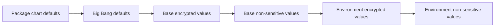

# Configure Big Bang

[[_TOC_]]

Big Bang configuration declares which packages Flux deploys, where their sources come from, and which global or package-specific values they receive. Keep desired state in an environment repository and treat the selected Big Bang release—not copied examples—as the source of defaults and supported keys.

## Configuration Sources of Truth

Use these sources for different questions:

| Question | Source |
| --- | --- |
| Which values are documented, and what are their defaults? | Generated [Values Reference](base-config.md) |
| Which values are valid? | [`chart/values.schema.json`](../../chart/values.schema.json) |
| What does Big Bang render? | [`chart/templates`](../../chart/templates) and locally rendered manifests |
| Which values does an individual package accept? | That package's documentation and chart values |
| How are environment files organized and bootstrapped? | [Big Bang customer template](https://repo1.dso.mil/big-bang/customers/template) |

The values reference is generated from the same `Chart.yaml` and `values.yaml` shipped in each release. The schema remains the exhaustive contract for valid keys and types. Do not maintain a separate hand-written list of defaults.

## Configuration Workflow

### 1. Pin the Release

Pin an immutable Big Bang release tag in both the remote `base/` reference used by the environment Kustomization and the `spec.ref` of the `bigbang` `GitRepository`. Keep both references on the same release.

Before changing the pin, review the release notes and confirm the target cluster satisfies that release's [`kubeVersion` constraint](../../chart/Chart.yaml). See [First Customer-managed Deployment](../getting-started/first-deployment.md) for the complete deployment sequence.

### 2. Layer Environment Values

The customer template separates reusable base configuration from environment-specific overrides. In both scopes, non-sensitive and sensitive values are stored separately:



Later inputs take precedence over earlier inputs. Each generated ConfigMap or Secret contains a `values.yaml` key consumed by the Big Bang `HelmRelease`. Use the customer template for the current filenames and Kustomize wiring; those implementation details may evolve independently of the Big Bang values API.

### 3. Configure Global Values

Common global settings include:

- `domain` for the base DNS domain used by package ingress hosts.
- `registryCredentials` for one or more private image registries.
- `git` for shared Git source authentication.
- `helmRepositories` for Helm or OCI sources and their credentials.
- `flux` for package reconciliation behavior.
- `networkPolicies` for shared network-policy settings.
- `openshift` for OpenShift-specific rendering.

Use the [Values Reference](base-config.md) for the exact structure and defaults in the selected release. Put credentials and other sensitive values in SOPS-encrypted files; see [Encryption](../concepts/encryption.md).

### 4. Configure Packages

Each integrated or additional package has an `enabled` switch, source configuration, optional Flux overrides, package-chart values, and optional [post-renderers](postrenderers.md).

Package sources use one of two modes:

- `sourceType: git` uses the package's `git` configuration and a Flux `GitRepository`.
- `sourceType: helmRepo` uses the package's `helmRepo` configuration and a named entry from global `helmRepositories`.

Do not combine fields from both source modes. Values under a package's `values` key pass through to that package chart and are documented by the package, not by the Big Bang values reference.

Use the [package index](../packages/) to find integration guidance. Use [Extra Package Deployment](../installation/environments/extra-package-deployment.md) for applications that are not integrated directly into Big Bang.

### 5. Render and Validate

Validate changes before committing them to the environment repository:

```shell
helm lint ./chart -f path/to/values.yaml
helm template bigbang ./chart \
  --namespace bigbang \
  -f path/to/values.yaml > /tmp/bigbang-rendered.yaml
```

Use the exact chart checkout and complete ordered values set intended for the environment. Review the rendered sources, releases, namespaces, Secrets, ingress objects, policies, and persistent resources—not only whether Helm exits successfully.

For encrypted environment configuration, also run the customer template's Kustomize/SOPS validation workflow before pushing.

### 6. Reconcile and Verify

After review and merge, observe reconciliation from the environment source through Big Bang and its packages:

```shell
flux get sources all -A
flux get kustomizations -A
flux get helmreleases -A
```

Verify workload health and application behavior after Flux reports Ready. See [Troubleshoot Upgrades](../operations/troubleshooting/upgrades.md) for a layer-by-layer diagnostic workflow.

## Focused Configuration Guides

- [Gateway and TLS configuration](gateways.md)
- [Network policies](network-policies.md)
- [Post-renderers](postrenderers.md)
- [Istio ambient mode](ambient.md)
- [Mission applications in ambient mode](ambient-mission-apps.md)
- [Package credentials](default-credentials.md)

The existing [Production Configuration](sample-prod-config.md) page contains package-specific considerations for GitLab, Vault, and Keycloak; it is not a complete production baseline.
