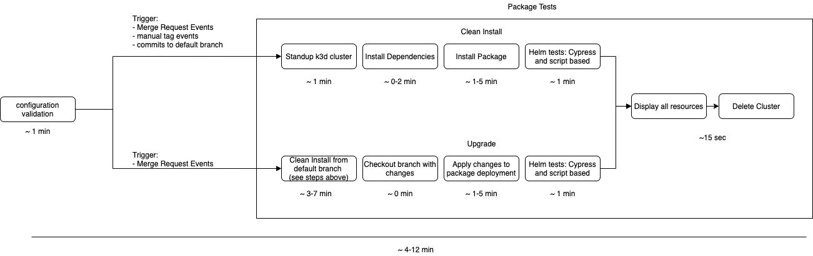
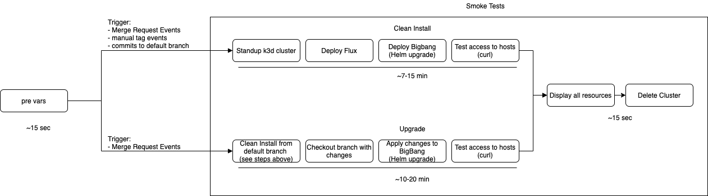
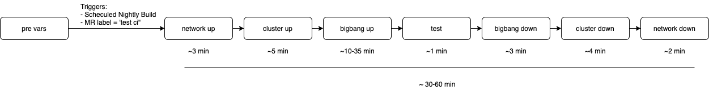

# Big Bang GitLab Continuous Integration (CI) Workflow

This document is meant to serve as an overview of the pipeline stages required to get a commit merged. There are package, bigbang, and infrastructure pipelines.

[[_TOC_]]

## Bigbang Runners Overview

### Privileged Runners

  These run on a privileged node pool with limited access to allow for docker in docker k3d clusters.
  * Package runners:
      * Separate runners for each BBTOC stage: graduated, incubating, and sandbox.
      * These run package k3d pipelines.
  * bigbang runner:
      * Runner used specifically for the bigbang repo.
      * This runs bigbang k3d pipelines.
    
### Non-Privileged Runners

  These run on a non-privileged node pool.
  * Generic runner:
      * This runner picks up all non-privileged stages within all pipelines: configuration validation, chart update check, and pre vars.
      * Used to spin up infrastructure testing clusters.
  * Release runner:
      * This runner handles all package and release stages in all pipelines.
      * Hashes, signs, and pushes all artifacts to bigbang umbrella s3 bucket.

## Package Pipeline Stages

This pipeline is triggered by the following for individual bigbang packages:

* Merge Request (MR) events
    * **NOTE:** Currently upgrade step only runs during MR events
* Manual tag events
* Commits to default branch

[Link to draw.io diagram file](../assets/diagrams/developer/bb-gitlab-ci-diagram.drawio). This diagram file should be modified on draw.io and exported into this repository when the developer/CI workflow changes. It is provided here for ease of use.

### Chart Update Check

This stage validates that the required files have been updated; README, Changelog, and Chart.yaml. All of these are needed to ensure a package releases can be created. If changes are only documentation a 'SKIP UPDATE CHECK' can be added to the merge request title to skip this check.

### Configuration Validation

This stage runs a `helm conftest` which is a plugin for testing helm charts with Open Policy Agent. It provides the following checks:

* Confirms that the helm chart is valid (e.g., should fail similar to how a helm lint fails if there is bad yaml).
* Runs the helm chart against a set of rego policies. Currently, these tests will only raise warnings on "insecure" things and will allow pipeline to proceed.

This stage also validates the oscal-component.yaml and checks for api deprecations within the package.

### Validate MR

This stage checks the MR description to ensure the `## Upgrade Notices` section contains information that is not the default `(Include any relevant notes about upgrades here or write "N/A" if there are none)`. This section is required to be filled out as if an upgrade notice is present, r2d2 will pull it into the Release Notes for the corresponding milestone. These Notices should be seen and written as customer facing when a template/secret/value name is updated that may require users to alter their configuration, this is not meant for internal or CI facing notes.

### Package Tests

This stage verifies several easy-to-check assumptions, including the following:

* Does package successfully install?
* Does package successfully upgrade (from master)?
* Package specific tests.

If required, the upgrade step can be skipped when the MR title starts with 'SKIP UPGRADE.'

### Auto Tag

When there is a merge into the default branch of a package, this stage is triggered and it will create a tag based on the version in the packages Chart.yaml.

### Package 

This stage is triggered when a protected tag is created. It is responsible for populating the image list, packaging the repo, prepping release, publishing to the s3 bucket, and pulling release notes from the changelog.

### Release

Upon successful completion of the package stage, this release stage will use those artifacts and run the gitlab release-cli utility to publish the release.

### Creating bigbang MR

Post merge to the default branch and tag creation above, the last step of the package release stage will perform `Creating bigbang Merge Request` which will pull down information from the package MR and auto increment the package's `git/helmRepo.tag` value along with pulling in the CHANGELOG and linking the package merge request. This stage can be skipped by adding `skip-bb-mr` label to the package MR pre-tag/release pipeline if a bigbang MR is already opened that will be manually updated to include the new tag.

## bigbang Pipeline Stages

This pipeline is triggered by the following for bigbang:

* MR events
    * **NOTE:** Currently upgrade step only runs during MR events
* Manual tag events
* Commits to default branch

The pipeline is split into several stages:

[Link to draw.io diagram file](../assets/diagrams/developer/bb-gitlab-ci-diagram.drawio). This diagram file should be modified on draw.io and exported into this repository when the developer/ci workflow changes. It is provided here for ease of use.

### Pre Vars

This stage generates a terraform var, grabs merge request labels, checks for changes from master to determine what packages have changes, and validates the oscal-component.yaml.

### Smoke Tests

For fast feedback testing, an ephemeral in cluster pipeline is created using [`k3d`](https://k3d.io) that lives for the lifetime of the gitlab ci job (max 1 hour).  Within that cluster, BigBang is deployed, and an initial set of smoke tests are performed against the deployment to ensure basic conformance.

This stage verifies several easy to check assumptions, including:

* Does BigBang successfully install?
* Does BigBang successfully upgrade (from master)?
* Are endpoints routable?

This stage will fail if:

* script failures
* gitrepositories status condition != ready
* expected helm releases are not present
* helm releases fail or timeout
* kustomization secrets are not ready or timeout
* deployments status condition != ready
* jobs status condition != complete
* statefulsets/daemonsets not 100% ready (ex. 0/1)
* any virtual service endpoints are not accessible

This stage also serves as a guide for local development, and care is taken to ensure all pipeline actions within this stage are repeatable locally.

This stage is ran on every MR event, and is a requirement for merging.

### Package 

This stage is triggered when a protected tag is created. It is responsible for populating the image list, packaging repos, prepping release, publishing to the s3 bucket, and pulling release notes from the changelog.

### Release

Upon successful completion of the package stage this release stage will use those artifacts and run the gitlab release-cli utility to publish the release.

## Infrastructure Testing Pipeline Stages

Ultimately, BigBang is designed to deploy production ready workloads on real infrastructure.  While local and ephemeral clusters are excellent for fast feedback during development, changes must ultimately be tested on real clusters on real infrastructure.

As part of Big Bang's architecture, it is expected work on any CNCF conformant Kubernetes cluster, on multiple clouds, and on premise environments.  By very definition, this means infrastructure testing is _slow_.  To strive for a pipeline with a happy medium of providing fast feedback while still exhaustively testing against environments that closely mirror production, __infrastructure testing only occurs on manual actions on merge request commits.__
This requires adding `test-ci::infra` label to your MR. In addition, infrastructure testing pipeline is run nightly on a schedule.

**NOTE:** Due to the amount of resources and time required for this pipeline, the `test-ci::infra` label should be used sparingly. The scheduled nightly run will ideally catch issues if they are already in master. The `test-ci::infra` label should mainly be used when:

* Your changes affect the infra ci
* Your changes are large in scope and likely to behave differently on "real" clusters

When you are comfortable your branch is ready to be merged, opening up an merge request will trigger the creation of a suite of infrastructure testing jobs which will require a manual action from a project maintainer (assuming smoke tests have passed).  Once the commit(s) are validated against the infrastructure tests, your changes are ready to be merged!

For _most_ of the infrastructure testing, `terraform` is chosen as the IAC tool of choice for infrastructure that BigBang owns, while the cluster creation process follows the vendors recommended installation process.

The infrastructure pipeline is designed to have _no_ human interaction, and is scoped to the lifecycle of the pipeline.  This means a single pipeline is fully responsible for provisioning infrastructure, but just as important, deprovisioning infrastructure, ensuring resources are not orphaned.

More information on the full set of infrastructure tests are provided in the following:

[Link to draw.io diagram file](../assets/diagrams/developer/bb-gitlab-ci-diagram.drawio). This diagram file should be modified on draw.io and exported into this repository when the developer / ci workflow changes. It is provided here for ease of use.

### Network Creation

For each cloud, a BigBang owned network will be created that conform with the appropriate set of tests about to be ran.  For example, to validate that Big Bang deploys in a connected environment on AWS, a VPC, subnets, and/or route tables are created, and the outputs are made available through terraform's remote `data` source.

At this time the infrastructure testing pipeline is only utilizing internet-connect AWS govcloud.

### Cluster Creation

The infrastructure pipeline is currently setup to standup an `rke2` cluster by default.

An `rke2` cluster is created that leverages the upstream [terraform modules](https://repo1.dso.mil/platform-one/distros/rancher-federal/rke2/rke2-aws-terraform)

It is a hard requirement at this stage that every cluster outputs an admin scoped `kubeconfig` as a gitlab ci artifact.  This artifact will be leveraged in the following stages for interacting with the created cluster.

### Big Bang Installation

Given the kubeconfig created in the previous stage, BigBang is installed on the cluster using the same installation process used in the smoke tests.

Like any BigBang installation, several cluster requirements (see [Pre-requisites](../prerequisites/kubernetes-preconfiguration.md)) must be met before BigBang is installed, and it is up to the vendor to ensure those requirements are met.

### Big Bang Tests

Assuming BigBang has installed successfully, additional tests residing within the `./tests` folder of this repository are run against the deployed cluster.

Currently, there are three test scripts that test the following:

* Wait for resources to be ready, ensures everything goes to running at a kubernetes level.
* Curl VirtualService endpoints, to validate istio works + the UIs are up.
* Fetch a list of non-IB images; this test never fails, but provides some contextual info.

### Teardown

Infrastructure teardown happens in the reverse sequence as to which they are deployed, and the pipeline will ensure these teardown jobs are *always* ran, regardless of whether or not the previous jobs were successful.

Combined with terraform's declarative remote state, the "always on" teardown ensures no orphaned resources are left over once tests are run.

Within the teardown process, the commit scoped terraform workspace is also deleted to ensure the remote state remains clean.

For example, if an RKE2 cluster fails to provision, a full teardown of bigbang, RKE2, and the network will be run, even though BigBang was never deployed.  This will result in two failing jobs (i.e., RKE2 up and bigbang down), but will ensure that no infrastructure resources become orphaned.
