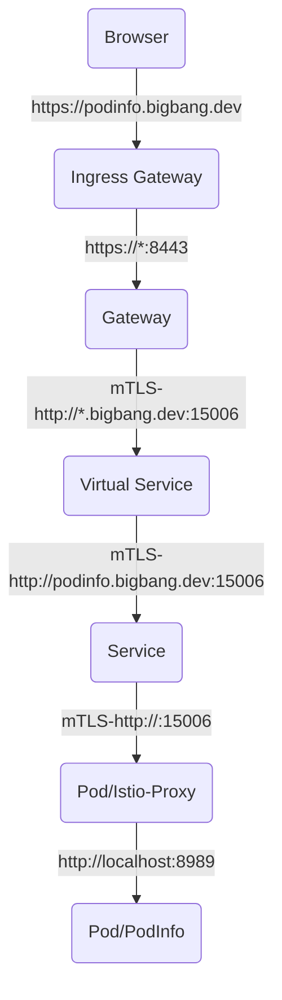

# Big Bang Package: Service Mesh Integration

[Istio](https://istio.io/) provides the [service mesh](https://istio.io/latest/about/service-mesh/) for Big Bang.  The service mesh assists with secure traffic routing in the cluster.  This document will show you how to update your package to support Big Bang's configuration of Istio.

## Prerequisites

- [Helm](https://helm.sh/docs/intro/install/)
- [Kubectl](https://kubernetes.io/docs/tasks/tools/#kubectl)
- [Git](https://git-scm.com/book/en/v2/Getting-Started-Installing-Git)
- A multi-node Kubernetes cluster to deploy Big Bang and your package
- A [Big Bang project containing the upstream Helm chart](./package-integration-upstream.md)

> Throughout this document, we will be setting up an application called `podinfo` as a demonstration

## Sidecar

The [Istio sidecar](https://istio.io/latest/docs/reference/config/networking/sidecar/) is a container that can be automatically injected into all package pods to provide encrypted traffic using [mutual TLS](https://istio.io/latest/docs/tasks/security/authentication/authn-policy/#auto-mutual-tls).  It also enables detailed [packet tracing](https://istio.io/latest/docs/tasks/observability/distributed-tracing/jaeger/) and [network traffic metrics](https://istio.io/latest/docs/ops/configuration/telemetry/envoy-stats/).

When Istio is enabled in the values, we want the sidecar to automatically be injected.  This can be achieved by adding the following to `bigbang/templates/podinfo/namespace.yaml`:

```yaml
metadata:
  labels:
    {{- if .Values.istio.enabled }}
    istio-injection: "enabled"
    {{- end }}
```

> Most packages are compatible with Istio's sidecar, but if you need to disable this, change the label to `istio-injection: "disabled"` in `bigbang/templates/podinfo/namespace.yaml`.

## Virtual Service

If your package has an externally facing service (e.g. URL, port), you will need to setup a `VirtualService` in Istio to access it from outside the cluster.

> Connections from inside the cluster can use the `Service` and do not require a `VirtualService`

For `https` connections, Istio will provide end-to-end encryption using TLS termination and mutual TLS to the sidecar.  Therefore, the `http` connection on the pod can be used for the virtual service.

> In some cases, you may have multiple services that need to be exposed.  A separate `VirtualService` should be created for each one.  See [this example](https://repo1.dso.mil/platform-one/big-bang/apps/security-tools/anchore-enterprise/-/blob/1.14.7-bb.2/chart/templates/bigbang/anchore-vs.yaml)

### virtualservice.yaml

Setup `chart/templates/bigbang/virtualservice.yaml` with the following default content:

```yaml
{{- $pkg := "podinfo" }}
{{- if and .Values.istio.enabled (get .Values.istio $pkg).enabled }}
apiVersion: networking.istio.io/v1beta1
kind: VirtualService
metadata:
  name: {{ $pkg }}
  namespace: {{ .Release.Namespace }}
  labels:
    {{- include (printf "%s.labels" $pkg) . | nindent 4 }}
    app.kubernetes.io/instance: {{ .Release.Name }}
spec:
  gateways:
  {{- range (get .Values.istio $pkg).gateways }}
    - {{ . }}
  {{- end }}
  hosts:
  {{- range (get .Values.istio $pkg).hosts }}
    - {{ tpl . $}}
  {{- end }}
  http:
  - route:
    - destination:
        port:
          number: {{ .Values.port | default "8080" }}
        host: {{ $pkg }}.{{ .Release.Namespace }}.svc.cluster.local
{{- end }}
```

The virtual service must be adjusted to make it compatible with the upstream chart by making the following changes:

- Change the service name to use the same pattern as other resources in the package.  For `podinfo`, this is `template "podinfo.fullname" .`.
- Adjust the labels to adhere to the [standard Helm labels](https://helm.sh/docs/chart_best_practices/labels/#standard-labels)
  - Re-use `_helper.tpl` functions from the upstream chart for common labels.  In this case, we are including the helper `podinfo.labels`.
  - Supplement the missing labels from the helper function.  In our case, the helper function was missing `app.kubernetes.io/instance`.
- Typically, there is a value for the http port in `chart/values.yaml`.  Use this in `spec.http[0].route[0].destination.port.number`.  In this case, we need to change `.Values.port` to `.Values.service.externalPort`.
- If your service name is not the same as the package name, you will need to change `spec.http[0].route[0].destination.host` to the service name.  For `podinfo`, it uses the helper `podinfo.fullname` to create the service name.

The final `virtualservice.yaml` looks like this:

```yaml
{{- $pkg := "podinfo" }}
{{- if and .Values.istio.enabled (get .Values.istio $pkg).enabled }}
apiVersion: networking.istio.io/v1beta1
kind: VirtualService
metadata:
  name: {{ template "podinfo.fullname" . }}
  namespace: {{ .Release.Namespace }}
  labels:
    {{- include (printf "%s.labels" $pkg) . | nindent 4 }}
    app.kubernetes.io/instance: {{ .Release.Name }}
spec:
  gateways:
  {{- range (get .Values.istio $pkg).gateways }}
    - {{ . }}
  {{- end }}
  hosts:
  {{- range (get .Values.istio $pkg).hosts }}
    - {{ tpl . $}}
  {{- end }}
  http:
  - route:
    - destination:
        port:
          number: {{ .Values.service.externalPort | default "8080" }}
        host: {{ template "podinfo.fullname" . }}.{{ .Release.Namespace }}.svc.cluster.local
{{- end }}
```

> For configuring a connection for something other than `http`, read  [Istio's documentation on traffic management](https://istio.io/latest/docs/ops/configuration/traffic-management/) to determine the best course of action.

### Package Defaults

In `chart/values.yaml`, default values for Istio are required as placeholders for the Helm templating.  We should assume that Istio is **not** installed in our defaults.  Add the following content to the values:

```yaml
# Big Bang Values
domain: bigbang.dev
istio:
  enabled: false
  podinfo:
    enabled: true
    gateways:
    - istio-system/main
    hosts:
    - podinfo.{{ .Values.domain }}
```

Some notes on the defaults:

- Always add a comment to modifications made to the upstream chart to assist with upgrading in the future
- `istio-system/main` is the default gateway created by the Istio Helm chart.  Big Bang will override this with `istio-system/public`, which it uses as the default gateway.
- The default FQDN is `podinfo.bigbang.dev`, which can be overridden if desired

#### Big Bang Defaults

Set the following in `bigbang/values.yaml` to enable Istio for integration testing.  These values will be used in the next section:

```yaml
# Update existing values
istiooperator:
  enabled: true
istio:
  enabled: true

# Add new value
podinfo:
  ingress:
    gateway: ""
```

### Big Bang Passdowns

Big Bang must override the default values for the package to passdown configuration.  It uses `bigbang/templates/podinfo/values.yaml` to do this.  Add the following content to the `bigbang.defaults.podinfo` definition:

```yaml
{{- define "bigbang.defaults.podinfo" -}}
# hostname is deprecated and replaced with domain. But if hostname exists then use it.
domain: {{ default .Values.domain .Values.hostname }}
istio:
  enabled: {{ .Values.istio.enabled }}
  podinfo:
    gateways:
    - istio-system/{{ default "public" .Values.podinfo.ingress.gateway }}
{{- end }}
```

### Dependencies

If we have enabled sidecar injection or created a virtual service, we will need to make sure Istio is deployed before our package.  This is done in the `HelmRelease` resource using `dependsOn`.  Add the following to `bigbang/templates/podinfo/helmrelease.yaml`:

```yaml
spec:
  {{- if .Values.istio.enabled }}
  dependsOn:
    {{- if .Values.istio.enabled }}
    - name: istio
      namespace: {{ .Release.Namespace }}
    {{- end }}
  {{- end }}
```

> There are two conditionals on purpose.  As we add more dependencies, the outer conditional will be used to determine if any dependencies are enabled.  The inner conditional(s) will be used to print each dependency.

## Validation

Test the following items to ensure Istio is working properly with your application:

1. Verify syntax and resolve errors:

   ```shell
   helm template -n bigbang -f ~/bigbang/chart/values.yaml -f bigbang/values.yaml bigbang-podinfo bigbang
   ```

1. Commit changes

   ```shell
   git add -A
   git commit -m "feat: Istio integration"
   git push
   ```

1. Install Big Bang core with `bigbang.dev` certificate

   ```shell
   # Iron Bank credentials are required since you are pulling Big Bang images from Iron Bank
   helm upgrade -i -n bigbang --create-namespace -f ~/bigbang/chart/values.yaml -f ~/bigbang/chart/ingress-certs.yaml -f bigbang/values.yaml --set registryCredentials.username=<your Iron Bank username> --set registryCredentials.password=<your Iron Bank PAT> bigbang ~/bigbang/chart
   ```

1. Install the package

   ```shell
   # Iron Bank credentials are optional until we migrate the package to an Iron Bank image
   helm upgrade -i -n bigbang --create-namespace -f ~/bigbang/chart/values.yaml -f ~/bigbang/chart/ingress-certs.yaml -f bigbang/values.yaml --set registryCredentials.username=<your Iron Bank username> --set registryCredentials.password=<your Iron Bank PAT> bigbang-podinfo bigbang
   ```

1. Watch the `GitRepository`, `HelmRelease`, and `Pods` by running `watch kubectl get gitrepo,hr,po -A`.  Istio operator, Istio control plane, and the package should all be installed.

1. Troubleshoot any deployment errors

1. Validate the TLS certificate is in the secret `istio-system/public-cert`.  This is the certificate Istio uses to provide https access to your package from outside the cluster.

   ```shell
   kubectl get secret -n istio-system public-cert -o 'go-template={{ index .data "tls.crt" }}' | base64 -d

   ## OUTPUT ##
   -----BEGIN CERTIFICATE-----
   MIIFYDCCB...
   ```

   > Istio self generates a different certificate for mutual TLS encryption between the Istio control plane and the Istio sidecar inside the pod for traffic into the pod.

1. Validate Istio's Ingress Gateway service is running.  This is the load balancer that listens for traffic coming from outside the cluster.

   ```shell
   kubectl describe services -n istio-system public-ingressgateway

   ## OUTPUT ##
   Name:                     public-ingressgateway
   Namespace:                istio-system
   Labels: ...
   ```

   > Big Bang defaults to a single ingress gateway called `public-ingressgateway`.

   In the description, you can see the following:
   - Type is `LoadBalancer`
   - `status-port` is configured for a health status check on ingress
   - `http` is configured to listen on port 80 and forward to port 8080
   - `https` is configured to listen on port 443 and forward to port 8443
   - LoadBalancer Ingress IPs are external IPs assigned to the load balancer that can be accessed outside of the cluster.

1. Validate Istio's Gateway is configured correctly.  Istio will use the Gateway's configuration for TLS encryption and host/port-based traffic matching.

   ```shell
   kubectl describe gateway -n istio-system

   ## OUTPUT ##
   Name:         public
   Namespace:    istio-system
   Labels: ...
   ```

   > Big Bang defaults to a single `Gateway` called `public`.

   By default the Gateway is setup with the following:

   - Connected to the `public-ingressgateway` using `spec.selector`
   - `http`:
     - Matches traffic for any hostname
     - Listen on port 8080
     - Redirects all traffic to `https`
   - `https`:
     - Matches all hosts in domain (`*.bigbang.dev`)
     - Listen on port 8443
     - Uses TLS certificate from `public-cert` for encryption/decryption

1. Validate the package's virtual service.  The virtual service controls the traffic routing between Istio and the package.

   ```shell
   kubectl describe virtualservice -n podinfo

   ## OUTPUT ##
   Name:         podinfo-podinfo
   Namespace:    podinfo
   Labels:  ...
   ```

   The virtual service should have the following configured:
   - Connection to Istio's `istio-system/public` Gateway using `spec.gateway`
   - Matches specific host for package (`podinfo.bigbang.dev`)
   - Routes `http` traffic to package's service and port.  You can view the service name and `http` port using `kubectl describe service -n podinfo`.

1. Validate Istio's sidecar is running in the package's pod.

   ```shell
   # Get "ready" status of running containers
   kubectl get pods -n podinfo -o jsonpath='{range .items[*].status.containerStatuses[*]}{@.name}{" "}{@.ready}{"\n"}'

   ## OUTPUT ##
   istio-proxy true
   podinfo true
   ```

   > If `istio-proxy` is not listed in the running containers, try restarting your pod.  Use `kubectl get deploy,sts,ds -n podinfo` to get the name and `kubectl rollout restart -n podinfo <name>` to restart it.  Then, check for the `istio-proxy` container again.

1. Check the package's URL

   > The hostname `*.bigbang.dev` points to your local IP address of 127.0.0.1.  If you are running the cluster on a different machine, you will need to add the hostname and host machine's IP to `/etc/hosts`.

   ```shell
   curl -sL https://podinfo.bigbang.dev

   ## OUTPUT ##
   {
     "hostname": "podinfo-podinfo-86b4b9d85c-rnd4z",
     "version": "6.0.0",
     "revision": "",
     "color": "#34577c",
     "logo": "https://raw.githubusercontent.com/stefanprodan/podinfo/gh-pages/cuddle_clap.gif",
     "message": "greetings from podinfo v6.0.0",
     "goos": "linux",
     "goarch": "amd64",
     "runtime": "go1.15.7",
     "num_goroutine": "8",
     "num_cpu": "32"
   }
   ```

You have now verified Istio is working properly with the package.  To recap, incoming traffic to the cluster is first processed by Istio's ingress gateway listening on specific ports on each node.  `http` and `https` traffic is forwarded to internal ports 8080 and 8443 respectively.  The Istio Gateway configuration redirects `http` traffic to `https` and `https` traffic matching the domain (`bigbang.dev`) is TLS decrypted.  The Virtual Service configuration processes `https` traffic from the Gateway matching the package's hostname (`podinfo.bigbang.dev`) and routes traffic to the package's service and `http` port.  The service then directs traffic to the pod for handling.  Since the pod has the Istio sidecar running, the mutual TLS Istio feature will automatically encrypt traffic from the gateway to the pod inside the cluster (even though its http).  The sidecar will then decrypt to package before sending it over to the package for handling.  The following diagram illustrates this flow:

> 15006 is the port reserved for Istio Proxy incoming traffic



As a final test, you can use your browser to navigate to `https://podinfo.bigbang.dev` to see the web user interface for podinfo.
