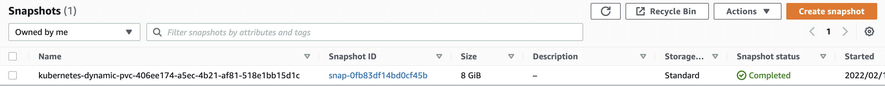
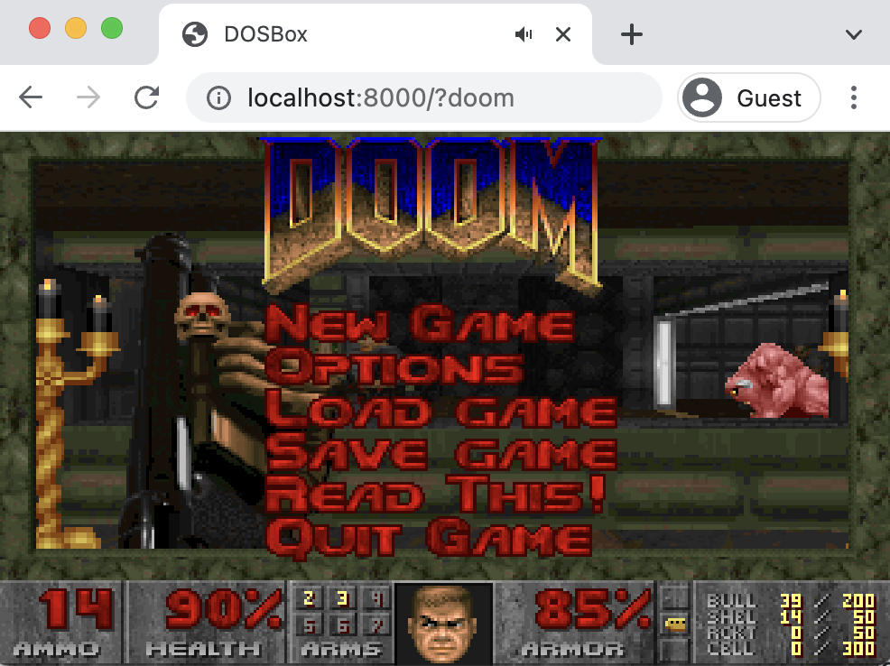

# Migrating a Nexus Repository Using Velero

This guide demonstrates how to perform a migration of Nexus repositories and artifacts between Kubernetes clusters.

[[_TOC_]]

## Prerequisites/Assumptions

- K8s running in AWS
- Nexus PersistentVolume is using AWS EBS
- Migration is between clusters on the same AWS instance and availability zone (due to known Velero [limitations](https://velero.io/docs/v1.6/locations/#limitations--caveats))
- Migration occurs between K8s clusters with the same version
- Velero CLI [tool](https://github.com/vmware-tanzu/velero/releases)
- Crane CLI [tool](https://github.com/google/go-containerregistry)

## Preparation

1. Ensure the Velero addon in the Big Bang values file is properly configured, sample configuration below:

    ```yaml
    addons:
      velero:
        enabled: true
        plugins:
        - aws
        values:
          serviceAccount:
            server:
              name: velero
          configuration:
            provider: aws
            backupStorageLocation:
              bucket: nexus-velero-backup
            volumeSnapshotLocation:
              provider: aws
              config:
                region: us-east-1
          credentials:
            useSecret: true
            secretContents:
              cloud: |
                [default]
                aws_access_key_id = <CHANGE ME>
                aws_secret_access_key = <CHANGE ME>
    ```

1. Manually create an S3 bucket that the backup configuration will be stored in (in this case it is named `nexus-velero-backup`), this should match the `configuration.backupStorageLocation.bucket` key above
1. The `credentials.secretContents.cloud` credentials should have the necessary permissions to read/write to S3, volumes and volume snapshots
1. As a sanity check, take a look at the Velero logs to make sure the backup location (S3 bucket) is valid, you should see something like:

    ```plaintext
    level=info msg="Backup storage location valid, marking as available" backup-storage-location=default controller=backup-storage-location logSource="pkg/controller/backup_storage_location_controller.go:121"
    ```

1. Ensure there are images/artifacts in Nexus. An as example we will use the [Doom DOS image](https://earthly.dev/blog/dos-gaming-in-docker/) and a simple nginx image. Running `crane catalog nexus-docker.bigbang.dev` will show all of the artifacts and images in Nexus:  

    ```console
    repository/nexus-docker/doom-dos
    repository/nexus-docker/nginx
    ```

## Backing Up Nexus

In the cluster containing the Nexus repositories to migrate, running the following command will create a backup called `nexus-ns-backup` and will backup all resources in the `nexus-repository-manager` namespace, including the associated PersistentVolume:

```shell
velero backup create nexus-ns-backup --include-namespaces nexus-repository-manager --include-cluster-resources=true
```

Specifically, this will backup all Nexus resources to the S3 bucket `configuration.backupStorageLocation.bucket` specified above and will create a volume snapshot of the Nexus EBS volume.

 **Double-check** AWS to make sure this is the case by reviewing the contents of the S3 bucket:

 ```shell
 aws s3 ls s3://nexus-velero-backup --recursive --human-readable --summarize
 ```

Expected output:  

```console
backups/nexus-ns-backup/nexus-ns-backup-csi-volumesnapshotcontents.json.gz
backups/nexus-ns-backup/nexus-ns-backup-csi-volumesnapshots.json.gz
backups/nexus-ns-backup/nexus-ns-backup-logs.gz
backups/nexus-ns-backup/nexus-ns-backup-podvolumebackups.json.gz
backups/nexus-ns-backup/nexus-ns-backup-resource-list.json.gz
backups/nexus-ns-backup/nexus-ns-backup-volumesnapshots.json.gz
backups/nexus-ns-backup/nexus-ns-backup.tar.gz
backups/nexus-ns-backup/velero-backup.json
```

Also ensure an EBS volume snapshot has been created and the Snapshot status is `Completed`.  


## Restoring From Backup

1. In the new cluster, ensure that Nexus and Velero are running and healthy
    - It is critical to ensure that Nexus has been included in the new cluster's Big Bang deployment, otherwise the restored Nexus configuration will not be managed by the Big Bang Helm chart.
1. If you are using the same `velero.values` from above, Velero should automatically be configured to use the same backup location as before. Verify this with `velero backup get` and you should see output that looks like:

    ```console
    NAME              STATUS      ERRORS   WARNINGS   CREATED                         EXPIRES   STORAGE LOCATION   SELECTOR
    nexus-ns-backup   Completed   0        0          2022-02-08 12:34:46 +0100 CET   29d       default            <none>
    ```  

1. To perform the migration, Nexus must be shut down. In the Nexus Deployment, bring the `spec.replicas` down to `0`.
1. Ensure that the Nexus PVC and PV are also removed (**you may have to delete these manually!**), and that the corresponding Nexus EBS volume has been deleted.
    - If you have to remove the Nexus PV and PVC manually, delete the PVC first, which should cascade to the PV; then, manually delete the underlying EBS volume (if it still exists)

1. Now that Nexus is down and the new cluster is configured to use the same backup location as the old one, perform the migration by running:  
    `velero restore create --from-backup  nexus-ns-backup`

1. The Nexus PV and PVC should be recreated (verify before continuing!), but the pod will fail to start due to the previous change in the Nexus deployment spec. Change the Nexus deployment `spec.replicas` back to `1`. This will bring up the Nexus pod which should connect to the PVC and PV created during the Velero restore.
1. Once the Nexus pod is running and healthy, log in to Nexus and verify that the repositories have been restored
    - The credentials to log in will have been restored from the Nexus backup, so they should match the credentials of the Nexus that was migrated (not the new installation!)
    - It is recommended to log in to Nexus and download a sampling of images/artifacts to ensure they are working as expected.

    For example, login to Nexus using the migrated credentials:  
    `docker login -u admin -p admin nexus-docker.bigbang.dev/repository/nexus-docker`

    Running `crane catalog nexus-docker.bigbang.dev` should show the same output as before:

    ```console
    repository/nexus-docker/doom-dos
    repository/nexus-docker/nginx
    ```

    To ensure the integrity of the migrated image, we will pull and run the `doom-dos` image and defeat evil!  

    ```shell
    docker pull nexus-docker.bigbang.dev/repository/nexus-docker/doom-dos:latest && \
    docker run -p 8000:8000 nexus-docker.bigbang.dev/repository/nexus-docker/doom-dos:latest
    ```

    

## Appendix

### Sample Nexus values

```yaml
addons:
  nexus:
    enabled: true
    values:
      nexus:
        docker:
          enabled: true
          registries:
            - host: nexus-docker.bigbang.dev
              port: 5000
```
