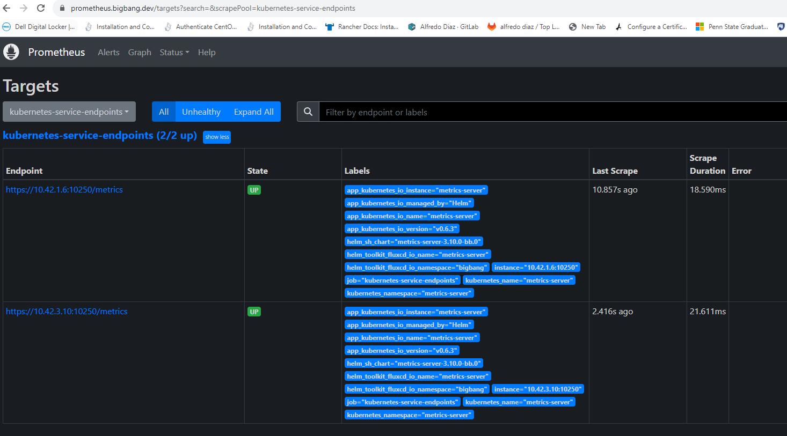

# Integrating Prometheus Label Scraping for Sample Application

## Introduction

Integrating Prometheus metrics scraping with label scraping services is helpful for monitoring monitoring applications that either don't ship with a a ServiceMonitor, for testing in researching to build out a serviceMonitor resource, or in-development applications where creating and managing annotations is simpler than building and managing ServiceMonitors. This guide will explain how to integrate metrics scraping for your annotated service endpoints or specific pods with Big Bang.

By default, global endpoint monitoring is behind a hidden value in Big Bang. If you wish to enable, it the sections below are for each configuration.

The available Global serviceMonitor for annotated endpoints service is defined by the prometheus job name `kubernetes-service-endpoints` with following hidden value `monitoring.globalServiceEndpointMetrics` in `values.yaml`:
```
monitoring:
  globalServiceEndpointMetrics:
    enabled: true
```

The available Global serviceMonitor for annotated pods is defined by the prometheus job name `kubernetes-pods` with following hidden value `monitoring.globalPodEndpointMetrics` in `values.yaml`:
```
monitoring:
  globalPodEndpointMetrics:
    enabled: true
```

## Prerequisites

Before integrating with Prometheus, ensure the following:

- Determine if the application supports Prometheus metrics exporting. If not, find a Prometheus exporter to provide this service.
- Identify the path and port used to scrape metrics on the application or exporter.
- List the services and/or pods that should be monitored.

## Integration Steps

### 1. Define Placeholder Values for a Service (Recommended)

Add placeholders in `chart/values.yaml` to configure whether the monitoring stack (Prometheus) is enabled:
the following is an example of a placeholder for allowing scraping of the `metrics-server` service endpoint:
```yaml
addons:
  metrics-server:
    values: 
      service:
        annotations:
          prometheus.io/scrape: "true"
          prometheus.io/port: "10250"
          prometheus.io/path: "/metrics"
      serviceMonitor:
        enabled: false  # set to true to enable monitoring if the service is not already being scraped. This is an easily re-producible example but ideally the app will not ship with a serviceMonitor.

**NOTE:** The example above is for the metrics-server application, you will need to update the service annotations to match your application. Also note that metrics-server is already being scraped by a local serviceMonitor, so you will need to disable it so label scraping can be enabled.
```

Applications configured correctly will be scraped by Prometheus under the `target->` `kubernetes-service-endpoints` in the Prometheus User Interface (UI). Refer to the image below. If you do not know the correct port and path for your application, you may use `Service Discovery` in the Prometheus UI to find the correct port and path for your application.



