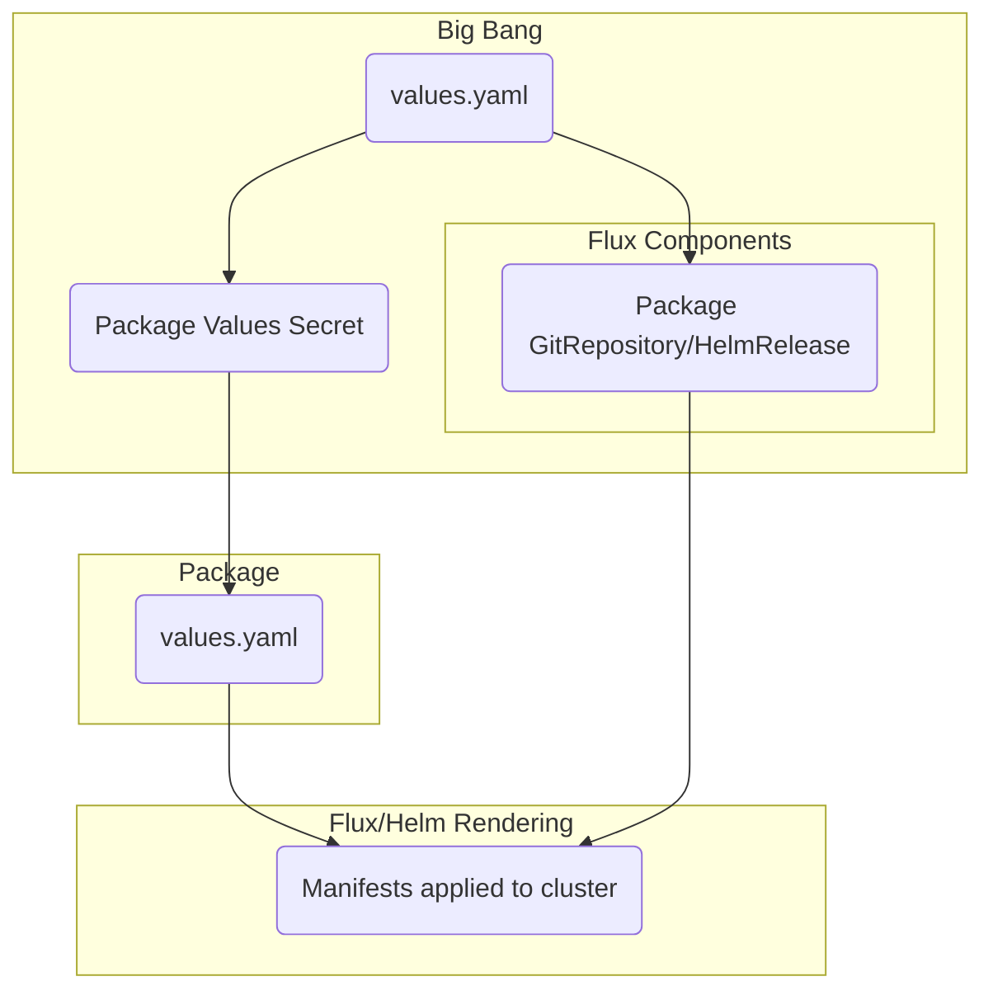

# The Basics

Big Bang uses [Helm](https://helm.sh/) to handle configuration values for Big Bang, so in order to understand how Big Bang works it is first essential to understand Helm. Under the hood, Helm is essentially just a template rendering engine: template files are defined where variables are used as placeholders for values, Helm takes those values and interpolates them into the template, then outputs the rendered template file (for Kubernetes, this means YAML). For anyone that has experience with configuration management tools, it is similar in function to Jinja for Ansible and ERB templates for Puppet and Chef.

Big Bang takes this basic functionality and uses it to create a somewhat complex set of layers that the values get passed through. Each layer includes a set of separate templates that are unique, yet share some standards, which receive values from the layer above and pass them through to the templates in the layer below. The purpose of this guide is to walk through how this works at a high level to increase the level of understanding amongst the community of Big Bang users.

For additional information regarding Helm templates/values in general, read through the upstream [documentation](https://helm.sh/docs/topics/charts/#templates-and-values).

# Big Bang Specifics

## Hierarchy

Big Bang is a slight variation from the typical "umbrella" helm chart pattern. Individual package charts are not direct subcharts within Big Bang, instead they are deployed by Flux custom resources. These individual package charts (istio, monitoring, gitlab, etc) can be considered "child" helm charts of the Big Bang chart.

The variables in Big Bang's `values.yaml` file are either passed to Flux or Helm depending on the deployment methodology. Values specific to individual packages will be passed to Flux and used to deploy the package itself. Technically speaking, when you deploy Big Bang you are deploying a number of Flux objects and Flux does the heavy lifting to deploy the actual applications. For more information on Flux, see its official [documentation](https://fluxcd.io/docs/components/).

A high level conceptual graph of how values flow through Big Bang is provided below:



## Values

Variables defined in Big Bang's [values.yaml](/chart/values.yaml) are values that the Big Bang team has identified as ones which users will be most likely to want to set when installing or upgrading Big Bang. This provides a single, standard way to set the most deployment-specific values and many users may not need to do any more than customize these values for their environment. Beyond these the Big Bang team also provides additional ways to pass values through to specific packages or modify templates after rendering. 

### Big Bang Configuration Values

There are a number of values in the Big Bang chart that are solely used for configuration of the Big Bang chart itself. Typically these values are used for the Flux templates (HelmRelease, GitRepository) or for secrets (registry credentials, git credentials).

Some examples of these values include:
- `registryCredentials`: Used to configure the image pull secrets for every namespace
- `git`: Used to configure credentials (if required) for cloning the Big Bang package repos
- `flux`: Used for configuring Flux parameters for all HelmReleases
- `<package>.git`: Used for configuring the Flux GitRepository for each package

### Global Configuration Values


Global values within Big Bang are used in cases where packages inherit a common configuration. These mainly include configuration for networking, common SSO provider config, and other common usability values.

Some examples of these values include:
- `domain`: This value informs the VirtualService configurations for all packages
- `openshift`: This toggle provides for configuration of any OpenShift specific values across all packages
- `networkPolicies`: These values inform configuration of network policies (enabling, disabling, setting IP ranges)
- `imagePullPolicy`: When set this value is used to configure all packages (and their pods) with a common pull policy
- `sso` (top level value): The configuration set here is used to assist with packages' individual OIDC or SAML configuration, such as endpoints

**Important Note**: While we use the term "global" here these values are NOT the exact same as a Helm global value. Helm globals are directly passed to all subcharts. Big Bang globals are in some cases passed directly to the package charts, but in other cases they are manipulated/customized to inform package values.

### Abstracted Package Values

Each package generally has some configuration that is commonly used for a production deployment. In these cases we try to abstract and simplify the configuration to make it easy for end users. Common use cases for this are database or object storage connections, SSO client ID/Secret, and license details. These values are all set under a `<package>` or `addons.<package>` key, since they are specific to one package in Big Bang.

When these values are set they are passed through to the package itself. In some cases the Big Bang chart provides additional utility by creating any necessary secrets or toggling other values that are needed.

Some examples of these values include:
- `<package>.database`: Simplified configuration for an external database connection (user, pass, host, port, etc)
- `<package>.objectStorage`: Similar configuration for external storage (i.e. S3)
- `<package>.sso.client_id`: Specific SSO client ID for the package
- `<package>.enterprise.license`: Enterprise license for the specific package

### Package Values Passthrough

Not every deployment need/configuration for a specific package will be represented by the globals or abstracted values. Although the values you need may not be listed explicitly in the Big Bang chart values, there are still options to set them.

Every package has a `values: {}` section where you can set additional variables which are defined in the chart but not exposed in Big Bang's `values.yaml`. To see available values options for a specific package you can check the package repo and view its `chart/values.yaml` file. It is important to note that anything set via `<package>.values` will take precedence over the abstracted or global values configured by Big Bang.

Indentation of these values WILL NOT match the same indentation as the package level. As an example, let's say you want to set the `replicaCount` value for the Kiali package. If you were to check the [Kiali values](https://repo1.dso.mil/platform-one/big-bang/apps/core/kiali/-/blob/c1d7cfcde20b7778b34ef909f49fc9e7cd2f7ec7/chart/values.yaml#L41) you could override the value this way:

```yaml
replicaCount: 3
```

In Big Bang to override this value you will want to add this to your configuration:

```yaml
kiali:
  values:
    replicaCount: 3
```

### Post-renderers

In some cases customers run into limitations that even values passthrough cannot solve. In cases where the package chart/template file itself does not provide a value for configuration you can make use of Post Renderers.

These are an advanced capability within Helm and Flux that allows end users to make modifications to the chart after it has been rendered. For more information and specific on how to leverage this capability see [this document](/docs/postrenderers.md).
