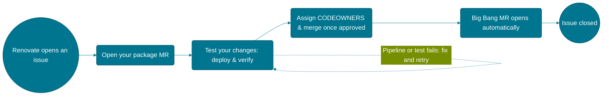

# Renovate Package Maintenance

This page describes how the Big Bang team internally processes a Renovate-triggered package update, from issue to merged release — it's for CODEOWNERS and contributors working an update, not for deploying or configuring Renovate in your own environment. For that, see [Renovate](renovate.md).

Most Big Bang-maintained Helm charts wrap an upstream vendor chart using the passthrough pattern (check Chart.yaml for an upstream-aliased dependency to confirm). The steps below cover what to do at each stage:
 

## Preparing your package update
 
Every package should have a `docs/DEVELOPMENT_MAINTENANCE.md` file — read it before starting, since it documents any local deviations from the upstream chart or values that this specific package needs. CODEOWNERS should use the same file when reviewing, and update it if a step is no longer accurate.
 
## Finishing your package merge request
 
Before taking your package MR out of Draft:
 
- Note any `SKIP UPGRADE`/`skip-bb-mr` pipeline items in the MR, with justification — see the [CI Workflow](../../community/development/ci-workflow.md) doc.
- Write the `## Upgrade Notices` section for someone downstream who wasn't in the room — avoid internal team shorthand or CI-specific notes. This section exists for changes that require a downstream user to take action — a renamed value or a moved template, for example.
- Remove `SKIP UPDATE CHECK` from the MR title and confirm a `chart update check` pipeline stage has run.
## After your package MR merges
 
Confirm the `main` and tag pipelines both pass — reach out to CODEOWNERS or anchors if not.
 
## The automatic Big Bang merge request
 
Once your package's tag pipeline succeeds, `bigbang-bot` opens a separate, second merge request in the main Big Bang repository. Link it to your issue with `Closes <issue URL>`, confirm its pipeline passes, take it out of Draft, and assign **anchors and Big Bang codeowners** as reviewers.