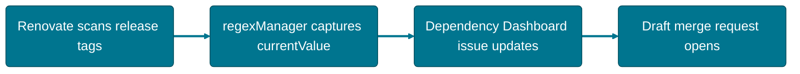

# Renovate

## Deployment of Renovate

Renovate is an integrated package and can be deployed using the Big Bang Helm chart.



### Example Deployment Values

```yaml
renovate:
  enabled: true
  git:
    repo: https://repo1.dso.mil/big-bang/product/packages/renovate.git
    tag: 46.31.6-bb.4
  values:
    networkPolicies:
      enabled: "{{ $.Values.networkPolicies.enabled }}"
    istio:
      enabled: "{{ $.Values.istiod.enabled }}"
    cronjob:
      schedule: '0 1 * * *'
    renovate:
      config: |
          {
              "platform": "gitlab",
              "endpoint": "https://gitlab.example.com/api/v4",
              "token": "your-gitlab-renovate-user-token",
              "autodiscover": "false",
              "dryRun": true,
              "printConfig": true,
              "repositories": ["username/repo", "orgname/repo"]
          }
```

### Config

The configuration sets up a self-hosted instance of Renovate that connects with a platform. In the example, we connect to GitLab using the GitLab API v4 at a specified URL.

#### Auth

It is recommended to use a repository-scoped auth token with developer access for least privilege.

#### Repositories

The `repositories` key in this self-hosted Renovate configuration specifies which repositories should be included in the update checks performed by Renovate. Accepts an array of strings or objects.

See [Self Hosted Configuration](https://docs.renovatebot.com/self-hosted-configuration/#self-hosted-configuration-options) for more details.

### Cron Job

Refer to the [Scheduling Renovate Guide](#handling-scheduling-in-the-chart).

### Individual Package Configuration

The configuration file for Renovate is called `renovate.json` and is located in each project's root directory. See [Package Configuration](#package-configuration).

## Handling Scheduling in the Chart

Renovate's schedule is set via the `schedule` field in the `cronjob` section of your values, using standard Cron syntax or Renovate's human-readable "Later" syntax. Running Renovate around the clock can be too "noisy" for some projects — use the schedule to limit the time window in which Renovate acts on your repository.

The default is `0 1 * * *` (01:00 every day).

If one of [Renovate's built-in schedule presets](https://docs.renovatebot.com/presets-schedule/) fits your needs, use it instead of writing a custom expression, and consider requesting a new preset upstream if others would likely benefit from it too.

### Additional Examples

Text schedules known to work, in addition to standard Cron syntax:

```
every weekend
before 5:00am
after 10pm and before 5:00am
after 10pm and before 5am every weekday
on friday and saturday
every 3 months on the first day of the month
```

#### Cron Syntax

```text
*    *    *    *    *
-    -    -    -    -
|    |    |    |    |
|    |    |    |    +----- day of the week (0 - 6) (Sunday=0)
|    |    |    +---------- month (1 - 12)
|    |    +--------------- day of the month (1 - 31)
|    +-------------------- hour (0 - 23)
+------------------------- minute (0 - 59)
```

For example, to run the Renovate job every day at 1:00 AM, set the schedule field to `0 1 * * *`.

### Other Options

 See the [Kubernetes CronJob documentation](https://kubernetes.io/docs/concepts/workloads/controllers/cron-jobs/) and [Kubernetes Job documentation](https://kubernetes.io/docs/concepts/workloads/controllers/job/) for configuration details.

Once you've configured the schedule in your values, deploy or update the Renovate chart with `helm install` or `helm upgrade` as usual.

### Example Yaml

```yaml
renovate:
  enabled: true
  git:
    repo: https://repo1.dso.mil/big-bang/product/packages/renovate.git
    tag: 46.31.6-bb.4
  values:
    cronjob:
      # At 01:00 every day
      schedule: "0 1 * * *"
      # -- If it is set to true, all subsequent executions are suspended. This setting does not apply to already started executions.
      suspend: false
      annotations: {}
      labels: {}
      concurrencyPolicy: ""
      failedJobsHistoryLimit: ""
      successfulJobsHistoryLimit: ""
      jobRestartPolicy: Never
      jobBackoffLimit: ""
      startingDeadlineSeconds: ""
```

## Renovate Configuration for Big Bang Customer Template

### Package Configuration

#### Example Package Configuration

The following example is for a user fork of the [customer template](https://repo1.dso.mil/big-bang/customers/template). It opens a dependency dashboard issue tracking Big Bang's own version, and watches for new Big Bang release tags via `regexManagers`, detailed below.

```json
{
  "baseBranches": ["main"],
  "configWarningReuseIssue": false,
  "dependencyDashboard": true,
  "dependencyDashboardHeader": "- [ ] Review Big Bang changelog/release notes.",
  "dependencyDashboardTitle": "Renovate: Upgrade Big Bang",
  "draftPR": true,
  "enabledManagers": ["regex"],
  "labels": ["renovate"],
  "commitMessagePrefix": "",
  "separateMajorMinor": false,
  "packageRules": [
    {
      "groupName": "Big Bang",
      "matchDatasources": ["git-tags"]
    }
  ],
  "regexManagers": [
    {
      "fileMatch": ["^base/kustomization\\.yaml$"],
      "matchStrings": [".+?ref=+(?<currentValue>.+)"],
      "depNameTemplate": "https://repo1.dso.mil/big-bang/bigbang.git",
      "datasourceTemplate": "git-tags",
      "versioningTemplate": "regex:^(?<major>\\d+)\\.(?<minor>\\d+)\\.(?<patch>\\d+)$"
    },
    {
      "fileMatch": ["^dev/kustomization\\.yaml$"],
      "matchStrings": ["tag:\\s+\"(?<currentValue>.+)\""],
      "depNameTemplate": "https://repo1.dso.mil/big-bang/bigbang.git",
      "datasourceTemplate": "git-tags",
      "versioningTemplate": "regex:^(?<major>\\d+)\\.(?<minor>\\d+)\\.(?<patch>\\d+)$"
    },
    {
      "fileMatch": ["^dev/configmap\\.yaml$"],
      "matchStrings": [
        "git:\\s+repo:\\s+(?<depName>.+)\\s+tag:\\s+\"(?<currentValue>.+)\""
      ],
      "datasourceTemplate": "git-tags",
      "versioningTemplate": "regex:^(?<major>\\d+)\\.(?<minor>\\d+)\\.(?<patch>\\d+)-bb\\.(?<build>\\d+)$"
    }
  ]
}
```

##### RegEx Managers

This is where the majority of Big Bang-specific configuration work happens: regex-based rules that tell Renovate which files to watch and how to extract the current version from each.

In this example, the version of Big Bang tracked by `base/kustomization.yaml` is the target. The regex matches the ref in a line like `- git::https://repo1.dso.mil/big-bang/bigbang.git//base?ref=1.41.0`, capturing the version number as `currentValue`:

```
- git::https://repo1.dso.mil/big-bang/bigbang.git//base?ref=1.41.0
                                                          └──┬──┘
                                                    captured as currentValue
```

```json
{
  "fileMatch": ["^base/kustomization\\.yaml$"],
  "matchStrings": [".+?ref=+(?<currentValue>.+)"],
  "depNameTemplate": "https://repo1.dso.mil/big-bang/bigbang.git",
  "datasourceTemplate": "git-tags",
  "versioningTemplate": "regex:^(?<major>\\d+)\\.(?<minor>\\d+)\\.(?<patch>\\d+)$"
}
```

The same pattern applies to `dev/kustomization.yaml`, or the kustomization for any environment-specific folder.

Targeting an individual package (rather than Big Bang itself) needs a more complex regex, since you're matching `git.tag` where `git.repository` matches the `depName`:

```json
{
  "fileMatch": ["^dev/configmap\\.yaml$"],
  "matchStrings": [
    "git:\\s+repo:\\s+(?<depName>.+)\\s+tag:\\s+\"(?<currentValue>.+)\""
  ],
  "depNameTemplate": "https://repo1.dso.mil/big-bang/product/packages/kyverno.git",
  "datasourceTemplate": "git-tags",
  "versioningTemplate": "regex:^(?<major>\\d+)\\.(?<minor>\\d+)\\.(?<patch>\\d+)-bb\\.(?<build>\\d+)$"
}
```

```yaml
kyverno:
  git:
    repo: https://repo1.dso.mil/big-bang/product/packages/kyverno.git
    tag: "2.6.5-bb.2"
  values:
    replicaCount: 1
```

The `fileMatch` array selects which files to scan, using a regex path relative to the repository root — for example, `["^chart/values\\.yaml$"]` matches only `chart/values.yaml`. `matchStrings` then needs specific named capture groups for Renovate to understand what it's looking at:

- `<currentValue>`: the dependency's current version or tag (e.g., `v1.2.3`).
- `<datasource>`: the dependency type — for Big Bang packages, use `git-tags`.
- `<depName>`: the dependency's name, used as the repository lookup key.
- `<currentDigest>` (optional): a SHA256 image digest, if you want Renovate to update that instead of a tag.

Use [regex named groups](https://www.regular-expressions.info/refext.html) to capture these. See [Renovate's regexManagers reference](https://docs.renovatebot.com/configuration-options/#regexmanagers) for the full syntax.

#### Package Configuration Options

See [Renovate's configuration options](https://docs.renovatebot.com/configuration-options/) for details on available package configuration options.