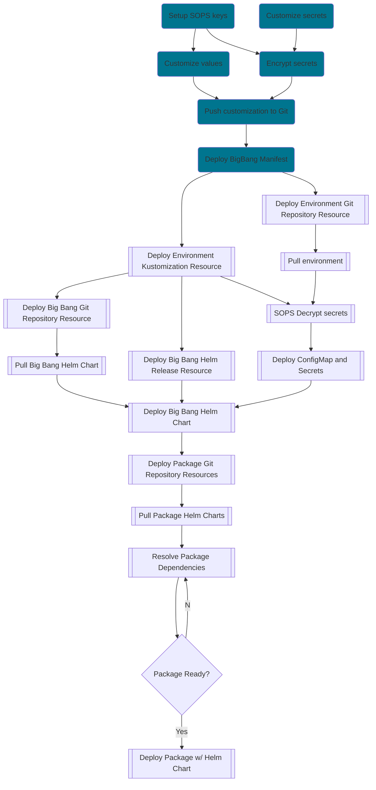

# Big Bang Overview

Table of Contents

- [Big Bang Overview](#big-bang-overview)
  - [Key Concepts](#key-concepts)
    - [Big Bang](#big-bang)
    - [Big Bang Components](#big-bang-components)
    - [Flux v2](#flux-v2)
    - [GitOps](#gitops)
    - [SOPS](#sops)
    - [Kustomize](#kustomize)
    - [Helm](#helm)
  - [Packages](#packages)
  - [Architecture](#architecture)
    - [Configuration](#configuration)
    - [Deployment](#deployment)
    - [Diagram](#diagram)

---

## Key Concepts

### Big Bang

Big Bang is a declarative, continuous delivery tool for core DoD hardened and approved [packages](#packages) into a Kubernetes cluster.  Big Bang follows a [GitOps](#gitops) approach to configuration management, using [Flux v2](#flux-v2) to reconcile Git with the cluster.  Environments (e.g. dev, prod) and packages (e.g. istio) can be fully configured to suit the deployment needs.

### Big Bang Components

Big Bang is made of several components that operate together.  These include a [base Kustomize](../base/), a [Helm chart](../chart), [packages](../chart/templates), and an [environment](https://repo1.dso.mil/platform-one/big-bang/customers/bigbang).  The environment and base Kustomize are used together to deploy the Big Bang configuration and Helm chart.  The Helm chart is then used to facilitate deployment of the packages.

### Flux v2

[Flux v2](https://toolkit.fluxcd.io/) is the tool used by Big Bang to reconcile sources of configuration in Git with actual code deployment.  Flux includes resources to reconcile Git repositories, [Kustomizations](https://kustomize.io/) to Kubernetes manifests, and [Helm Chart](https://helm.sh/docs/topics/charts/) releases.  Flux automatically monitors changes in these items and reconciles with the Kubernetes cluster.

### GitOps

[GitOps](https://www.weave.works/technologies/gitops/) is a way to declaratively manage a Kubernetes cluster using a single source of truth in Git.  All Kubernetes configuration is stored in Git.  And, a tool (e.g. [Flux](#flux-v2)) is used to automatically monitor and reconcile the configuration with the running Kubernetes cluster.  This allows all changes to the cluster to be version controlled and pipelined.

### SOPS

[SOPS](https://github.com/mozilla/sops) is a way to encrypt values in YAML, JSON, ENV, INI, or BINARY files so that sensitive data can be securely shared.  Big Bang uses SOPS to encrypt pull secrets, certificates, and other secrets so that it can be stored into the Git repository securely.  Big Bang (via Flux) uses the private key, stored in a secure area (e.g. KMS) to decrypt the secrets and deploy them into the cluster for use.

### Kustomize

[Kustomize](https://kustomize.io/) is a tool that assists with configuration management for Kubernetes manifest files.  It uses overlays and patching to customize a base set of manifests for deployment.  Big Bang uses Kustomize to setup the environment (e.g. dev, prod) configuration.

### Helm

[Helm](https://helm.sh/) is a tool that assists with configuration management for Kubernetes manifest files.  It uses charts, which includes templates and values, to create a set of manifests for deployment. Big Bang uses Helm charts to deploy all of its packages.

---

## Packages

The following packages are included in a default deployment of Big Bang:

|Name|Description|Helm Chart Repo|
|--|--|--|
|[Istio](https://istio.io/)|[Service Mesh](https://www.redhat.com/en/topics/microservices/what-is-a-service-mesh)|[Link](https://repo1.dso.mil/platform-one/big-bang/apps/core/servicemesh.git)|
|Cluster Auditor| |[Link](https://repo1.dso.mil/platform-one/big-bang/apps/core/cluster-auditor.git)|
|[Open Policy Agent Gatekeeper](https://github.com/open-policy-agent/gatekeeper)| Policy Management | [Link](https://repo1.dso.mil/platform-one/big-bang/apps/core/policy.git)|
|[Elastic Cloud on Kubernetes (ECK)](https://www.elastic.co/guide/en/cloud-on-k8s/current/index.html)| Logging; Incl. Elasticsearch & Kibana |[Link](https://repo1.dso.mil/platform-one/big-bang/apps/core/elasticsearch-kibana.git)|
|[Prometheus](https://prometheus.io/) and [Grafana](https://grafana.com/)| Monitoring |[Link](https://repo1.dso.mil/platform-one/big-bang/apps/core/monitoring.git)|
|[Twistlock](https://www.paloaltonetworks.com/prisma/cloud)| Security Scanning |[Link](https://repo1.dso.mil/platform-one/big-bang/apps/security-tools/twistlock.git)|

In addition, the following packages can be added onto the default deployment:

|Name|Description|Helm Chart Repo|
|--|--|--|
|[Argo CD](https://argoproj.github.io/argo-cd/)| Continuous Delivery |[Link](https://repo1.dso.mil/platform-one/big-bang/apps/core/argocd.git)|
|Auth Service|Single Sign On|[Link](https://repo1.dso.mil/platform-one/big-bang/apps/sandbox/authservice.git)

---

## Architecture

The diagram below shows a typical deployment of Big Bang into a Kubernetes cluster.  The items in blue require user interaction.  The remaining items are automated by Big Bang.

### Configuration

1. The user must [setup an encryption key pair](./encryption.md) for SOPS and store the private key securely (e.g. KMS).  This should **NOT** be stored in Git.
1. The user should then [configure Big Bang](./configuration.md) values and secrets for the targeted Kubernetes cluster.
1. All secrets should be encrypted with SOPS to protect them.
1. Once all of the configuration has been completed, it must be pushed to a Git repository.

### Deployment

1. With everything in Git, the user can [deploy BigBang](./deployment.md) using a Kubernetes manifest.
1. The manifest holds two Flux resources, one pointing to the Git repository holding the custom environment, and one telling Flux to run Kustomize on a targeted folder within the repo.
   1. The repository is reconciled first, pulling the files from Git.
   1. Next, Kustomize is run on the environment configuration
      1. The Kustomize files use Big Bang's Git repo as a base before applying overlays and patches for the configuration.
      1. Flux uses SOPS to decrypt any secrets before deploying the manifests
      1. After completing the Kustomization process, Flux deploys two ConfigMaps, two Secrets, and flux resources for Big Bang
1. Big Bang's flux resources include a Git repository holding the Helm chart and a Helm Release resource that tells Flux how to deploy the Helm chart.
   1. The repository is reconciled first, pulling the Helm chart from Git.
   1. The Helm Release will check for the Helm chart and the Secrets / ConfigMaps deployed before performing a Helm install
1. Once the Helm release deploys the Helm chart for Big Bang, each package that is enabled will have a Flux Git Repository and Helm Release resource deployed.
1. All of the package Git repositories containing Helm charts will be pulled so that Flux can reconcile dependencies.
1. Each package's Helm Release has dependencies built in.  Flux will reconcile these dependencies and deploy the Helm chart for the package once all of the dependencies are ready.
1. Once all of the packages are ready, Big Bang will monitor Git periodically for changes and reconcile using the methods above.

### Diagram

