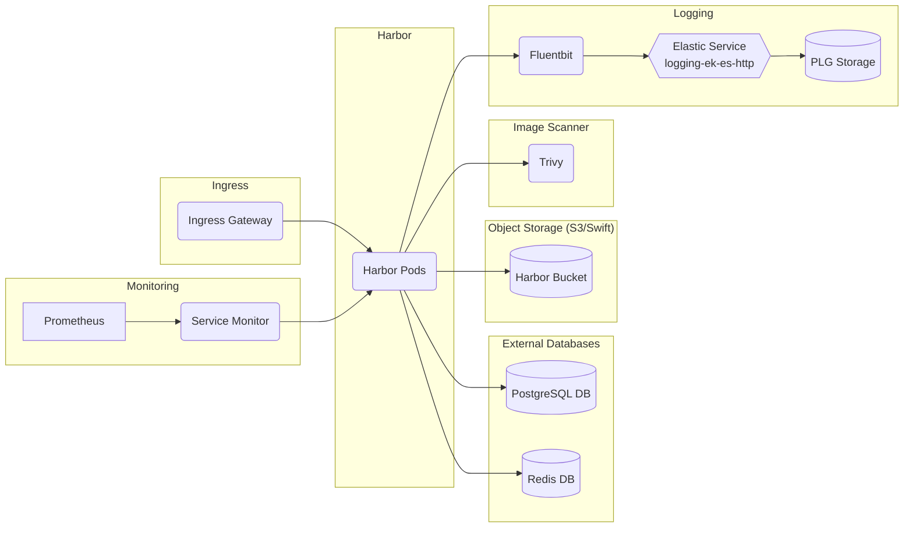

# Harbor

## Overview

[Harbor](https://goharbor.io/) is an open source registry that secures artifacts with policies and role-based access control, ensures images are scanned and free from vulnerabilities, and signs images as trusted.

### Harbor




For more information on the Harbor architecture, see [Harbor Overview and Architecture](https://github.com/goharbor/harbor/wiki/Architecture-Overview-of-Harbor).

## Harbor Touch Points

### Storage

By default Harbor uses local storage for the registry, but you can optionally configure the storage_service setting so that Harbor uses external storage.

See below for an example of the values to provide an external storage backend for Harbor:

```yaml
persistence:
  imageChartStorage:
    # Specify the type of storage: "filesystem", "azure", "gcs", "s3", "swift",
    # "oss" and fill the information needed in the corresponding section. The type
    # must be "filesystem" if you want to use persistent volumes for registry
    type: s3
    s3:
      # Set an existing secret for S3 accesskey and secretkey
      # keys in the secret should be REGISTRY_STORAGE_S3_ACCESSKEY and REGISTRY_STORAGE_S3_SECRETKEY for registry
      #existingSecret: ""
      region: us-west-1
      bucket: bucketname
      #accesskey: awsaccesskey
      #secretkey: awssecretkey
      #regionendpoint: http://myobjects.local
      #encrypt: false
      #keyid: mykeyid
      #secure: true
```

### High Availability

Reference the [Harbor High Availability Guide](https://repo1.dso.mil/big-bang/apps/sandbox/harbor/-/blob/main/chart/docs/High%20Availability.md) for an overview of a harbor high availability deployment.

See below for an example of the values to provide high availability within harbor:

```yaml
portal:
  replicas: 2
core:
  replicas: 2
jobservice:
  replicas: 2
registry:
  replicas: 2     
```

### UI

Harbor is accessible via extensible API and web UI. Within the values you are able to configure the URL that harbor is able to be accessed.

See below for an example of how to set the values to set the URL for UI within Harbor:

```yaml
externalURL: https://core.harbor.domain
core:
  secretName: "name_of_secret"
```

For additional information reference [Deploying Harbor in Production](https://repo1.dso.mil/big-bang/apps/sandbox/harbor/-/blob/harbor-architecture/docs/production.md)

### Logging

Harbor keeps a log of all of the operations that users perform in a project. You can apply filters to help you to search the logs. By default, Harbor tracks all image pull, push, and delete operations performed and keeps a record of these actions in a database. Harbor offers the ability to manage audit logs by configuring an audit log retention window and setting a syslog endpoint to forward audit logs.

### Monitoring

Harbor exposes prometheus metrics in the API of each service if the config.yaml used by that service has the metrics.enabled keys set to enabled. Each service exports its own metrics and can be scraped by the monitoring package within a BigBang installation.

See below for an example of how to set the values to enable metrics for Harbor:

```yaml
metrics:
  enabled: true
```

### Dependent Packages

- PostgreSQL (in-cluster by default; can be configured to use an external postgres)
- Redis (in-cluster by default; can be configured to use an external redis)
