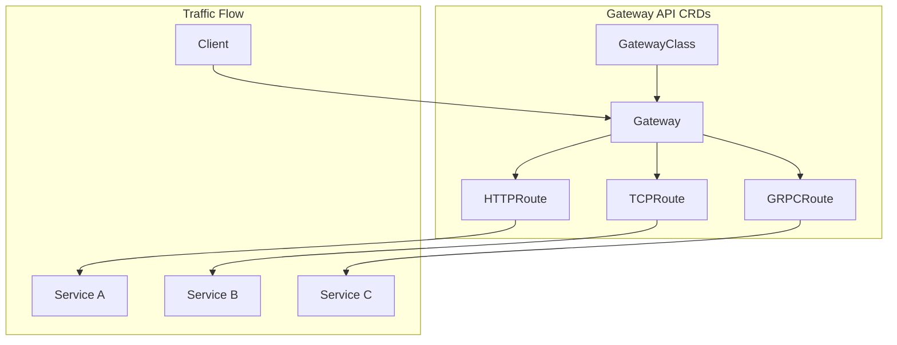

# Gateway API

## Overview

[Gateway API](https://gateway-api.sigs.k8s.io/) is a collection of Kubernetes Custom Resource Definitions (CRDs) that provide an expressive, extensible, and role-oriented approach to defining traffic routing and network policies. It is the successor to the Kubernetes Ingress API and provides a more powerful and flexible way to configure ingress, egress, and service-to-service traffic.

Gateway API provides the standard API for configuring traffic management in modern Kubernetes environments. In Istio ambient mode, Gateway API is required specifically for L7 traffic management via waypoint proxies. Basic L4 ambient functionality (mTLS, network policies) works with just ztunnel and does not require Gateway API.



## Big Bang Touchpoints

### Licensing

Gateway API is open source, licensed under the [Apache License 2.0](https://github.com/kubernetes-sigs/gateway-api/blob/main/LICENSE).

### Installation

Gateway API CRDs are installed into the `kube-system` namespace. The package can be enabled explicitly or is automatically enabled when `istio.ambient.enabled: true` is set in Big Bang values:

```yaml
# Explicit enable
gatewayAPI:
  enabled: true

# Or via ambient mode (auto-enables gateway-api)
istio:
  ambient:
    enabled: true
```

### Storage

Gateway API installs CRDs only and does not require any persistent storage.

### UI

Gateway API does not have a UI. Configuration is managed via kubectl and the Gateway API CRDs.

### Dependent Packages

Gateway API has no required dependencies within Big Bang. However, it is typically used alongside:

- **Istio** (istiod, istio-gateway): Uses Gateway API for traffic management when ambient mode is enabled
- **ztunnel**: Works with Gateway API for L4 traffic handling in ambient mode

### Configuration

This package installs only the Gateway API CRDs and does not deploy any controllers or workloads. There are no upstream chart values to configure.

```yaml
gatewayAPI:
  enabled: true
```

The actual Gateway API controller functionality is provided by Istio (istiod) when it reconciles Gateway and HTTPRoute resources.
