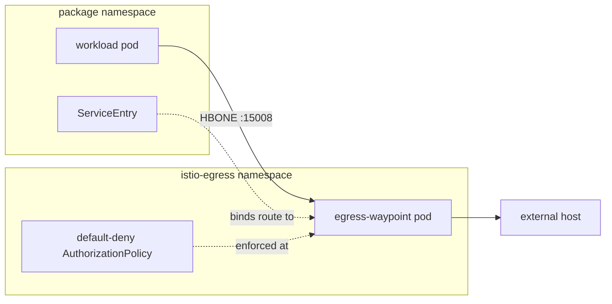

# Istio Egress Gateway

> **Alpha:** this feature is in alpha. Values, generated resources, and
> package coverage may change between releases.

## Overview

[istio-egress-gateway](https://repo1.dso.mil/big-bang/product/packages/istio-egress-gateway)
deploys a centralized egress [waypoint](https://istio.io/latest/docs/ambient/usage/waypoint/)
for clusters running Istio in ambient mode, giving package egress traffic a
single, policy-enforced exit point. It is a small first-party chart: it renders
a Gateway API `Gateway`, a waypoint configuration `ConfigMap`, and a
default-deny `AuthorizationPolicy`. The waypoint proxy pods themselves are
created and managed by istiod from the `Gateway` resource; the chart deploys no
workloads of its own.



Packages bind their outbound routes (bb-common `routes.outbound`) to the
waypoint, which denies all traffic except what each route's
AuthorizationPolicy allows. See
[Configuring an Egress Gateway](../../configuration/ambient-egress-gateway.md)
for usage and configuration.

## Big Bang Touchpoints

### Licensing

The chart is a first-party Big Bang package. The waypoint proxy it configures
is part of the Istio project, licensed under the
[Apache License 2.0](https://github.com/istio/istio/blob/master/LICENSE).

### Installation

The waypoint is deployed to the `istio-egress` namespace. It requires ambient
mode (`istio.ambient.enabled: true`) and can be enabled via the global flag or
the package directly:

```yaml
istio:
  egressGateway:
    enabled: true

# Or directly
istioEgressGateway:
  enabled: true
```

### Storage

The waypoint is a stateless proxy and does not require any persistent storage.

### UI

The package does not have a dedicated UI. Observability is provided through:

- **Kiali**: visualize egress traffic from source workloads through the
  waypoint to external hosts
- **Grafana**: view waypoint metrics via Prometheus
- **Kubectl**: inspect the waypoint pods and access logs

### Logging

The waypoint writes Envoy access logs to stdout (enabled mesh-wide by Big
Bang's istiod defaults), recording source workload, destination host, upstream
IP, bytes, and allow/deny outcome per connection. Logs are captured by the
cluster's logging collector (Alloy or Fluentbit) and shipped to your
configured logging backend (Loki or Elasticsearch).

### Monitoring

The waypoint pod is a standard `istio-proxy` container with the Istio
Prometheus annotations, so it is automatically scraped by the monitoring
package's `istio-envoy` PodMonitor. Metrics carry the external host as
`destination_service`, giving per-host, per-source traffic visibility
(`istio_requests_total` for plaintext HTTP routes, `istio_tcp_*` for HTTPS
passthrough).

### Health Checks

The istiod-generated waypoint Deployment includes standard Kubernetes
readiness probes. The `Gateway` resource reports `Programmed: True` once the
waypoint is ready.

### High Availability

The waypoint is a single shared Deployment serving every bound route across
all packages. Replicas, resources, HPA, and PDB are configured via
`istioEgressGateway.values.waypoint.config`; see
[Waypoint sizing and behavior](../../configuration/ambient-egress-gateway.md#waypoint-sizing-and-behavior).

### Dependent Packages

The egress gateway requires the ambient mode stack:

- **istiod**: creates and manages the waypoint pods from the `Gateway` resource
- **istio-cni** and **ztunnel**: capture workload traffic and tunnel it to the
  waypoint over HBONE
- **Gateway API**: provides the `Gateway` CRD and `istio-waypoint` GatewayClass

### Configuration

Values can be passed through to the istio-egress-gateway chart:

```yaml
istioEgressGateway:
  enabled: true
  values:
    defaultDeny:
      enabled: true
    waypoint:
      config:
        deployment:
          spec:
            replicas: 2
```

See [Configuring an Egress Gateway](../../configuration/ambient-egress-gateway.md)
for binding package routes to the waypoint, and the
[package documentation](https://repo1.dso.mil/big-bang/product/packages/istio-egress-gateway/-/blob/main/docs/overview.md)
for the full values reference.
