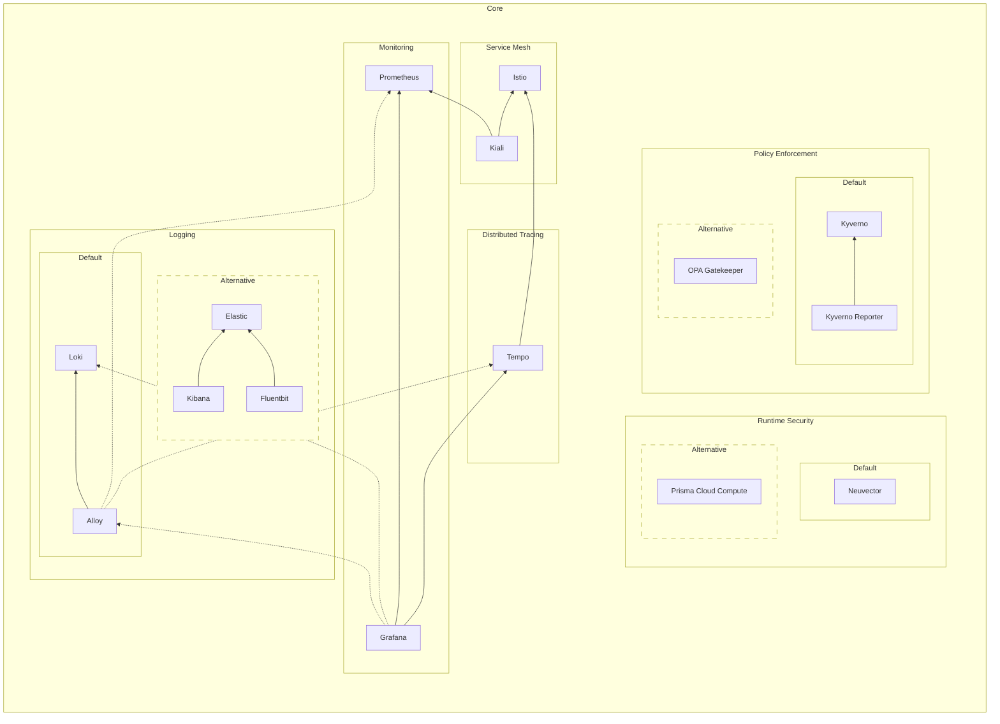
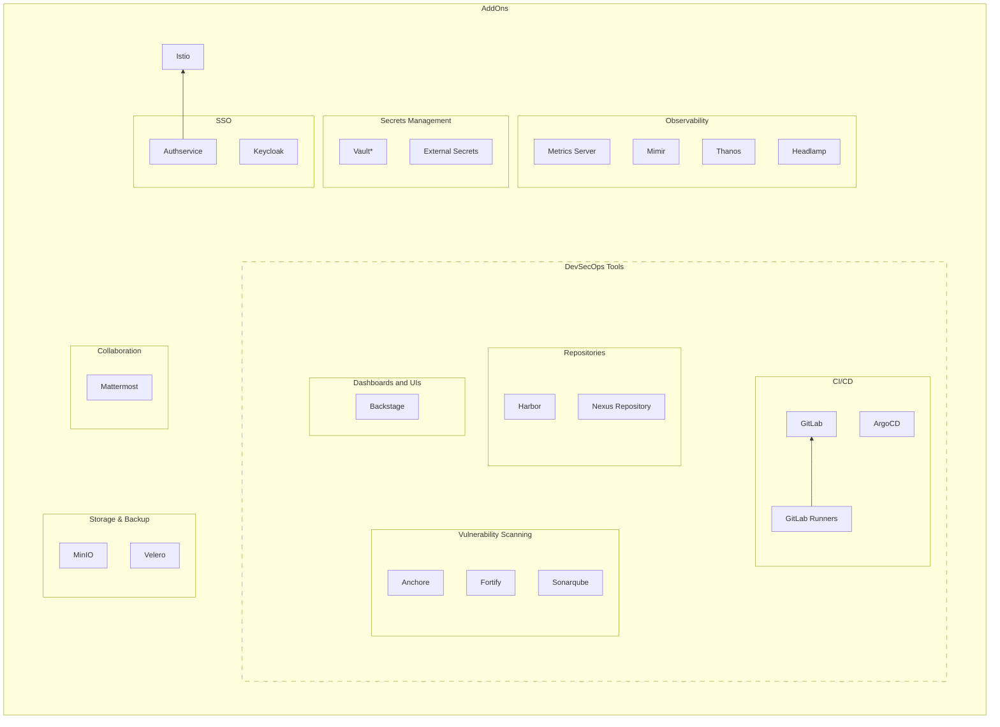

# Packages

Big Bang includes many different packages that provide services to the ecosystem.  Each of these packages is deployed by a Helm chart located in a repository under [Big Bang's Universe Group](https://repo1.dso.mil/big-bang/product).  The packages are broken up into several categories listed below.  Sometimes packages are tightly coupled and grouped together in a stack.  When using a stack, all packages in the stack will be deployed.

[[_TOC_]]

## Technical Oversight Committee (TOC)

The Big Bang TOC supports users and contributors of the Big Bang ecosystem.  If you would like to add, modify, or remove packages in Big Bang, we encourage you to attend the TOC to discuss your ideas.  You can find details in [the BBTOC repository](https://repo1.dso.mil/big-bang/product/bbtoc), specifically in the [Package Maintenance Tracks](https://repo1.dso.mil/big-bang/product/bbtoc/-/blob/main/process/Package%20Maintenance%20Tracks.md) document.

## Dependency Tree

Several of Big Bang's packages have dependencies on other packages.  A Dependency exists if the package would have a significant (or total) loss in functionality if the dependency was not present.

> Footnotes:
>
> - Dotted lines in `Core` indicate a package that is not enabled by default
> - The following were left off the chart to keep it simple
>   - Most packages depend on Istio for encrypted traffic and ingress to interfaces.
>   - Some packages have operators that are deployed prior to the package and manage the package's state.

## Core

Core packages make up the foundation of Big Bang.  At least one of the supported stacks listed in each category must be enabled to be considered a Big Bang cluster.  These packages are designed to provide administrative support for other packages.

### Service Mesh

A service mesh is a dedicated infrastructure layer for making service-to-service communication safe, fast, and reliable.  It provides fine-grained control and enforcement of network routing into, out of, and within the cluster.  It can also supply end-to-end traffic encryption, authentication, and authorization.

|Default|Stack|Package|Function|Repositories|
|--|--|--|--|--|
|X|Istio|Istio CRDs |CRDs|[istio-crds](https://repo1.dso.mil/big-bang/product/packages/istio-crds)|
|X|Istio|Istiod |Control Plane|[istiod](https://repo1.dso.mil/big-bang/product/packages/istiod)|
|X|Istio|Istio Gateway | Ingress Gateway |[istio-gateway](https://repo1.dso.mil/big-bang/product/packages/istio-gateway)|
| |Istio|Istio CNI | Traffic Interception |[istio-cni](https://repo1.dso.mil/big-bang/product/packages/istio-cni)|
|X|Istio|[Kiali](./kiali.md)|Management Console|[kiali](https://repo1.dso.mil/big-bang/product/packages/kiali)|

### Logging

A logging stack is a set of scalable tools that can aggregate logs from cluster services and provide real-time queries and analysis.  Logging is typically comprised of three components: a forwarder, storage, and a visualizer.

|Default|Stack|Package|Function|Repositories|
|--|--|--|--|--|
|X|ALG|[Alloy](./alloy.md)|Forwarder|[alloy](https://repo1.dso.mil/big-bang/product/packages/alloy)|
|X|ALG|[Loki](./loki.md)|Storage|[loki](https://repo1.dso.mil/big-bang/product/packages/loki)|
| |EFK|Elastic Cloud on Kubernetes (ECK) Operator|Operator|[eck-operator](https://repo1.dso.mil/big-bang/product/packages/eck-operator)|
| |EFK|[Elasticsearch / Kibana](./elasticsearch-kibana.md)|Storage & Visualization|[elasticsearch-kibana](https://repo1.dso.mil/big-bang/product/packages/elasticsearch-kibana)|
| |EFK|[Fluentbit](./fluentbit.md)|Forwarder|[fluentbit](https://repo1.dso.mil/big-bang/product/packages/fluentbit)|

> ALG stack uses the Grafana package, deployed in [monitoring](#monitoring), for visualization.

### Policy Enforcement

Policy Enforcement is the ability to validate Kubernetes resources against compliance, security, and best-practice policies.  If a resource violates a policy, the enforcement tool can deny access to the cluster, dynamically modify the resource to force compliance, or simply record the violation in an audit report.  Usually, a reporting tool accompanies the engine to help with analyzing and visualizing policy violations.

|Default|Stack|Package|Function|Repositories|
|--|--|--|--|--|
| |Gatekeeper|[OPA Gatekeeper](./opa-gatekeeper.md)|Engine & Policies|[policy](https://repo1.dso.mil/big-bang/product/packages/policy)|
|X|Kyverno|[Kyverno](./kyverno.md)|Engine|[kyverno](https://repo1.dso.mil/big-bang/product/packages/kyverno)|
|X|Kyverno|Kyverno Policies|Policies|[kyverno-policies](https://repo1.dso.mil/big-bang/product/packages/kyverno-policies)|
|X|Kyverno|Kyverno Reporter|Reporting|[kyverno-reporter](https://repo1.dso.mil/big-bang/product/packages/kyverno-reporter)|

### Monitoring

A monitoring stack is used to collect, visualize, and alert on time-series metrics from cluster resources.  Metrics are quantitative measurements that provide insight into the cluster.  Some examples of metrics include memory utilization, disk utilization, network latency, number of web queries, or number of database transactions.

|Default|Stack|Package|Function|Repositories|
|--|--|--|--|--|
|X|Monitoring|[Prometheus](./monitoring.md)|Collection & Alerting|[monitoring](https://repo1.dso.mil/big-bang/product/packages/monitoring)|
|X|Monitoring|[Grafana](./monitoring.md)|Visualization|[monitoring](https://repo1.dso.mil/big-bang/product/packages/monitoring)|

### Distributed Tracing

Distributed tracing is a method of tracking application transactions as they flows through cluster services.  It is a diagnosing technique to help characterize and troubleshoot problems from the user's perspective.

|Default|Package|Repositories|
|--|--|--|
|X|[Tempo](./tempo.md)|[tempo](https://repo1.dso.mil/big-bang/product/packages/tempo)|

### Runtime Security

Runtime security is the active protection of containers running in the cluster.  This type of tool includes scanning for vulnerabilities, checking compliance, detecting threats, and preventing intrusions.  Many of these tools also include forensics and incident response features.

|Default|Package|Repositories|
|--|--|--|
|X|[Neuvector](./neuvector.md)|[neuvector](https://repo1.dso.mil/big-bang/product/packages/neuvector)|
| |[Prisma Cloud Compute](./twistlock.md) (AKA Twistlock) |[twistlock](https://repo1.dso.mil/big-bang/product/packages/twistlock)|

## Addons

End users can extend Big Bang services beyond the core packages by enabling any of the many team-supported addon packages. Addons are supported by the Big Bang team and integrated with the core platform (Istio, Kyverno, Prometheus etc..) There are additional community-supported Big Bang packages that are not listed as addons.

### Single Sign-On

Single sign-on tools include packages that provide centralized authentication and authorization. This includes identity providers, authentication proxies, and session management.

|Package|Function|Repository|
|--|--|--|
|[Authservice](./authservice.md)|Istio extension for Single Sign-On (SSO)|[authservice](https://repo1.dso.mil/big-bang/product/packages/authservice)|
|[Keycloak](./keycloak.md)|IdP, Identity Broker, AuthN/Z|[keycloak](https://repo1.dso.mil/big-bang/product/packages/keycloak)|

### Secrets Management

Secrets management tools include packages that securely store, distribute, and rotate sensitive data such as passwords, API keys, and certificates. This includes encrypted storage, dynamic secrets generation, and access policies.

|Package|Function|Repository|
|--|--|--|
|[Vault](./vault.md)|Sensitive Data Access Control|[vault](https://repo1.dso.mil/big-bang/product/packages/vault)|
|[External Secrets](./external-secrets-operator.md)|Secrets management|[external-secrets](https://repo1.dso.mil/big-bang/product/packages/external-secrets)|

### Observability

Observability tools include packages for collecting, storing, and visualizing system telemetry. This includes metrics collection, long-term storage, dashboards, and monitoring interfaces for logs, metrics, and traces.

|Package|Function|Repository|
|--|--|--|
|[Metrics Server](./metricserver.md)|Monitors pod CPU & memory utilization|[metrics-server](https://repo1.dso.mil/big-bang/product/packages/metrics-server)|
|[Mimir](./mimir.md)|Long-term storage for Prometheus metrics|[mimir](https://repo1.dso.mil/big-bang/product/packages/mimir)|
|Headlamp|Cluster management dashboard|[headlamp](https://repo1.dso.mil/big-bang/product/packages/headlamp)|
|Thanos|Multi-cluster Prometheus setup|[thanos](https://repo1.dso.mil/big-bang/product/packages/thanos)|

### Collaboration

Collaboration tools provide environments to help teams work together online.  Chatting, video conferencing, file sharing, and whiteboards are all examples of collaboration tools.

|Stack|Package|Function|Repository|
|--|--|--|--|
|Mattermost|Mattermost Operator|Operator|[mattermost-operator](https://repo1.dso.mil/big-bang/product/packages/mattermost-operator)|
|Mattermost|[Mattermost](./mattermost.md)|Chat|[mattermost](https://repo1.dso.mil/big-bang/product/packages/mattermost)|

### Storage & Backup Utilities

For non-critical or on-prem deployments where data loss is an acceptable risk, these utilities offer a simple and low-cost solution for in-cluster data persistence (databases, object / blob storage, and caches). However, if scalability, availability, and resiliency (e.g. backup and restore) are requirements, it is generally advantageous to instead use a managed, cloud based offering.

|Stack|Package|Function|Repository|
|--|--|--|--|
|MinIO|MinIO Operator|Operator|[minio-operator](https://repo1.dso.mil/big-bang/product/packages/minio-operator)|
|MinIO|[MinIO](./minio.md)|S3 Object Storage|[minio](https://repo1.dso.mil/big-bang/product/packages/minio)|
|Velero|[Velero](./velero.md)|Cluster Backup & Restore|[velero](https://repo1.dso.mil/big-bang/product/packages/velero)|

### DevSecOps Tools

DevSecOps tools include packages that programmers and security teams use to plan, author, test, debug, secure, deploy, and control code. This includes repositories, bug / feature tracking, pipelines, code analysis, security scanning, vulnerability assessment, automated tests, container registries, deployment orchestration, developer portals, and development environments.

|Stack|Package|Function|Repository|
|--|--|--|--|
|GitLab|[GitLab](./gitlab.md)|Code repository, issue tracking, release planning, security and compliance scanning, pipelines, artifact repository, wiki|[gitLab](https://repo1.dso.mil/big-bang/product/packages/gitlab)|
|GitLab|GitLab Runner|Executor for GitLab pipelines|[gitlab-runner](https://repo1.dso.mil/big-bang/product/packages/gitlab-runner)|
|ArgoCD|[ArgoCD](./argocd.md)|Continuous Deployment|[argocd](https://repo1.dso.mil/big-bang/product/packages/argocd)|
|Anchore|[Anchore](./anchore.md)|Vulnerability Scanner|[anchore-enterprise](https://repo1.dso.mil/big-bang/product/packages/anchore-enterprise)|
|Fortify|[Fortify](./fortify.md)|Security scanning tool|[fortify](https://repo1.dso.mil/big-bang/product/packages/fortify)|
|Sonarqube|[Sonarqube](./sonarqube.md)|Static code analysis|[sonarqube](https://repo1.dso.mil/big-bang/product/packages/sonarqube)|
|Nexus|[Nexus Repository Manager](./nexusRepositoryManager.md)|Artifact repository|[nexus](https://repo1.dso.mil/big-bang/product/packages/nexus)|
|Harbor|[Harbor](./harbor.md)|Container registry|[harbor](https://repo1.dso.mil/big-bang/product/packages/harbor)|
|Backstage|[Backstage](./backstage.md)|Developer portal platform|[backstage](https://repo1.dso.mil/big-bang/product/packages/backstage)|

## Further Information

You can find some additional details about features supported by each package by visiting [this document](../../packages.md).
