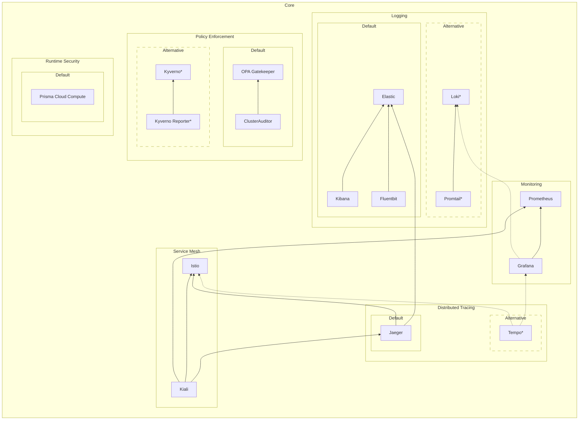
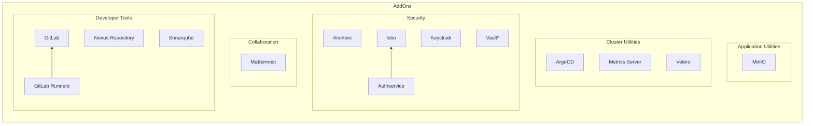

# Big Bang Packages

Big Bang includes many different packages that provide services to the ecosystem.  Each of these packages is deployed by a Helm chart located in a repository under [Big Bang's Packages Group](https://repo1.dso.mil/platform-one/big-bang/apps).  The packages are broken up into several categories listed below.  Sometimes packages are tightly coupled and grouped together in a stack.  When using a stack, all packages in the stack will be deployed.

[[_TOC_]]

## Technical Oversight Committee (TOC)

The Big Bang TOC supports users and contributors of the Big Bang ecosystem.  If you would like to add, modify, or remove packages in Big Bang, we encourage you to attend the TOC to discuss your ideas.  You can find details in [the TOC repository](https://repo1.dso.mil/platform-one/bbtoc).

## Dependency Tree

Several of Big Bang's packages have dependencies on other packages.  A Dependency exists if the package would have a significant (or total) loss in functionality if the dependency was not present.

> Footnotes:
>
> - Pages marked with `*` are  in Beta testing
> - Dotted lines in `Core` indicate a package that is not enabled by default
> - The following were left off the chart to keep it simple
>   - Most packages depend on Istio for encrypted traffic and ingress to interfaces.
>   - Some packages have operators that are deployed prior to the package and manage the package's state.

## Core

Core packages make up the foundation of Big Bang.  At least one of the supported stacks listed in each category must be enabled to be considered a Big Bang cluster.  These packages are designed to provide administrative support for other packages.

### Service Mesh

A service mesh is a dedicated infrastructure layer for making service-to-service communication safe, fast, and reliable.  It provides fine-grained control and enforcement of network routing into, out of, and within the cluster.  It can also supply end-to-end traffic encryption, authentication, and authorization.

|Default|Stack|Package|Function|Repositories|
|--|--|--|--|--|
|X|Istio|Istio Operator|Operator|[istio-operator](https://repo1.dso.mil/platform-one/big-bang/apps/core/istio-operator)|
|X|Istio|[Istio](./istio/Architecture.md)|Control Plane|[istio-controlplane](https://repo1.dso.mil/platform-one/big-bang/apps/core/istio-controlplane)|
|X|Istio|[Kiali](./kiali/Architecture.md)|Management Console|[kiali](https://repo1.dso.mil/platform-one/big-bang/apps/core/kiali)|

### Logging

A logging stack is a set of scalable tools that can aggregate logs from cluster services and provide real-time queries and analysis.  Logging is typically comprised of three components: a forwarder, storage, and a visualizer.

|Default|Stack|Package|Function|Repositories|
|--|--|--|--|--|
|X|EFK|Elastic Cloud on Kubernetes (ECK) Operator|Operator|[eck-operator](https://repo1.dso.mil/platform-one/big-bang/apps/core/eck-operator)
|X|EFK|[Elasticsearch / Kibana](./elasticsearch-kibana/Architecture.md)|Storage & Visualization|[policy](https://repo1.dso.mil/platform-one/big-bang/apps/core/policy)|
|X|EFK|[Fluentbit](./fluentbit/Architecture.md)|Forwarder|[fluentbit](https://repo1.dso.mil/platform-one/big-bang/apps/core/fluentbit)|
| |PLG|[Loki](./loki/Architecture.md) |Storage|[loki](https://repo1.dso.mil/platform-one/big-bang/apps/sandbox/loki)|
| |PLG|Promtail |Forwarder|[promtail](https://repo1.dso.mil/platform-one/big-bang/apps/sandbox/promtail)|
> PLG stack uses Grafana, deployed in [monitoring](#monitoring), for visualization.

### Policy Enforcement

Policy Enforcement is the ability to validate Kubernetes resources against compliance, security, and best-practice policies.  If a resource violates a policy, the enforcement tool can deny access to the cluster, dynamically modify the resource to force compliance, or simply record the violation in an audit report.  Usually, a reporting tool accompanies the engine to help with analyzing and visualizing policy violations.

|Default|Stack|Package|Function|Repositories|
|--|--|--|--|--|
|X|Gatekeeper|[OPA Gatekeeper](./opa-gatekeeper/Architecture.md)|Engine & Policies|[policy](https://repo1.dso.mil/platform-one/big-bang/apps/core/policy)|
|X|Gatekeeper|[Cluster Auditor](./cluster-auditor/Architecture.md)|Reporting|[cluster-auditor](https://repo1.dso.mil/platform-one/big-bang/apps/core/cluster-auditor)|
| |Kyverno|[Kyverno](./kyverno/Architecture.md) |Engine|[kyverno](https://repo1.dso.mil/platform-one/big-bang/apps/sandbox/kyverno)|
| |Kyverno|Kyverno Policies |Policies|[kyverno-policies](https://repo1.dso.mil/platform-one/big-bang/apps/sandbox/kyverno-policies)|
| |Kyverno|Kyverno Reporter |Reporting|[kyverno-reporter](https://repo1.dso.mil/platform-one/big-bang/apps/sandbox/kyverno-reporter)|

### Monitoring

A monitoring stack is used to collect, visualize, and alert on time-series metrics from cluster resources.  Metrics are quantitative measurements that provide insight into the cluster.  Some examples of metrics include memory utilization, disk utilization, network latency, number of web queries, or number of database transactions.

|Default|Stack|Package|Function|Repositories|
|--|--|--|--|--|
|X|Monitoring|[Prometheus](./monitoring/Architecture.md)|Collection & Alerting|[monitoring](https://repo1.dso.mil/platform-one/big-bang/apps/core/monitoring)|
|X|Monitoring|[Grafana](./monitoring/Architecture.md)|Visualization|[monitoring](https://repo1.dso.mil/platform-one/big-bang/apps/core/monitoring)|

### Distributed Tracing

Distributed tracing is a method of tracking application transactions as they flows through cluster services.  It is a diagnosing technique to help characterize and troubleshoot problems from the user's perspective.

|Default|Package|Repositories|
|--|--|--|
|X|[Jaeger](./jaeger/Architecture.md)|[jaeger](https://repo1.dso.mil/platform-one/big-bang/apps/core/jaeger)|
| |Tempo |[tempo](https://repo1.dso.mil/platform-one/big-bang/apps/sandbox/tempo)|
Product:

### Runtime Security

Runtime security is the active protection of containers running in the cluster.  This type of tool includes scanning for vulnerabilities, checking compliance, detecting threats, and preventing intrusions.  Many of these tools also include forensics and incident response features.

|Default|Package|Repositories|
|--|--|--|
|X|[Prisma Cloud Compute](./twistlock/Architecture.md) (AKA Twistlock) |[twistlock](https://repo1.dso.mil/platform-one/big-bang/apps/security-tools/twistlock)|

## Addons

Addons can be used to extend Big Bang with additional services.  All of the addons listed here are supported by the Big Bang team and integrated into the product.  There may be additional community supported Big Bang packages that are not listed here.  These packages are disabled in Big Bang by default.

### Storage Utilities

Storage utilities include packages that provide services to store and retrieve temporal or persistent data in the cluster.  This category includes databases, object storage, and data caching.  It is generally advantageous to use cloud based offerings instead of these to take advantage of scalability, availability, and resiliency (e.g. backup and restore).  However, for non-critical or on-prem deployments, these utilities offer a simpler and lower cost solution.

|Stack|Package|Function|Repository|
|--|--|--|--|
|MinIO|MinIO Operator|Operator|[minio-operator](https://repo1.dso.mil/platform-one/big-bang/apps/application-utilities/minio-operator)|
|MinIO|[MinIO](./minio/Architecture.md)|S3 Object Storage|[minio](https://repo1.dso.mil/platform-one/big-bang/apps/application-utilities/minio)|

### Cluster Utilities

Cluster utilities add functionality to Kubernetes clusters rather than applications.  Examples include resource utilization, cluster backup and restore, continuos deployment, or load balancers.

|Package|Function|Repository|
|--|--|--|
|ArgoCD|Continuous Deployment|[argocd](https://repo1.dso.mil/platform-one/big-bang/apps/core/argocd)
|Metrics Server|Monitors pod CPU & memory utilization|[metrics-server](https://repo1.dso.mil/platform-one/big-bang/apps/sandbox/metrics-server)|
|Velero|Cluster Backup & Restore|[velero](https://repo1.dso.mil/platform-one/big-bang/apps/cluster-utilities/velero)|

### Security

Security packages add additional security features for protecting services or data from unauthorized access or exploitation.  This includes things like identity providers (IdP), identity brokers, authentication (AuthN), authorization (AuthZ), single sign-on (SSO), security scanning, intrusion detection/prevention, and sensitive data protection.

|Package|Function|Repository|
|--|--|--|
|[Anchore](./anchore/Architecture.md)|Vulnerability Scanner|[anchore-enterprise](https://repo1.dso.mil/platform-one/big-bang/apps/security-tools/anchore-enterprise)|
|[Authservice](./authservice/Architecture.md)|Istio extension for Single Sign-On (SSO)|[authservice](https://repo1.dso.mil/platform-one/big-bang/apps/core/authservice)|
|[Keycloak](./keycloak/Architecture.md)|IdP, Identity Broker, AuthN/Z|[keycloak](https://repo1.dso.mil/platform-one/big-bang/apps/security-tools/keycloak)|
|Vault |Sensitive Data Access Control|[vault](https://repo1.dso.mil/platform-one/big-bang/apps/sandbox/vault)|

### Collaboration

Collaboration tools provide environments to help teams work together online.  Chatting, video conferencing, file sharing, and whiteboards are all examples of collaboration tools.

|Stack|Package|Function|Repository|
|--|--|--|--|
|Mattermost|Mattermost Operator|Operator|[mattermost-operator](https://repo1.dso.mil/platform-one/big-bang/apps/collaboration-tools/mattermost-operator)|
|Mattermost|[Mattermost](./mattermost/Architecture.md)|Chat|[mattermost](https://repo1.dso.mil/platform-one/big-bang/apps/collaboration-tools/mattermost)|

### Developer Tools

Developer tools include packages that a programmer would use to plan, author, test, debug, or control code.  This includes repositories, bug / feature tracking, pipelines, code analysis, automated tests, and development environments.

|Stack|Package|Function|Repository|
|--|--|--|--|
|GitLab|[GitLab](./gitlab/Architecture.md)|Code repository, issue tracking, release planning, security and compliance scanning, pipelines, artifact repository, wiki|[gitLab](https://repo1.dso.mil/platform-one/big-bang/apps/developer-tools/gitlab)|
|GitLab|GitLab Runner|Executor for GitLab pipelines|[gitlab-runner](https://repo1.dso.mil/platform-one/big-bang/apps/developer-tools/gitlab-runner)|
|Nexus|Nexus Repository|Artifact repository|[nexus](https://repo1.dso.mil/platform-one/big-bang/apps/developer-tools/nexus)
|Sonarqube|[Sonarqube](./sonarqube/Architecture.md)|Static code analysis|[sonarqube](https://repo1.dso.mil/platform-one/big-bang/apps/developer-tools/sonarqube)

## Further Information

You can find some additional details about features supported by each package by visiting [this document](../../../Packages.md).
