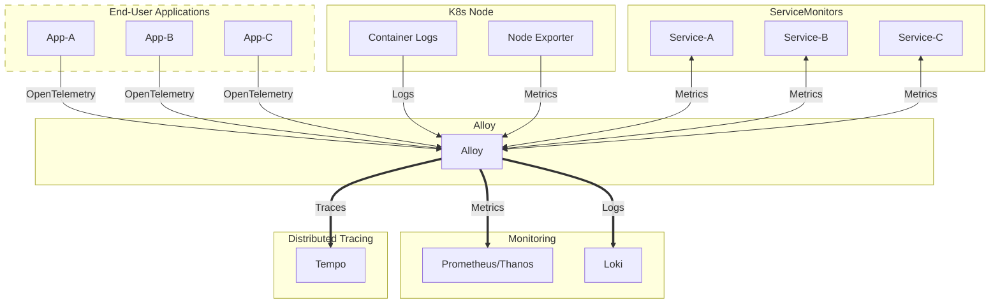

# Grafana Alloy

## Overview

[Grafana Alloy](https://grafana.com/docs/alloy/latest/), formerly known as
Grafana Agent, is Grafana's opinionated spin of the OpenTelemetry collector. It
combines many open-source projects in the cloud-native observability space with
the goal of being the only observability component necessary to collect and
distribute telemetry signals within a cluster.

## Big Bang Touchpoints

### Licensing

Grafana Alloy is open-source,
[licensed under Apache 2.0](https://github.com/grafana/alloy/blob/main/LICENSE).

### UI

While Grafana Alloy does expose a
[UI for visualizing its configuration status](https://grafana.com/docs/alloy/latest/troubleshoot/debug/),
it is not necessary for use and is not exposed by default within Big Bang.

### Storage

Grafana Alloy requires no storage itself, opting instead to push telemetry
signals to other cluster components like Loki and Tempo, which have their own
storage needs.

### Logging

Grafana Alloy writes its logs to stderr. These logs will be picked up by the
logging collector configured within the cluster.

### High Availability

Grafana Alloy supports multiple deployment modes with built-in clustering.
Depending on which features are enabled in the `k8s-monitoring` chart, Alloy
may be deployed as a `StatefulSet`, `DaemonSet`, or `Deployment`.

### Health Checks

Grafana Alloy is configured with standard liveness and readiness probes. In
addition to the health of Alloy itself, cluster administrators can view the UI
mentioned above for specific health statuses of individual Alloy
[components](https://grafana.com/docs/alloy/latest/get-started/components/).
