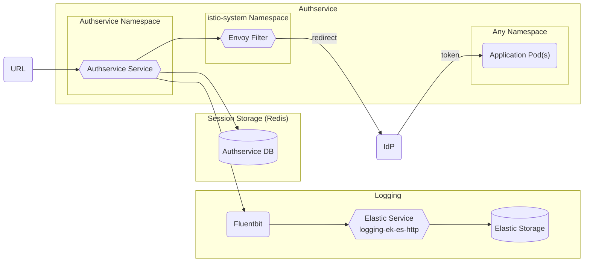

# Authservice

An implementation of [Envoy](https://envoyproxy.io) [External Authorization](https://www.envoyproxy.io/docs/envoy/latest/configuration/http/http_filters/ext_authz_filter),
focused on delivering authN/Z solutions for [Istio](https://istio.io) and [Kubernetes](https://kubernetes.io).

## Overview

`authservice` helps delegate the [OIDC Authorization Code Grant Flow](https://openid.net/specs/openid-connect-core-1_0.html#CodeFlowAuth)
to the Istio mesh. `authservice` is compatible with any standard OIDC Provider as well as other Istio End-user Auth features,
including [Authentication Policy](https://istio.io/docs/tasks/security/authn-policy/) and [RBAC](https://istio.io/docs/tasks/security/rbac-groups/).
Together, they allow developers to protect their APIs and web apps without any application code required.



## Big Bang Touch Points

### Licensing

[Authservice](https://github.com/istio-ecosystem/authservice) utilizes an Apache-2.0 License. The Iron Bank repo for the hardened authservice image can be found [here](https://repo1.dso.mil/dsop/istio-ecosystem/authservice) and the Big Bang repo for the authservice Helm Chart can be found [here](https://repo1.dso.mil/platform-one/big-bang/apps/core/authservice).

### Single Sign On

Authservice provides OIDC Single Sign On capabilities for apps that don't have native support.

Pods just need to have istio-injection, a single label which by default is `protect=keycloak` applied to the pods, and a corresponding chain to load into authservice.

```yaml
spec:
  template:
    metadata:
      labels:
        protect: keycloak
```

If you need to guarantee that authservice protects everything behind istio-ingressgateway, you can label ingressgateway instead of individual applications.

```yaml
istio:
  ingressGateways:
    public-ingressgateway:
      extraLabels:
        protect: keycloak
```

This label can be adjusted via following values in the Big Bang chart:

```yaml
addons:
  authservice:
    values:
      selector:
        key: protect
        value: keycloak
```

The corresponding chain loaded in to authservice via the values in the Big Bang chart:
For more information see the [README.md](https://repo1.dso.mil/platform-one/big-bang/apps/core/authservice/-/blob/main/README.md) in the Authservice package.

```yaml
addons:
  authservice:
    chains:
      example:
        callback_uri: ...
        match: ...
        client_id: ...
        client_secret: ...
```

### Storage

Authservice can be configured to use a redis server for distributed state storage. This Redis instance is used for OIDC token storage/retrieval.

```yaml
addons:
  authservice:
    redis:
      host: "redis.mydomain.com"
      port: "6379"
      password: "password"
```

### High Availability

When setting `replicaCount` above `1`, Authservice will utilize an HA redis deployment, but it can also be configured to use an external redis such as Elasticache.

Authservice also utilizes a horizontal pod autoscaler, which can be configured with min & max replicas and target CPU & memory utilization:

```yaml
addons:
  authservice:
    values:
      replicaCount: 2
      autoscaling:
        enabled: false
        minReplicas: 1
        maxReplicas: 3
        targetCPUUtilizationPercentage: 80
        targetMemoryUtilizationPercentage: 80
```

### UI

There is no UI feature for authservice.

### Logging

Within Big Bang, logs are captured by fluentbit and shipped to elastic by default.

### Health Checks

The authservice Dockerfile includes a [healthcheck](https://repo1.dso.mil/dsop/istio-ecosystem/authservice/-/blob/master/Dockerfile#L23-24) and the authservice Helm Chart includes [liveness & readiness probes](https://repo1.dso.mil/platform-one/big-bang/apps/core/authservice/-/blob/main/chart/templates/deployment.yaml#L42-47) in its deployment:

```yaml
livenessProbe:
  tcpSocket:
    port: 10003
readinessProbe:
  tcpSocket:
    port: 10003
```

### Dependent Packages

When setting `replicaCount` above `1`, a redis configuration is required.
