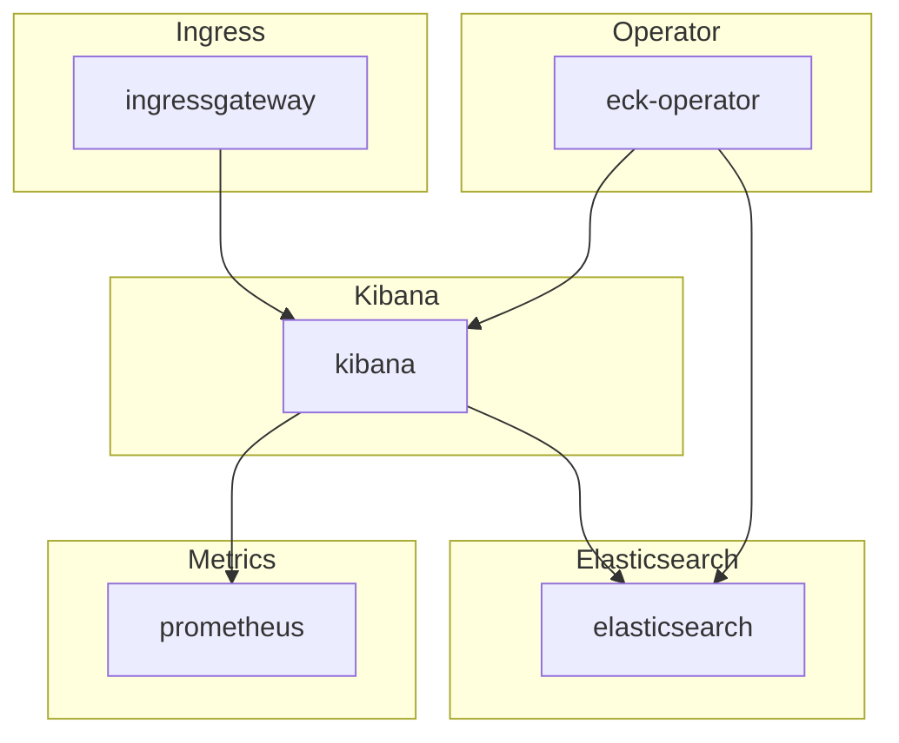

# Elasticsearch-Kibana

## Overview

[Elasticsearch-Kibana](https://www.elastic.co/elastic-stack) Elasticsearch is a search engine based on the Lucene library. It provides a distributed, multi-tenant-capable full-text search engine with an HTTP web interface and schema-free JSON documents. Kibana is a data visualization dashboard for Elasticsearch. It provides visualization capabilities on top of the content indexed on an Elasticsearch cluster. Users can create bar, line and scatter plots, or pie charts and maps on top of large volumes of data.

## Big Bang Touch Points



### Storage

Persistent storage for both Elasticsearch Master and Data nodes can be configured with the following values:

```yaml
logging:
  values:
    elasticsearch:
      master:
      persistence:
        storageClassName: ""
        size: 10Gi
      data:
      persistence:
        storageClassName: ""
        size: 20Gi
```

### Istio Configuration

Istio is disabled in the elasticsearch-kibana chart by default and can be enabled with the following values in the bigbang chart:

```yaml
hostname: bigbang.dev
istio:
  enabled: true
```

These values get passed into the logging chart [here](https://repo1.dso.mil/platform-one/big-bang/bigbang/-/blob/master/chart/templates/logging/elasticsearch-kibana/values.yaml#L6). This creates the Istio virtual service and maps to the main istio gateway for bigbang. The Kibana GUI is available behind this Istio VirtualService that is configured automatically at "kibana.{{ .Values.hostname }}" (value set above) and can be configured with the following values:

```yaml
logging:
  values:
    istio:
      kibana:
        # Toggle vs creation
        enabled: true
        annotations: {}
        labels: {}
        gateways:
          - istio-system/main
        hosts:
          - kibana.{{ .Values.hostname }}
```

## High Availability

This can be accomplished by increasing the "count" or number of replicas in each deployment in the stack:

```yaml
logging:
  values:
    kibana:
      count: 1
    elasticsearch:
      master:
        count: 3
      data:
        count: 4
```

## Single Sign On (SSO)

SSO integration for the eck stack requires a license (see below) and can be configured with the following values:

```yaml
sso:
  oidc:
    # -- Domain for keycloak used for configuring SSO
    host: login.dso.mil
    # -- Keycloak realm containing clients
    realm: baby-yoda

logging:
  sso:
    # -- Toggle OIDC SSO for Kibana/Elasticsearch on and off.
    # Enabling this option will auto-create any required secrets.
    enabled: true
    # -- Elasticsearch/Kibana OIDC client ID
    client_id: "EXAMPLE_OIDC_CLIENT"
    # -- Elasticsearch/Kibana OIDC client secret
    client_secret: "EXAMPLE_OIDC_CLIENT_SECRET"
```

## Licensing

Features like SSO integration, email/slack/Pagerduty alerting, FIPS 140-2 mode, encryption at rest, and more for the eck stack requires a platinum or enterprise license. Information about licensing and all features is available [here](https://www.elastic.co/pricing/). A Trial license can be enabled by setting `trial: true` in the below settings to enable a 30-day trial of enterprise settings.
Licensing can be configured with the following values:

```yaml
logging:
  license:
    trial: false
    keyJSON: |
      {"license":{"uid":....}}
```

## Health Checks

Licensed ECK comes with [built in Health monitoring for Kibana and Elasticsearch](https://www.elastic.co/guide/en/kibana/current/monitoring-kibana.html). This is called self-monitoring within the Kibana UI available at the Stack Monitoring settings <https://KIBANA_URL/app/monitoring>#.

Outside of the UI it is possible to check the health of Elasticsearch cluster via port-forward via doing the following:

```shell
kubectl get secrets -n logging logging-ek-es-elastic-user -o go-template='{{.data.elastic | base64decode}}'

kubectl port-forward svc/logging-ek-es-http -n logging 9200:9200

curl -ku "elastic:ELASTIC_PASSWORD" "https://localhost:9200/_cluster/health?pretty"
```
