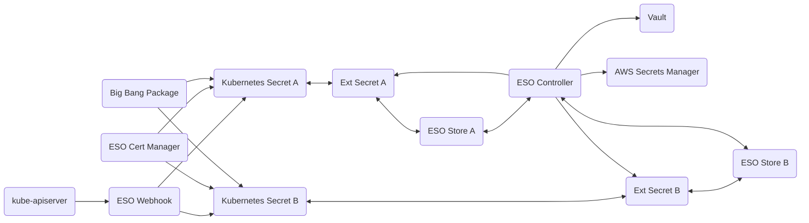

# External Secrets Operator

## Overview

[External Secrets Operator](https://github.com/external-secrets/external-secrets) reads information from a third-party service (such as AWS Secrets Manager, or Vault) and automatically injects the values into the Kubernetes cluster as Kubernetes secrets.

### External Secrets Operator



## Big Bang Touch Points

### Licensing

External Secrets Operator is [licensed under the Apache License](https://github.com/external-secrets/external-secrets/blob/main/LICENSE). No additional licensing is necessary for use or redistribution.

### Storage

The external secrets operator adds no new storage mechanisms of its own, but allows for the integration of various external secrets providers (like AWS Secrets Manager, or Vault) to Kubernetes secrets. 

The only storage to configure is the [SecretStore](https://external-secrets.io/latest/api/secretstore/) and [ClusterSecretStore](https://external-secrets.io/latest/api/clustersecretstore/) objects which perform this integration.

### UI

The external secrets operator has no user interface. It is an operator that enhances and modifies other objects, it is not a service that stands on its own.

### Logging

The External Secrets Operator produces logs that contain information about the internal state of the controller, webhook and cert controller. This information is currently logged by the default pod logging mechanism. 

_Note:_ within Big Bang, logs are captured by fluentbit and shipped to elastic by default.

External Secrets Operator loglevels are controllable through the values passed to the addon. Here is an example of configuring debug log levels for the ESO controller, certificate controller and webhook:

```yaml
addons:
  vault:
    values:
      extraArgs:
        loglevel: debug
      certController:
        extraArgs:
          loglevel: debug
      webhook:
        extraArgs:
          loglevel: debug
```

### Monitoring

The external secrets operator provides the ability to monitor the status and performance of secret stores, external secret providers, and individual secrets. These external secrets are provided through the `/metrics` endpoint.

Additional steps are required to display the collected metrics in Grafana. A sample dashboard is provided in [the upstream documentation](https://external-secrets.io/main/api/metrics/).

### Health Checks

Liveness and readiness probes are included in the external secrets operator chart for all deployments. The `/healthz/ready` endpoint is used on port 8081 (by default). 