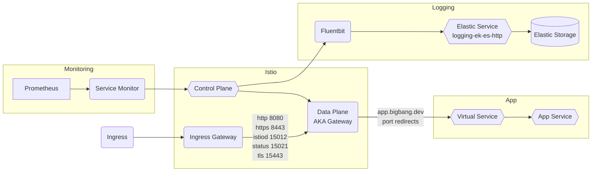

# Istio

## Overview

[Istio](https://istio.io/latest/docs/concepts/what-is-istio/) is an open platform for providing a uniform way to [integrate microservices](https://istio.io/latest/docs/examples/microservices-istio/), manage [traffic flow](https://istio.io/latest/docs/concepts/traffic-management/) across microservices, enforce policies and aggregate telemetry data. Istio's control plane provides an abstraction
layer over the underlying cluster management platform, such as Kubernetes.



## Big Bang Touchpoints

### Licensing

Istio is an open source tool that utilizes an Apache-2.0 License.

### Storage

Aside from the packages that it can integrate with, Istio provides no storage requirements.

### High Availability

By default, Istio is configured with 1 istiod replica, but it can be configured in the Big Bang values to use horizontal pod autoscaling:

```yaml
istio:
  values:
    istiod:
      replicaCount: 1
      hpaSpec:
        minReplicas: 1
        maxReplicas: 3
```

Likewise, the ingress gateway replicas can be specified and extra ingress gateways can be configured:

```yaml
istio:
  values:
    ingressGateway:
      minReplicas: 1
      maxReplicas: 5
    extraIngressGateways:
    # ...
```

### UI

Big Bang can be configured to deploy [Kiali](https://repo1.dso.mil/platform-one/big-bang/apps/core/kiali) (a management console that provides dashboards, observability, and other robust capabilities) and [Jaeger](https://repo1.dso.mil/platform-one/big-bang/apps/core/jaeger) (an end-to-end distributed tracing system), both of which include UI features to help you visualize your Istio mesh. To enable Kialia and Jaeger, simply update the Big Bang values.yaml:

```yaml
istio:
  enabled: true
jaeger:
  enabled: true
kiali:
  enabled: true
```

### Logging

Within Big Bang, logs are captured by fluentbit and shipped to elastic by default.

### Monitoring

Monitoring can be enabled to automatically capture metrics for Istio when `monitoring.enabled` is set to `true` in the Big Bang values.yaml. Since Istio 1.5, standard metrics are directly exported by the Envoy proxy. For a list of metrics, see [Istio Standard Metrics](https://istio.io/latest/docs/reference/config/metrics/#metrics) and [Istio Observability](https://istio.io/latest/docs/ops/best-practices/observability/).

Grafana (part of the monitoring packages) is a standalone component of Big Bang that can provide dashboards to show monitoring data. For more information, see Big Bang's [Grafana docs](https://repo1.dso.mil/platform-one/big-bang/apps/core/monitoring/-/tree/main/docs#grafana) and [Visualizing Metrics with Grafana](https://istio.io/latest/docs/tasks/observability/metrics/using-istio-dashboard/).

### Healthchecks

There are standard readiness probes built into the envoy sidecars and istio containers. See [here](https://istio.io/latest/docs/reference/config/istio.operator.v1alpha1/#ReadinessProbe) for more info.

You can get events in an istio-injected naemspace to see if your sidecars are unhealthy or having issues. To check the health/status of the istio installation, run `kubectl get istiooperators -n istio-system`.

### Dependant Packages

- istio-operator