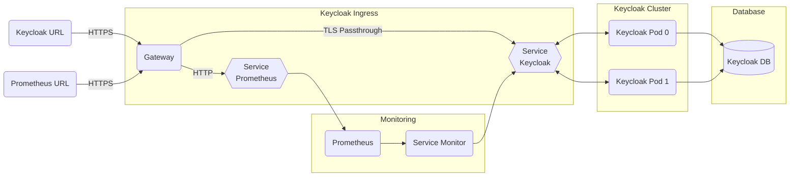

# Keycloak

## Overview

[Keycloak](https://www.keycloak.org/) provides open source identity and access management for modern applications and services.  This document will cover the architectural touchpoints for the Big Bang Keycloak package, which has been extended to include customizable registration and group segmentation.

### Keycloak Architecture



## Integration w/ Big Bang

Big Bang's integration with Keycloak requires special considerations and configuration compared to other applications.  This document will help you get it setup correctly.

### Keycloak with Other Apps

Due to the sensitivity of Keycloak, Big Bang does not support deploying KeyCloak and any other add-ons.  But, Keycloak can be deployed with the core Big Bang applications (e.g. Istio, Monitoring, Logging).  The URL to access these core apps is under the `admin` subdomain to avoid [a problem with overlapping certificates](#certificate-overlap-problem).  For example, in the `bigbang.dev` domain, to access Prometheus, you would go to `https://prometheus.admin.bigbang.dev`.  Keycloak would still be accessed at `https://keycloak.bigbang.dev`.

> The `admin` subdomain is only used when Keycloak is enabled

### Keycloak's Custom Image

The upstream [Keycloak Helm chart](https://repo1.dso.mil/platform-one/big-bang/apps/security-tools/keycloak) is customized for use in Platform One.  It contains the following modifications from a standard Keycloak deployment:

- Customized Platform One registration plugin

Additional customization can be added through values.  For example:

```yaml
addons:
  keycloak:
    # Setup TLS key pair
    # An alternative to this is to create a secret namged `tlskey` and `tlscert` using Kustomize in the customer template.  Then use the volume and volumemount configuration below to mount the files.  In this case, the `ingress.key` and `ingress.cert` would be left blank.
    ingress:
      key: |-
        {insert keycloak TLS key}
      cert: |-
        {insert keycloak TLS cert}
    values:
      secrets:
        # The `env` secret is used to add environmental variables to the keycloak pod
        env:
          stringData:
            # Keycloak will use the `customreg.yaml` for configuring the custom registration process.
            CUSTOM_REGISTRATION_CONFIG: /opt/jboss/keycloak/customreg.yaml
            # Keycloak will load a custom realm defined in `realm.json`
            KEYCLOAK_IMPORT: /opt/jboss/keycloak/realm.json
            # Keycloak will load a custom set of certificate authorities
            X509_CA_BUNDLE: /etc/x509/https/cas.pem
        # The `certauthority` secret holds the certificate authority keys.
        # Using the customer template, kustomize could be used to create the secret instead of using the keycloak chart via values
        certauthority:
          stringData:
            cas.pem: |-
              {insert CAS.PEM content}
        # The `customreg` secret holds the configuration for customer registration.
        # Using the customer template, kustomize could be used to create the secret instead of using the keycloak chart via values
        customreg:
          stringData:
            customreg.yaml: |-
              {insert customreg.yaml content}
        # The `realm` secret holds the custom realm configuration.
        # Using the customer template, kustomize could be used to create the secret instead of using the keycloak chart via values
        realm:
          stringData:
            realm.json: |-
              {insert realm.json content}
      # Create volumes for each secret above
      extraVolumes: |-
        - name: certauthority
          secret:
            secretName: {{ include "keycloak.fullname" . }}-certauthority
        - name: customreg
          secret:
            secretName: {{ include "keycloak.fullname" . }}-customreg
        - name: realm
          secret:
            secretName: {{ include "keycloak.fullname" . }}-realm
      # Volume mount each volume in the appropriate location
      extraVolumeMounts: |-
        - name: certauthority
          mountPath: /etc/x509/https/cas.pem
          subPath: cas.pem
          readOnly: true
        - name: customreg
          mountPath: /opt/jboss/keycloak/customreg.yaml
          subPath: customreg.yaml
          readOnly: true
        - name: realm
          mountPath: /opt/jboss/keycloak/realm.json
          subPath: realm.json
          readOnly: true
```

### Keycloak Admin password

Big Bang creates a default admin user for logging into the admin console.  To override the default admin credentials in Keycloak, set the following in Big Bang's `values.yaml`:

```yaml
addons:
  keycloak:
    values:
      secrets:
        credentials:
          stringData:
            adminuser: your_admin_username
            password: your_admin_password
```

### Keycloak TLS

To properly configure Keycloak TLS, you must provide Keycloak a certificate in `addons.keycloak.ingress` that does not overlap with any TLS terminated app certificate.  See [the details](#certificate-overlap-problem) for further information on why this is a problem.

In the Big Bang implementation, [core apps use the `admin` subdomain](#keycloak-with-other-apps).  You need two wildcard SAN certificates, one for `*.admin.yourdomain` and one for `*.yourdomain` for this implementation.  The `*.admin.yourdomain` cert goes into `istio.ingress` and the `*.yourdomain` cert goes into `addons.keycloak.ingress`.

In the following example for Big Bang, we provide a certificate for `*.admin.bigbang.dev` to TLS terminated apps and a `*.bigbang.dev` certificate to Keycloak.

```yaml
hostname: bigbang.dev
istio:
  ingress:
    key: |-
      <Private Key for *.admin.bigbang.dev>
    cert: |-
      <Certificate for *.admin.bigbang.dev>
addons:
  keycloak:
    enabled: true
    ingress:
      key: |-
        <Private key for *.bigbang.dev>
      cert: |-
        <Certificate for *.bigbang.dev>
```

#### Certificate Overlap Problem

> This problem automatically worked around by Big Bang if you have non-overlapping certificates as [recommended above](#keycloak-tls).  Youc an skip this section unless you want the gritty details.

Modern browsers will reuse established TLS connections when the destination's IP and port are the same and the current certificate is valid.  See the [HTTP/2 spec](https://httpwg.org/specs/rfc7540.html#rfc.section.9.1.1) for details.  If our cluster has a single load balancer and listens on port 443 for multiple apps, then the IP address and port for all apps in the cluster will be the same from the browser's point of view.  Normally, this isn't a problem because Big Bang uses TLS termination for all applications.  The encryption occurs between Istio and the browser no matter which hostname you use, so the connection can be reused without problems.

With Keycloak, we need to passthrough TLS rather than terminate it at Istio.  If we have other apps, like Kiali, that are TLS terminated, Istio needs two server entries in its Gateway to passthrough TLS for hosts matching `keycloak.bigbang.dev` and to terminate TLS for other hosts.  If the certificate used for TLS is valid for both Keycloak and other apps (e.g. the cert includes a SAN of `*.bigbang.dev`), then the browser thinks it can reuse connections between the applications (the IP, port, and cert are the same).  If you access a TLS terminated app first (e.g. `kiali.bigbang.dev`), then try to access `keycloak.bigbang.dev`, the browser tries to reuse the connection to the terminated app, resulting in a [data leak](https://cve.mitre.org/cgi-bin/cvename.cgi?name=CVE-2020-11767) to the terminated app and a 404 error in the browser.  Istio is [supposed to handle this](https://github.com/istio/istio/issues/13589) situation, but does not.

To workaround this situation, you have to isolate the applications by IP, port, or certificate so the browser will not reuse the connection between them.  You can use external load balancers or different ingress ports to create unique IPs or ports for the applications.  Or you can create non-overlapping certs for the applications.  This does not prevent you from using wildcard certs, since you could have one cert for `*.bigbang.dev` and another for `*.admin.bigbang.dev` that don't overlap.  Alternatively, you can create one cert for `kiali.bigbang.dev` and other TLS terminated apps and another cert for `keycloak.bigbang.dev`.

> All of the core and addon apps are TLS terminated except Keycloak.

## Big Bang Touchpoints

### GUI

Keycloak has two main end point URLs:
[https://keycloak.bigbang.dev](https://keycloak.bigbang.dev) for authentication.
[https://keycloak.bigbang.dev/auth/admin](https://keycloak.bigbang.dev/auth/admin) for administration.

The `bigbang.dev` domain name can be customized by setting the `hostname` in `values.yaml`

### Database

An external shared database is required for Keycloak operation in production.  It should be setup according to [the Keycloak database configuration documentation](https://www.keycloak.org/docs/latest/server_installation/#_database).

> For development ad test, a Postgres database is provided inside the cluster.  This should **NOT** be used in production.

The following values can be customized in `values.yaml` to connect to your external database:

```yaml
addons:
  keycloak:
    database:
      host: mydb.mydomain.com
      type: postgres
      port: 5432
      database: keycloak
      username: kcuser
      password: p@ssw0rd
```

### Logging

Logging is automatic for Keycloak when the Logging package is enabled in Big Bang.  Fluentbit captures the logs and ships them to Elastic.

### Monitoring

When the Monitoring package is enabled, Big Bang will turn on Keycloak's production of Prometheus metrics and setup a Service Monitor to scrape those metrics.  By default, metrics for the `datasources` (db), `undertow` (http), and `jgroup` subsystems are enabled.

### Health Checks

Liveness and readiness probes are included in the Keycloak Helm chart for all deployments. The probes check the endpoint at `/auth/realm/master/` on port 8080 of the pods.  This means the probes will still succeed even if you have an invalid certificate loaded into Keycloak.

If you wish to adjust the probes, you can override the values in `values.yaml`:

```yaml
addons:
  keycloak:
    values:
      livenessProbe: |
        httpGet:
          path: /auth/realms/master
          port: http
          scheme: HTTP
        initialDelaySeconds: 120
        failureThreshold: 15
        periodSeconds: 15
      readinessProbe: |
        httpGet:
          path: /auth/realms/master
          port: http
          scheme: HTTP
        initialDelaySeconds: 120
        failureThreshold: 15
        timeoutSeconds: 2
```

## Licensing

Keycloak is available under the [Apache License 2.0](https://github.com/keycloak/keycloak/blob/master/LICENSE.txt) for free.

## High Availability

By default Big Bang deploys Keycloak with two replicas in a high availability cluster configuration.  It is already configured to support cache sharing, anti-affinity, failovers, and rolling updates.  If you wish to increase or decrease the number of replicas, you can set the following in `values.yaml`:

```yaml
addons:
  keycloak:
    values:
      replicas: 2
```

## Dependent Packages

- Istio for ingress
- (Optional) Monitoring for metrics
- PostgreSQL database (development/test only)
