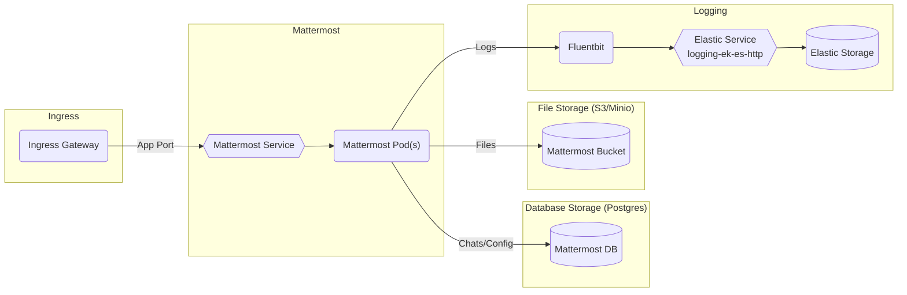
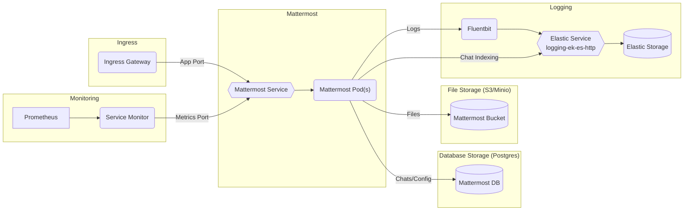

# Mattermost

## Overview

[Mattermost](https://mattermost.com/) is an open-source, self-hostable online chat service with file sharing, search, and integrations.

Big Bang's implementation uses the [Mattermost operator](https://github.com/mattermost/mattermost-operator) to provide custom resources and manage the application.

### Basic Tier



### Enterprise Tier with Integrations



## Big Bang Touch Points

### UI

The Mattermost UI is the primary way of interacting with Mattermost. The UI is accessible via a web browser, desktop client, and mobile apps. The UI provides access to all mattermost features as well as configuration of the instance via the settings (or "System Console").

### Logging

Mattermost provides access to the system logs via the "System Console" (under "Server Logs"). The UI provides a basic search functionality as well for these logs

By default logs are also shipped to Elastic via Fluentbit for advanced searching/indexing. The filter `kubernetes.namespace_name` set to `mattermost` can provide easy viewing of Mattermost only logs.

Optional Enterprise Feature: Mattermost can make use of Elastic for improved performance with indexing of posts (which provides optimized search queries). For more details see the [dependencies section](#dependencies).

### Monitoring

Monitoring is available within Mattermost as a paid (E20) feature. If you have both `addons.mattermost.enterprise` and `monitoring` enabled within Big Bang values a service monitor will be deployed to automatically ship metrics data to Prometheus for consumption.

### Health Checks

The Mattermost Operator ships by default with health checks on the address `/api/v4/system/ping` port 8065 to verify that the system is healthy. Kubernetes will handle cycling unhealthy pods and all data will persist on the DB and File Storage.

## High Availability

**To allow for defining replica count and resource requests/limits, `users` is set to `null` by default. Changing this will negate these values and mattermost may not run due to OPA Gatekeeper constraints.**

To set a replica count greater than 1 requires an enterprise license, and can be configured like the following example:

```yaml
addons:
  mattermost:
    values:
      enterprise:
        enabled: true
      replicaCount: 3
```

**Setting a user value is not supported due to OPA constraint issues**

If you want to use Mattermost's user/size value you will need to handle OPA violations and exceptions yourself since this is **not BB supported.** If all of these considerations have been accounted for and you still want to deploy with Mattermost's user sizing it can be done by setting the value as in this example:

```yaml
addons:
  mattermost:
    values:
      users: 1000
```


## Single Sign On (SSO)

SSO is built in for Mattermost and Big Bang uses the [Gitlab SSO integration](https://docs.mattermost.com/deployment/sso-gitlab.html) as its implementation since this option is available at the free tier. Mattermost also provides OAuth and SAML integration as paid features for its [enterprise tiers](#licensing) if you wish to use those.

If using Big Bang's SSO implementation, Keycloak is used behind the scenes to "spoof" the way Gitlab interaction works for SSO. The set up for how to configure Keycloak to handle this is well documented via the [Mattermost docs](https://repo1.dso.mil/platform-one/big-bang/apps/collaboration-tools/mattermost/-/blob/main/docs/keycloak.md).

See below for an example of the values to provide to Mattermost for SSO setup:

```yaml
addons:
  mattermost:
    sso:
      enabled: true
      client_id: platform1_a8604cc9-f5e9-4656-802d-d05624370245_bb8-mattermost
      client_secret: no-secret
      auth_endpoint: https://login.dso.mil/oauth/authorize
      token_endpoint: https://login.dso.mil/oauth/token
      user_api_endpoint: https://login.dso.mil/api/v4/user
```

## Licensing

Big Bang deploys the free version of Mattermost by default, but there are two additional tiers of paid licenses for additional features. Pricing for these licenses is typically based upon number of users. Full details can be viewed on [Mattermost's tier page](https://docs.mattermost.com/overview/product.html). If you want to trial the E20 features you can request a trial via Mattermost's [request page](https://mattermost.com/trial/) or after deploying via the System Console you can begin a 30 day trial under the "Edition and License" page.

### Mattermost E10 Additional Features

- Active Directory/LDAP Single Sign-on
- OAuth 2.0 authentication for team creation, account creation, and user sign-in
- Encrypted push notifications with service level agreements (SLAs) via HPNS
- Advanced access control policy
- Next business day support via online ticketing system
- Scale to handle hundreds of users per team

### Mattermost E20 Additional Features

- Advanced SAML 2.0 authentication with Okta, OneLogin, and Active Directory Federation Services
- Active Directory/LDAP group sync
- OpenID Connect authentication for team creation, account creation, and user sign-in
- Compliance exports of message histories with oversight protection
- Custom retention policies for messages and files
- High Availability support with multi-node database deployment
- Horizontal scaling through cluster-based deployment
- Elasticsearch support for highly efficient database searches in a cluster environment
- Advanced performance monitoring
- Eligibility for Premier Support add-on

### License Values

Once you have obtained a license this can be added to your values in Big Bang to automatically set up your Mattermost instance with the license (replacing the `license:` value with your full license string):

```yaml
addons:
  mattermost:
    enterprise:
      enabled: true
      license: "ehjgjhh..."
```

## Storage

### Database Storage

Mattermost makes use of a database to store all chat information as well as persistent configuration for all of Mattermost. By default Big Bang deploys an in-cluster Postgresql instance for this purpose, but it is recommended to point to an external DB instance for HA. Currently Big Bang supports pointing to any external Postgres instance via values config. See the below example for values to point your database connection to an external instance:

```yaml
addons:
  mattermost:
    database:
      host: "mypostgreshost"
      port: "5432"
      username: "myusername"
      password: "mypassword"
      database: "mattermost"
      # OPTIONAL: Provide the postgres SSL mode
      ssl_mode: ""
```

### File Storage

Mattermost uses S3, Minio, or another S3-style storage for file storage. By default Big Bang deploys an in-cluster Minio instance for this purpose, but you have the option to point to an external Minio or S3 if desired. See the below example for the values to supply:

```yaml
addons:
  mattermost:
    objectStorage:
      endpoint: "s3.amazonaws.com"
      accessKey: "myAccessKey"
      accessSecret: "myAccessSecret"
      bucket: "myMattermostBucket"
```

## Dependencies

Mattermost requires only database storage, file storage, and the mattermost operator by default the operator is bundled in Big Bang, and the database/file storage can also be provided in cluster via Big Bang or externalized (see the [storage section](#storage) above). No additional external dependencies are required, everything can be done via Big Bang. There is an optional dependency on Elasticsearch to provide optimized searches rather than using DB queries (E20 Enterprise license required) - see the official [Mattermost doc](https://docs.mattermost.com/deployment/elasticsearch.html) for more details.
