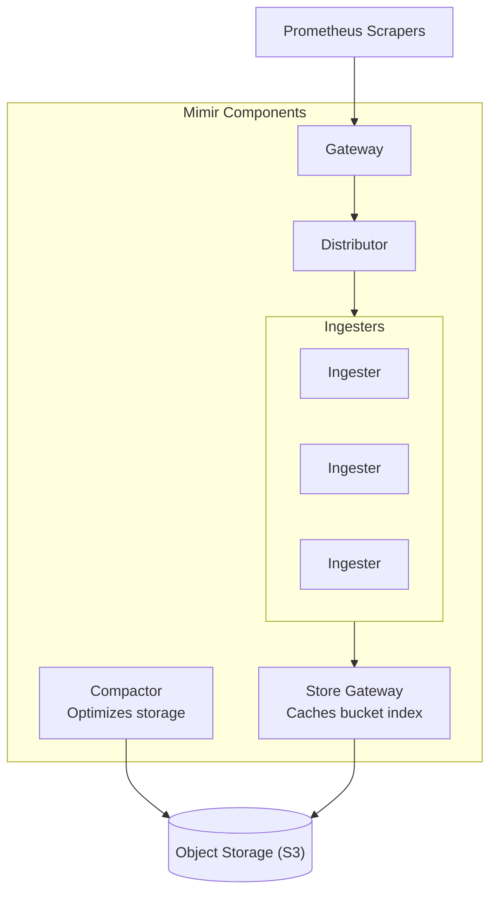
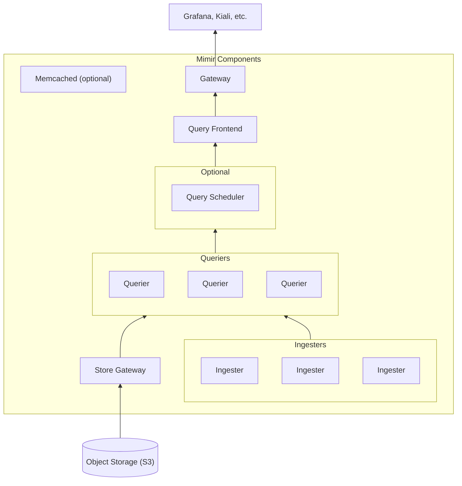

# Mimir

Mimir is an open source, horizontally scalable, highly available, multi-tenant
Time Series Database (TSDB) for long-term storage for Prometheus.

## Architecture

While Mimir itself supports a number of deployment modes including monolith,
simple-scalable, and microservice-based paradigms, the community supports only
microservice-based via `helm install`, so that is the only deployment mode
supported by Big Bang.

### Write Path

### Read Path

### Multitenancy

While multitenancy is one of Mimir's standout features compared to other
long-term Prometheus storage options, no tenancy decisions are made by Big Bang.
By default in Big Bang, all metrics consumed by Mimir belong to the 'anonymous'
tenant.

## Big Bang Touchpoints

### Licensing

Grafana Mimir is open-source,
[licensed under AGPL v3.0](https://github.com/grafana/mimir/blob/main/LICENSE).

### UI

While Mimir is a Prometheus-compatible storage backend, it does not expose the
Prometheus UI. It is expected that Mimir will be consumed entirely via its API.
Mimir does have an administrative interface that is useful for debugging and
diagnostics, but the Big Bang team does not expose this by default.

### Storage

Mimir is designed to work with an external S3-compatible object storage service.
It can function by writing metrics to disk directly. In Big Bang, it is
configured to do so when Minio is not enabled and no other object storage
configuration is provided.

### Logging

Grafana Mimir writes its logs to stderr. These logs will be picked up by the
logging collector configured within the cluster.

### High Availability

Grafana Mimir is only community supported in a highly-scalable
microservice-based deployment mode. The Big Bang team makes no assumptions about
consumer scaling needs and leaves the exact configuration for a performant
deployment up to the Big Bang consumer. By default, the components are deployed
with at least n+1 availability.

Grafana publishes
[a guide](https://grafana.com/docs/mimir/latest/manage/run-production-environment/planning-capacity/)
for Mimir capacity planning that can be helpful when performing scaling
configuration.

### Health Checks

Grafana Mimir is configured with standard liveness and readiness probes. In
addition to the health of Mimir itself, cluster administrators can port-forward
the admin UI to get an overall view of cluster and gossip ring health.
