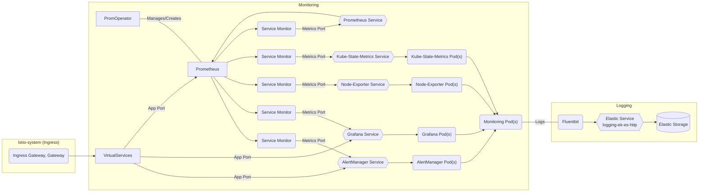

# Monitoring

## Overview

Monitoring in Bigbang is deployed using the upstream chart  [kube-prometheus-stack](https://github.com/prometheus-community/helm-charts/tree/main/charts/kube-prometheus-stack)

Installs the kube-prometheus stack, a collection of Kubernetes manifests, Grafana dashboards, and Prometheus rules combined with documentation and scripts to provide easy to operate end-to-end Kubernetes cluster monitoring with Prometheus using the Prometheus Operator.



## Big Bang Touchpoints

### UI

Alertmanager, Prometheus and Grafana within the monitoring Package have UIs that are accessible and configurable. By default they are externally available behind an Istio installation.

### Storage

#### Alertmanager

Persistent storage values for Alert Manager can be set/modified in the Big Bang chart:

```yaml
monitoring:
  values:
    alertmanager:
      alertmanagerSpec:
        storage:
          volumeClaimTemplate:
            spec:
                storageClassName: 
                accessModes: ["ReadWriteOnce"]
                resources:
                  requests:
                    storage: 50Gi
              selector: {}
```

#### Prometheus-Operator

Persistent storage values for Prometheus-Operator can be set/modified in the Big Bang chart:

```yaml
monitoring:
  values:
    prometheus:
      prometheusSpec:
        storageSpec:
          volumeClaimTemplate:
            spec:
                storageClassName: 
                accessModes: ["ReadWriteOnce"]
                resources:
                  requests:
                    storage: 50Gi
              selector: {}
```

#### Grafana

Persistent storage values for Grafana can be set/modified in the Big Bang chart:

```yaml
monitoring:
  values:
    grafana:
      persistence:
        type: pvc
        enabled: false
        # storageClassName: default
        accessModes:
          - ReadWriteOnce
        size: 10Gi
        # annotations: {}
        finalizers:
          - kubernetes.io/pvc-protection
        # selectorLabels: {}
        # subPath: ""
        # existingClaim:
```

### Logging

Within the kube-prometheus-stack chart, you can customize both the LogFormat and LogLevel for the following components:
Note: within Big Bang, logs are captured by fluentbit and shipped to elastic by default.

#### Prometheus-Operator

LogFormat and LogLevel can be set for Prometheus-Operator via the following values in the Big Bang chart:

```yaml
monitoring:
  values:
    prometheusOperator:
      logFormat: logfmt
      logLevel: info
```

#### Prometheus

LogFormat and LogLevel can be set for Prometheus via the following values in the Big Bang chart:

```yaml
monitoring:
  values:
    prometheus:
      prometheusSpec:
         logFormat: logfmt
         logLevel: info
```

#### Alertmanager

LogFormat and LogLevel can be set for Alertmanager via the following values in the Big Bang chart:

```yaml
monitoring:
  values:
    alertmanager:
      alertmanagerSpec:
        logFormat: logfmt
        logLevel: info
```

#### Grafana

LogLevel can be set for Grafana via the following values in the Big Bang chart:

```yaml
monitoring:
  values:
    grafana:
      grafana.ini:
        log:
          mode: console
```

## Single Sign on (SSO)

SSO can be configured for monitoring through Authservice, more info is included in the following documentation:
[Monitoring SSO Integration](https://repo1.dso.mil/big-bang/product/packages/monitoring/-/blob/main/docs/KEYCLOAK.md)

## Monitoring

Monitoring deployment has serviceMonitors enabled for

* core-dns
* kube-api-server
* kube-controller-manager
* kube-dns
* kube-etcd
* kube-proxy
* kube-scheduler
* kube-state-metrics
* kubelet
* node-exporter
* alert manager
* grafana
* prometheus
* prometheus-operator
* node-exporter

Note: Other packages are responsible for deploying Service Monitors for their components as needed.

### HA

Support for Prometheus and other apps within the package are being researched and section will be updated:

#### Alertmanager

High Availability can be accomplished by increasing the number of replicas for the deployment of Alertmanager;
```yaml
monitoring:
  values:
    alertmanager:
      alertmanagerSpec:
        replicas: 3
```

#### Prometheus

High Availability can be accomplished by increasing the number of replicas for the deployment of Prometheus. [Thanos](https://repo1.dso.mil/big-bang/product/packages/thanos/-/tree/main) must also be installed in the same namespace as the monitoring package in order for data to replicate across pods. An example of a Thanos object storage config using minIO [is located here](https://repo1.dso.mil/big-bang/product/packages/thanos/-/blob/main/tests/test-values.yaml). Thanos also supports cloud object storage endpoints.
```yaml
monitoring:
  values:
    thanosRuler:
      enabled: true
    prometheusOperator:
      clusterDomain: "cluster.local"
    prometheus:
      thanosService:
        enabled: true
      thanosServiceMonitor:
        enabled: true
      prometheusSpec:
        replicas: 3
        thanos:
          baseImage: registry1.dso.mil/ironbank/opensource/thanos/thanos
          version: v0.29.0
          objectStorageConfig:
            key: objstore.yml
            name: thanos-objstore-secret
```

#### Grafana

High Availability can be accomplished by increasing the number of replicas for the deployment of Grafana and configuring an external database connection (postgresql/mysql) so users and dashboard information can be centrally located for the replicas to have a source of truth. See Grafana's [upstream documentation](https://grafana.com/docs/grafana/v9.0/setup-grafana/configure-grafana/#database)
```yaml
monitoring:
  values:
    grafana:
      replicas: 3
      grafana.ini:
        ...
	database:
	  type: [postgres|mysql]
	  host: external-db:5432
	  name: grafana
	  user: ""
	  password: ""
```

### Dependency Packages

When deploying BigBang, monitoring depends on gatekeeper/kyverno and istio being installed prior.

```yaml
  {{- if or .Values.gatekeeper.enabled .Values.istio.enabled .Values.kyvernoPolicies.enabled }}
  dependsOn:
  {{- if .Values.istio.enabled }}
    - name: istio
      namespace: {{ .Release.Namespace }}
  {{- end }}
  {{- if .Values.gatekeeper.enabled }}
    - name: gatekeeper
      namespace: {{ .Release.Namespace }}
  {{- end }}
  {{- if .Values.kyvernoPolicies.enabled }}
    - name: kyverno-policies
      namespace: {{ .Release.Namespace }}
  {{- end }}
  {{- end }}
```
