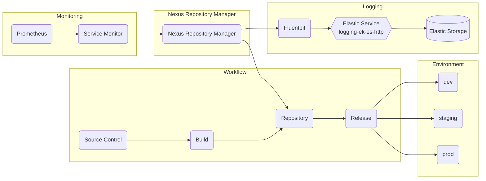

# Nexus

## Overview

Nexus repository manager is used to store build artifacts and provide features to push and pull artifacts using integration tools. Nexus provides a wealth of documentation [here](https://help.sonatype.com/repomanager3) with details about supported artifact formats, use cases, and more.

## Big Bang Touch Points

The below diagram includes the main Big Bang touchpoints to Nexus as well as a basic workflow for using Nexus.



### UI

Nexus Repository Manager serves as the user interface for Nexus. Nexus Repository Manager provides optional anonymous access for users who need to search repositories, browse repositories and look through the system feeds. UI access is exposed through the Istio Virtual Service.

### Logging

You can configure the level of logging for the repository manager and all plugins as well as inspect the current log using the user interface.
Logging can be enabled by clicking on the Logging menu item in the Administration submenu in the main menu. Logs are auto-scraped and shipped via your chosen logging stack when deployed with bigbang.

### Storage

Nexus requires access to persistent storage for storing repos, docker registries, etc. Persistent storage values can be set/modified in the bigbang chart:

```yaml
addons:
  nexusRepositoryManager:
    values:  
      persistence:
        storageSize: 8Gi
        accessMode: ReadWriteOnce
```

### Istio Configuration

Istio interaction with Nexus will be automatically toggled dependent on whether you have enabled Istio.

When enabled an Istio VirtualService will be deployed, along with other configuration for Nexus' interaction in the service mesh.

## Monitoring

Monitoring interaction with Nexus will be automatically toggled dependent on whether you have enabled monitoring.

When enabled a servicemonitor is deployed for automatic scraping of exposed metrics by prometheus.

## Resiliency

Nexus provides a helpful upstream guide on resiliency and high availability [here](https://help.sonatype.com/repomanager3/planning-your-implementation/resiliency-and-high-availability). Nexus does not support a traditional HA setup (more than 1 replica) so backups for resiliency are recommended.

## Single Sign on (SSO)

SSO can be configured for Nexus by the following the instructions from the package documentation [here](https://repo1.dso.mil/platform-one/big-bang/apps/developer-tools/nexus/-/blob/main/docs/keycloak.md)

## Licensing

By default, Big Bang will deploy the unlicensed version of Nexus. If you need some of the license features, such as SSO, you can add your license via values and it will be added to the deployment:

```yaml
addons:
  nexusRepositoryManager:
    enabled: true
    license_key: |
      ehjgjhh...
```

NOTE: This should be added via encrypted values to protect the license.

### Health Checks

Nexus Repository Manager uses Repository Health Check (RHC) for health checking. Repository Health Check (RHC) allows Nexus Repository users to identify open source security risks in proxy repositories at the earliest stages of their DevOps pipeline by providing the following key capabilities:

- A summary of components with security vulnerabilities categorized by severity.
- A count of license warnings per component categorized by severity.
