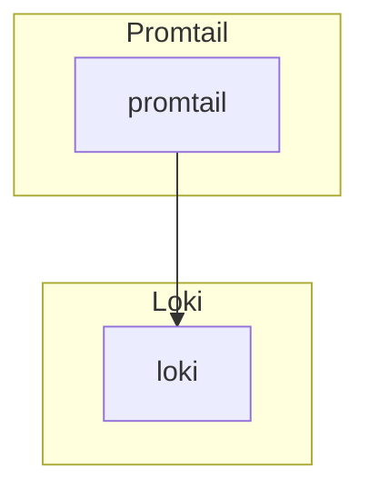

# Promtail

## Overview

> Promtail is an agent which reads log files and sends streams of log data to the centralised Loki instances along with a set of labels.

## Big Bang Touch Points



### Architecture: 
- [Promtail Client](https://grafana.com/docs/loki/latest/clients/promtail/)

### Storage

Promtail does not persist data, and instead reads log files and streams the data to a log aggregation system.

### Istio Configuration

Istio is disabled in the promtail chart by default and can be enabled by setting the following values in the bigbang chart:

```yaml
istio:
  enabled: true
```

These values get passed into the promtail chart [here](https://repo1.dso.mil/platform-one/big-bang/apps/sandbox/promtail/-/blob/main/chart/values.yaml#L428). 

## High Availability

By default, Promtail runs as a `daemonset` with a pod on each node.

## Single Sign on (SSO)

None. This service doesn't have a web interface.


## Licensing

Promtail utilizes an [AGPLv3 License](https://github.com/grafana/loki/blob/main/LICENSE) for it's code and binaries.