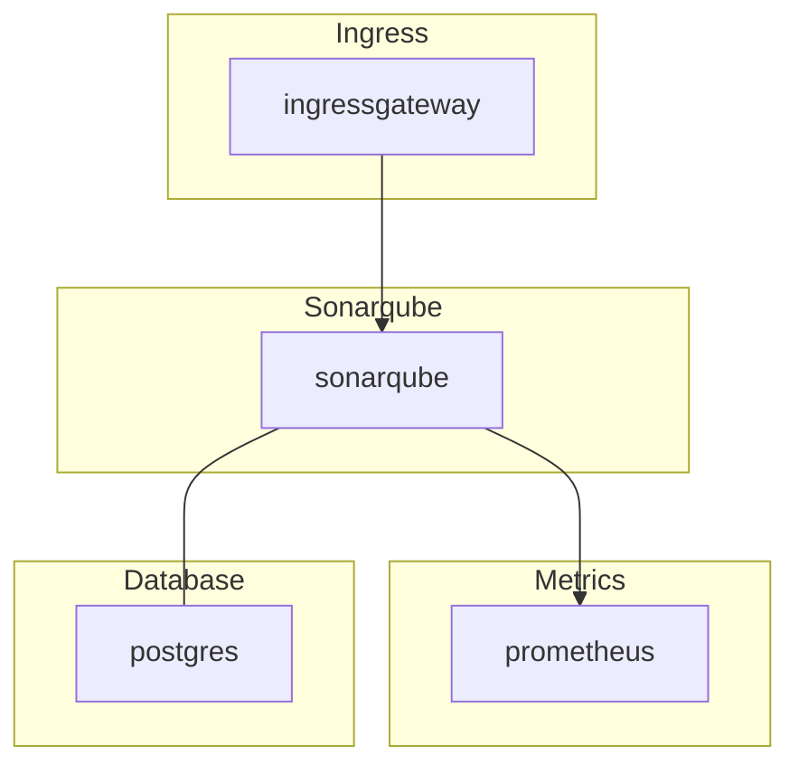
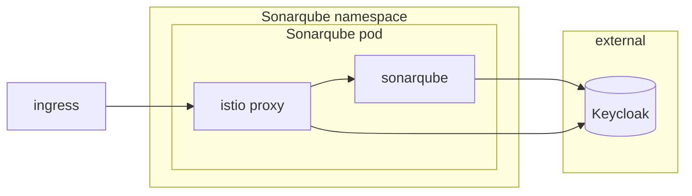

# Sonarqube

## Overview

[Sonarqube](https://www.sonarqube.org/) is an open-source platform for continuous inspection of code quality to perform automatic reviews with static analysis of code to detect bugs, code smells, and security vulnerabilities.

## Big Bang Touch Points



### Storage

Persistent storage can be enabled by setting the following values in the bigbang chart:

```yaml
addons:
  sonarqube:
    values:
      persistence:
        enabled: true
        annotations: {}
        storageClass:
        accessMode: ReadWriteOnce
        size: 10Gi
```

### Database

Sonarqube needs a postgres database to function. If one is not specified in the bigbang chart Sonarqube will deploy one internally within the namespace it is deployed to.

```yaml
addons:
  sonarqube:
    database:
      host: ""
      port: 5432
      database: ""
      username: ""
      password: ""
```

### Istio Configuration

Istio is disabled in the sonarqube chart by default and can be enabled by setting the following values in the bigbang chart:

```yaml
hostname: bigbang.dev
istio:
  enabled: true
```

These values get passed into the sonarqube chart [here](https://repo1.dso.mil/platform-one/big-bang/apps/developer-tools/sonarqube/-/blob/main/chart/values.yaml#L358). This creates the virtual service and maps to the istio gateway.

## High Availability

This can be accomplished by increasing the number of replicas in the deployment.

```yaml
addons:
  sonarqube:
    values:
      replicaCount: 2
```

## Single Sign on (SSO)

SSO integration can be configured by modifying the following settings in the bigbang chart.

```yaml
sso:
  oidc:
    host: login.dso.mil
    realm: baby-yoda

addons:
  sonarqube:
    enabled: true
    sso:
      enabled: true
      client_id: ""
      label: ""
      certificate: ""
      login: login
      name: name
      email: email
```



## Licencing

Sonarqube is released under the [Lesser GNU General Public License](https://en.wikipedia.org/wiki/Lesser_GNU_General_Public_License). The Bigbang chart utilizes the community edition of Sonarqube, but there are are also paid supported versions. Upgrades from community edition to enterprise or developer editions are possible via the [upgrade path](https://docs.sonarqube.org/latest/setup/upgrading/). Here is a link to their [Feature Comparison](https://www.sonarsource.com/plans-and-pricing/)

## Dependencies

Node kernel mods:
<https://repo1.dso.mil/platform-one/big-bang/bigbang/-/blob/master/docs/guides/prerequisites/os_preconfiguration.md#sonarqube-specific-configuration-sonarqube-is-a-bb-addon-app>
