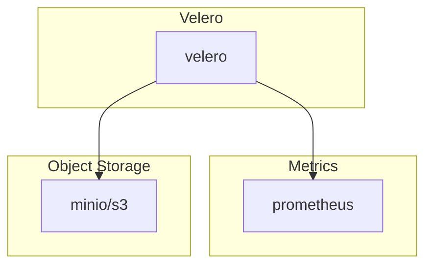

# Velero

## Overview

Velero is an open source tool to safely backup and restore, perform disaster recovery, and migrate Kubernetes cluster resources and persistent volumes.

## Big Bang Touch Points



### Architecture: 
- [How Velero works](https://velero.io/docs/main/how-velero-works/)

### Storage

Data from velero is stored in object storage and configuration is based upon the [provider](https://repo1.dso.mil/platform-one/big-bang/apps/cluster-utilities/velero/-/blob/main/chart/values.yaml#L226). 

### Istio Configuration

Istio is disabled in the velero chart by default and can be enabled by setting the following values in the bigbang chart:

```yaml
istio:
  enabled: true
```

These values get passed into the velero chart [here](https://repo1.dso.mil/platform-one/big-bang/apps/cluster-utilities/velero/-/blob/main/chart/values.yaml#L477). 

## High Availability

Velero does not have configurations for high availability.

## Single Sign on (SSO)

None. This service doesn't have a web interface.

## Licensing

[Apache 2.0 License](https://github.com/vmware-tanzu/velero/blob/main/LICENSE)

## Dependencies

Velero requires an object storage service available with the bucket details pre-configured. This can be block storage from block storage from AWS, Azure or other providers. `minio` and `minioOperator` can be enabled to provide this storage local to the cluster under the `addon` packages.