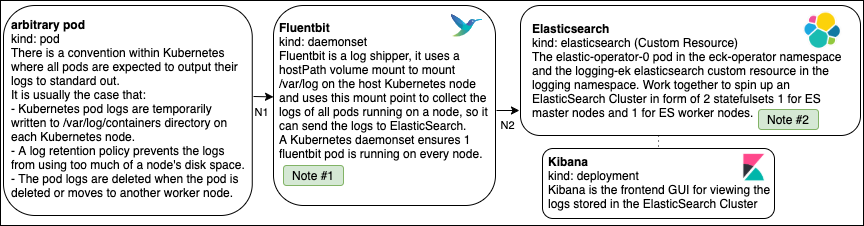

# Goals of this Diagram

* Help new users understand the data flow of pod logs

## Kubernetes Pod Logs Data Flow Diagram

| Line Number | Protocol | Port | Description |
| --- |  --- | --- | --- |
| N1 | Volume Mount | NA | Fluent Bit reads pod logs from a host node volume mount |
| N2 | HTTPS | TCP:9200 | Fluent Bit sends logs to Elastic Search over the URL: <https://logging-ek-es-http:9200> (This URL is only exposed over the Kubernetes Inner Cluster Network, and because Fluent Bit and ElasticSearch have Istio Envoy Proxy sidecar containers the network traffic is protected by the service mesh.) |

## Notes

1. The Fluent Bit log shipper is configured to send pod logs to the ElasticSearch Cluster in the logstash data format.  Logstash_Format On
2. By default: The log index logstash-%Y.%m.%d will create a new log index everyday, because %d will increment by one everyday. There are no default Index Lifecycle Management Policies that are created or applied to these indexes. It is recommended that customers create a Index Lifecycle policy to prevent disk space from filling up. (Example: Archive to s3 and then delete from PVC logs older than N days.)
